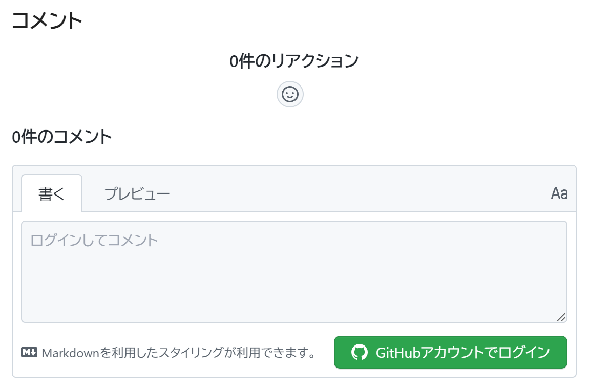
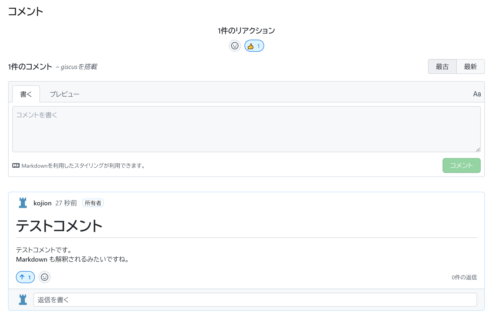

# Giscus

## コメントシステム

MkDocs のような最終的に HTML で表示する静的サイトの場合、以前までは記事に対するコメントを付与するといったような動的な要素を追加するのは難しいと考えていました。
しかし Material テーマであれば **Giscus** という GitHub Discussions を使用してコメントを残せる仕組みが用意されています。
今回こちらを試してみることにします。

!!! Note "以前 Disqus があった気がする"

    以前はクラウド型コメントシステムとして **Disqus** を使用するという記載があったように思いましたが、最近見てみると Giscus に置き換わっていました。
    そちらも使えるのだと思われますが、ここでは検証しません。

## 導入

[公式サイト: Adding a comment system](https://squidfunk.github.io/mkdocs-material/setup/adding-a-comment-system/)
の通り実施してみることにします。

Giscus インストール
:   [Giscus App](https://github.com/apps/giscus) のサイトから GitHub アプリとして Giscus をインストールします。

GitHub Discussions を有効にする
:   [Enabling or disabling GitHub Discussions for your repository](https://docs.github.com/en/repositories/managing-your-repositorys-settings-and-features/enabling-features-for-your-repository/enabling-or-disabling-github-discussions-for-a-repository)
の通り対象リポジトリで GitHub Discussions を有効にします。

スニペット生成
:   [Giscus サイト](https://giscus.app/ja)
にアクセスし、設問に答えていって `<script>` スニペットを生成します。

``` html
<script src="https://giscus.app/client.js"
        data-repo="kojion/chess"
        data-repo-id="R_kgDOHr3XSw"
        data-category="Announcements"
        data-category-id="DIC_kwDOHr3XS84CQVzN"
        data-mapping="pathname"
        data-reactions-enabled="1"
        data-emit-metadata="1"
        data-input-position="top"
        data-theme="light"
        data-lang="ja"
        data-loading="lazy"
        crossorigin="anonymous"
        async>
</script>
```

拡張テーマ用意
:   `mkdocs.yml` に拡張テーマを格納するための設定及びディレクトリを用意します。

``` yaml
theme:
  custom_dir: overrides
```

スニペット配置
:   `overrides/main.html` を用意し、以下の部分に先ほど生成したスニペットをペーストします:

``` python



  {{ super() }}

  <!-- Giscus -->
  <h2 id="__comments">{{ lang.t("meta.comments") }}</h2>
  <!-- Replace with generated snippet -->

  <!-- Synchronize Giscus theme with palette -->
  <script>
    var giscus = document.querySelector("script[src*=giscus]")

    /* Set palette on initial load */
    var palette = __md_get("__palette")
    if (palette && typeof palette.color === "object") {
      var theme = palette.color.scheme === "slate" ? "dark" : "light"
      giscus.setAttribute("data-theme", theme) 
    }

    /* Register event handlers after documented loaded */
    document.addEventListener("DOMContentLoaded", function() {
      var ref = document.querySelector("[data-md-component=palette]")
      ref.addEventListener("change", function() {
        var palette = __md_get("__palette")
        if (palette && typeof palette.color === "object") {
          var theme = palette.color.scheme === "slate" ? "dark" : "light"

          /* Instruct Giscus to change theme */
          var frame = document.querySelector(".giscus-frame")
          frame.contentWindow.postMessage(
            { giscus: { setConfig: { theme } } },
            "https://giscus.app"
          )
        }
      })
    })
  </script>

```

これでアクセスしてみると動きました。

## 動作確認

{class="img-left"}

各ページ下部に左図の通りコメントの入力フォームが表示されましたが、見てみたところ **GitHub ユーザでログインする必要がある** ように見えます。
ログインしないとコメントは入力できません。
**リアクション** という機能があって高評価、低評価などの反応を絵文字で付けることができるのですが、こちらも GitHub ユーザでログインしていないと付けることができません。
Twitter アカウントや Google アカウント連携でできれば良かったのですが GitHub ユーザとなるとちょっと敷居が高いように思います。
ただスパムで適当なコメントを連発されるような嫌がらせを避けるという意味では GitHub ユーザという出処がハッキリするというのは安心なのかもしれません。
試しに GitHub アカウントでログインしてテストコメントをしてみます。

{class="img-left"}

このようにテストコメントを行うことができました。
Markdown も解釈されていて、見た目も大変良いです。
尚、コメントした直後に GitHub に登録されているメールアドレスに対してコメントがあったことを示す通知が届きました。
これならコメントを見逃すこともありません。
リアクションという機能もちゃんと動作することが確認できました。
コメントを編集・削除したい場合は GitHub の対象リポジトリの GitHub Discussions のページに遷移すると行うことができます。

まとめると、コメントできる対象が GitHub ユーザであるという条件がついてしまうのが残念ですが、それ以外は非常に便利に使える良い機能と思いました。
GitHub ユーザでない方のために
**GitHub アカウントをお持ちの方のみコメントすることができます。お持ちでない方はメールや Twitter などでご指摘ください**
などといった注意書きを併記することで活用できれば良さそうです。