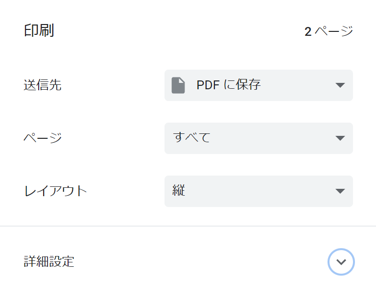

# PDF 出力

## 概要

{class="img-left"}

今まで見てきたように MkDocs は `mkdocs build` で HTML ドキュメントとして出力して配布することができます。
しかし配布先によっては HTML ドキュメントはあまり好まれず PDF や Excel のようなフォーマットで欲しいと言われることがあります。
なので Excel は難しいとしても PDF 出力はできるようにしておきたいところです。
これに関しては [mkdocs-with-pdf](https://github.com/orzih/mkdocs-with-pdf) のようなツールを使用したり
[wkhtmltopdf](https://wkhtmltopdf.org/) を使って HTML から PDF
に変換するなどの方法もありますが、ビルドが通らなかったり若干癖があったりして思った通りにならなかったりします。

そこで私が最も簡単だと思った方法は **印刷で PDF 出力** するものです。
例えば Chrome で印刷メニューを押した時は左図の通り送信先として **プリンターではなく PDF に保存を選択** できます。
Edge でも印刷メニューでプリンターとして PDF として保存を選択できます。
HTML 1 つずつ印刷する必要があって大量にドキュメントがある場合は面倒ですが、確実です。

## 余計な部分を出さないようにする

何も考えずに PDF 出力しようとしてしまうと不要な部分も出力されてしまうこともあると思います。
そこは拡張 CSS に印刷時に適用するスタイルとして以下のように書きます:

```css
/** 印刷用 */
@media print {
    // 印刷時に消す項目を列挙
    h2#__comments,div.giscus {
        display: none;
    }
}
```