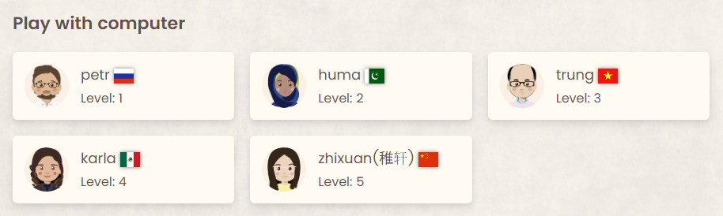
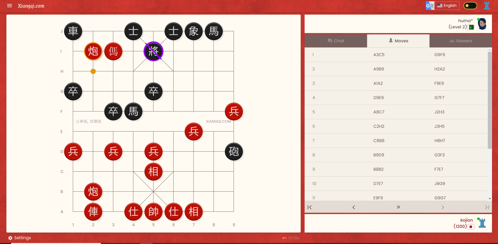

# 2022-07-28 シャンチーをやってみたという話

## きっかけ

私は元々チェスの傍らそこそこ熱心にバリアント・チェス[^1]や将棋をプレイするなどしていました。
それはそれで満足だったのですが、いくらバリアント・チェスを熱心にやったところで
**オンラインの中の閉じた世界のみでしか遊ぶことができない** というのは確かに思っていたことでした。
そういった用途ではうってつけなのは将棋なのですが、こちらは子どもの頃から触れているのでチェスほどは好きになれないのが自分でもよく分かっています。
将棋の道場に行って対面で将棋を指してみたいとかも全く思わない[^2]のが不思議なところではあります。

そんな中 NCS のチェスの大会が日本シャンチー協会の大会と同じ建物で行われたり Twitter 上で話題を見かけたりなどシャンチーを目にする機会が多くなってきました。
決定的だったのは **[xiangqi.com](https://xiangqi.com) というサイトの出来が良さそうだったこと**[^3] で、よし試しにやってみようか、と思いました。
駒の動かし方やルールは [Wikipedia](https://ja.wikipedia.org/wiki/%E3%82%B7%E3%83%A3%E3%83%B3%E3%83%81%E3%83%BC)
を見れば載っていますし、将棋とチェスが指せるのだからそこまで難儀はしないだろうと思っていました。

## やってみた結果

{align="left" width="30%"}
早速 xiangqi.com にユーザ登録してログインしてみました。
コンピュータとの対戦では、まずレベルが 1 から 5 の中から選択できるようです。
それぞれがどの程度のレベルなのかは分かりませんが、とりあえずレベル 1 からチャレンジしてみることにしました。
同じ画面でオンラインの対人戦の相手も何人か表示されますが、正直まだ何をどうしたらいいのか分からないレベルなので対人戦は憚られるところです。

初めてのシャンチーでレベル 1 と対戦してみましたが、何とか初挑戦で勝つことができました。
チェスと違って駒の働きが弱いのでどう守ったらいいのか分からず、タダ駒を作ってばかりになってしまいました。
ただレベル 1 だとタダ駒でもすぐに取ってくるようなことはありませんでした。
このあたりはチェスのコンピュータの一番下のレベルと同じような挙動と言えそうです。

{align="left" width="30%"}

続いてレベル 2 との対戦ですが、さすがに初戦は敗北、その後何回かやって惜しいところまでいくのですが敗北しました。
しかし数回チャレンジしたら何とか勝つことができました。
チェスと違って駒が結構残っている状態で敵陣に砲や馬を送り込んでも簡単に追い返されないように見えます。
あとシャンチーをプレイした人が口々に言われるのは **砲の動きが独特** ということですが、確かにそれも注目点ではありますがチェスからみると
**馬 (ナイト) や象が駒を飛び越えられない** というところが結構うっかりしました。
シャンチーでは馬は 4 点、車 (ルーク) は 9 点とチェスと随分違いますが、プレイしてみて納得しました。
飛び越えられないだけで大分弱くなります。
真横に駒を付けられてしまうと移動できませんし、自分の駒もうっかり横につけてしまって移動できないといったことになります。

## 次どうするか

その後レベル 3 にも何度かチャレンジしてみたのですが、歯が立たないということはないのですがまだ勝てていません。
暇つぶし感覚なのであればこのままコンピュータと数回やって飽きたら終わりでも良いのですが、せっかくなのでオープニングやタクティクス、エンドゲームなど触りだけでも知りたいと思いました。
そのためには入門書のような外部の情報に頼る必要があります。
アマゾンで探してみたところ
[強くなる！シャンチー入門](https://www.amazon.co.jp/%E5%BC%B7%E3%81%8F%E3%81%AA%E3%82%8B-%E3%82%B7%E3%83%A3%E3%83%B3%E3%83%81%E3%83%BC%E5%85%A5%E9%96%80-%E6%89%80%E5%8F%B8-%E5%92%8C%E6%99%B4/dp/4904686101/?_encoding=UTF8&pd_rd_w=EYx6k&content-id=amzn1.sym.09fc5329-add5-4943-82f6-96f98cfdada8&pf_rd_p=09fc5329-add5-4943-82f6-96f98cfdada8&pf_rd_r=ERH9TC38HAJAJRP578QT&pd_rd_wg=zcGV9&pd_rd_r=bd6347b6-4445-447d-9817-29b9be83479e&ref_=pd_gw_ci_mcx_mr_hp_atf_m)
という本が割と最近出たもので良さそうなので、次の買い物の機会に考えてみようと思いました。

[^1]: 有名なところではクレイジー・ハウス、アトミックなど。[Chess.com](https://chess.com) や [lichess](https://lichess.org) でプレイすることができます
[^2]: 正直 **怖い** という気持ちのほうが勝ちます
[^3]: チェスやバックギャモンの違いでも感じたのですがプレイ環境が充実しているというのは非常に大きいです