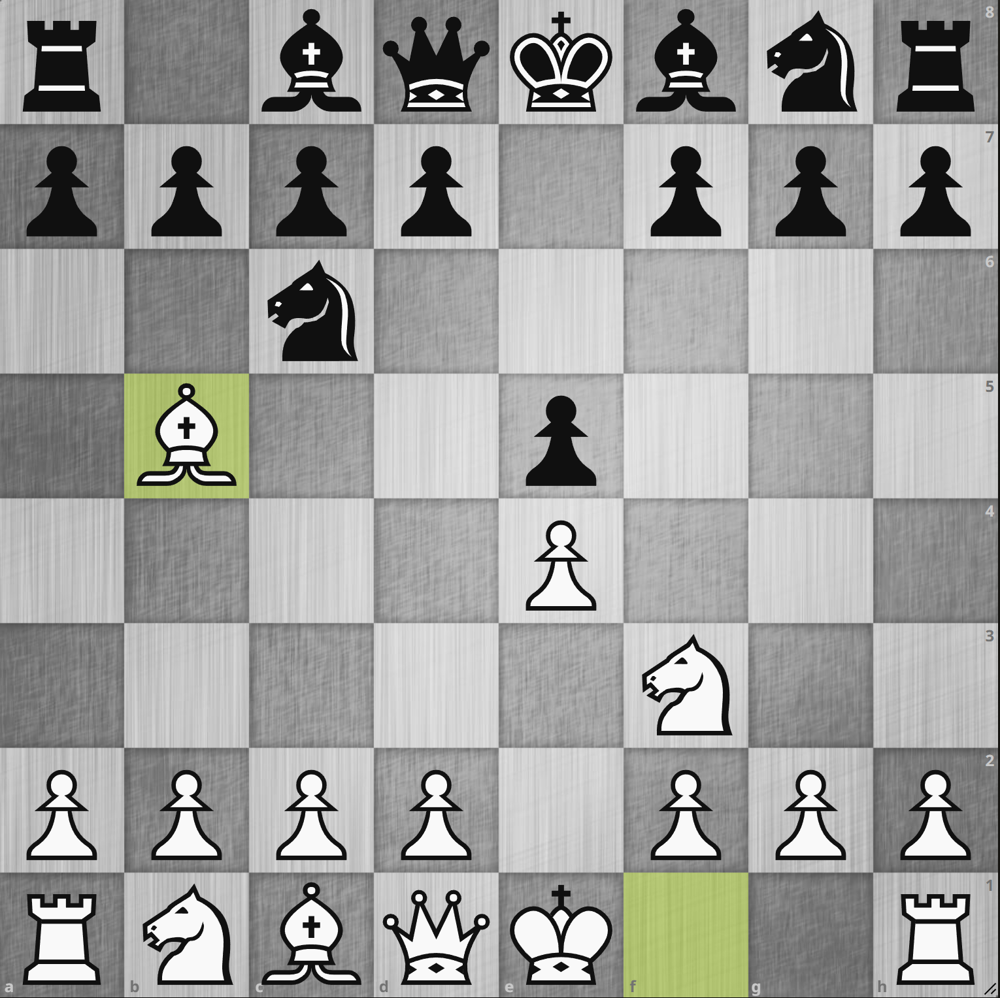
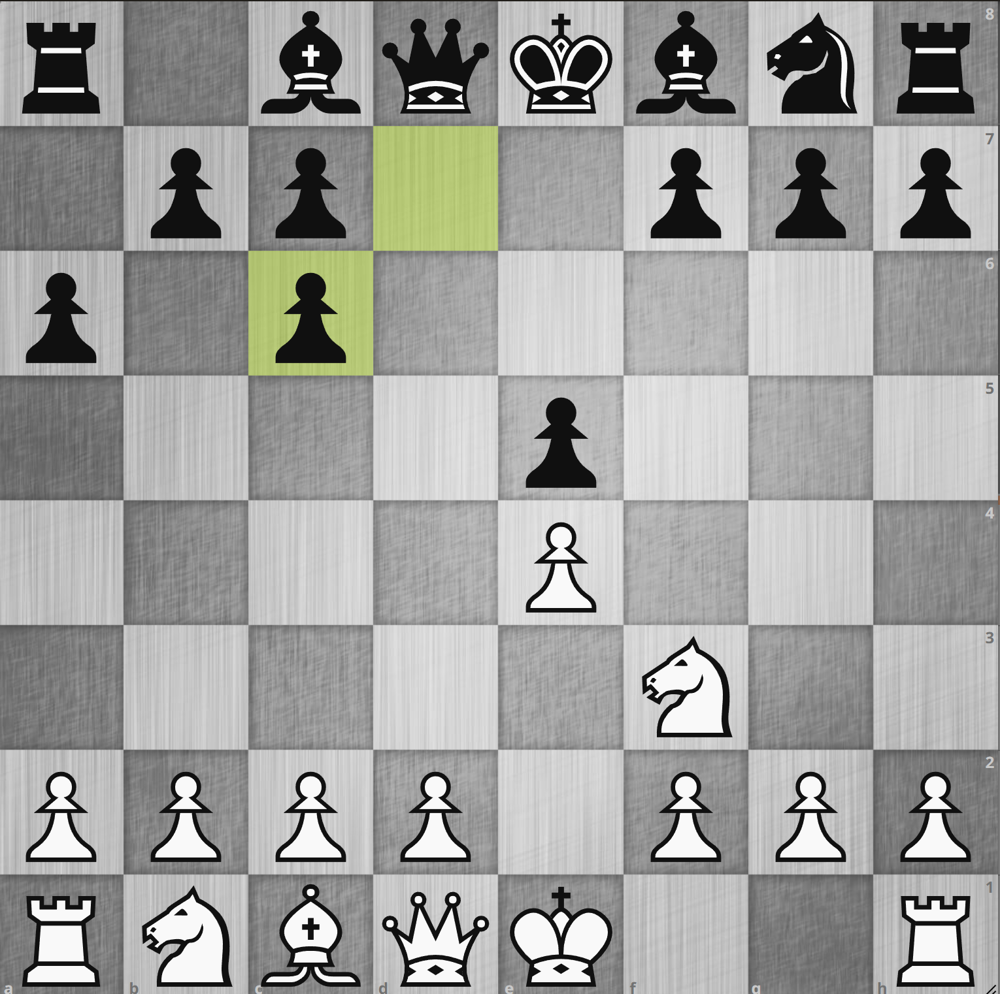
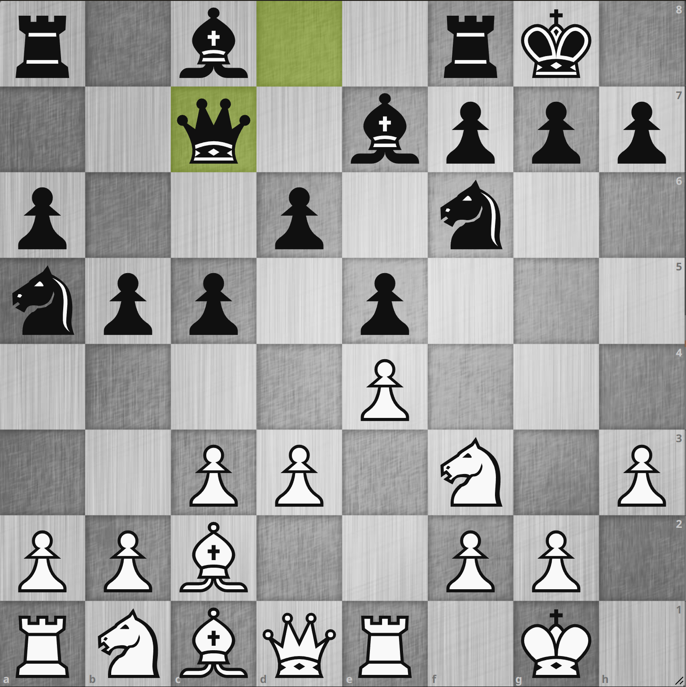
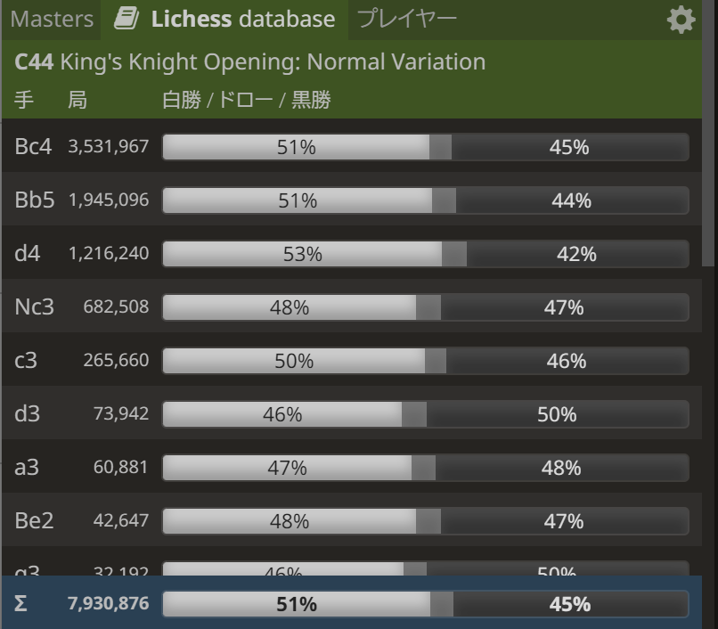
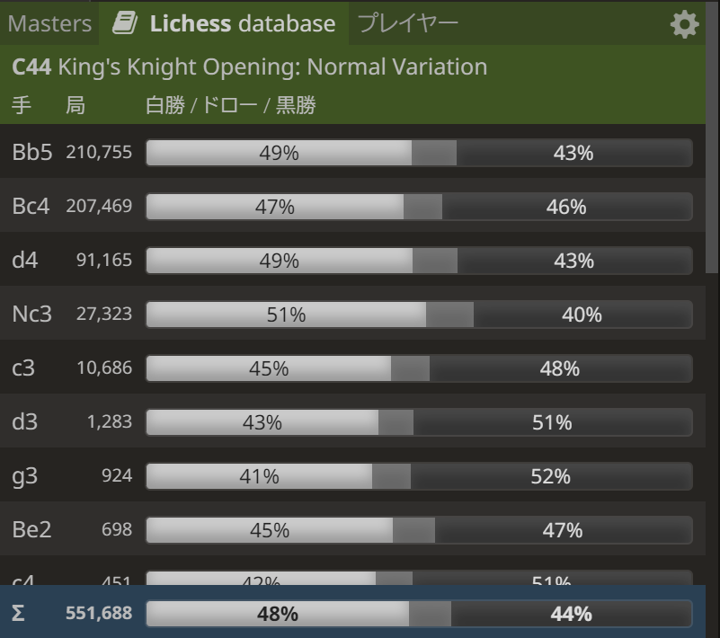
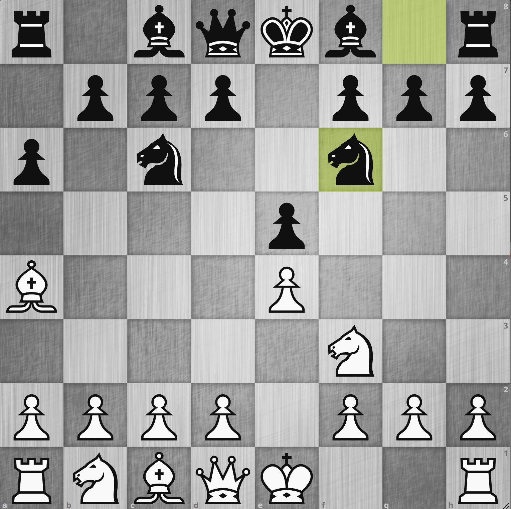

# 9 月 13 日: ルイ・ロペスは初級者にとってどうなのか

!!! note "初級者について"

    人によって解釈が異なるところだと思いますが、ここでは
    lichess ラピッド 1200 ～ 1700, Chess.com ラピッド 800 ～ 1300 くらいの水準とします。

## ルイ・ロペスが初級者向けではないと言われる所以

{.img-left}

ルイ・ロペスの定義ですが **1. e4 e5 2. Nf3 Nc6 3. Bb5** とする手順を指します。
この局面図で `3. Bb5` という手が c6 のナイトを攻撃していますが、ほとんどの場合すぐに取ろうという狙いではありません[^1]。
私はこのルイ・ロペスというオープニング、本に **オープニングのお手本** と書いてあったので本当にチェスを始めた時から使い始め、今までずっと使い続けています。

ルイ・ロペスと似たような手順で初心者・初級者向けとしてよく引き合いに出されるのが **イタリアン・ゲーム** で、これは
**1. e4 e5 2. Nf3 Nc6 3. Bc4** という手順となります。
ビショップを展開する先が一路違うだけですが、これがその後のゲーム展開に相当な影響を与えます。
`3. Bc4` という手は黒の弱点である f7 の地点を直接狙っており、その後の指し手が比較的分かりやすいのが魅力です。

さて、ルイ・ロペスがなぜ初心者・初級者向けではないと言われるのか、今だとよく分かります。多くは以下のような理由だと思います。

---

### 変化が異常に多い

前述の **1. e4 e5 2. Nf3 Nc6 3. Bb5** からの黒の応手に関してですが、それだけみても相当な数があります。
例えば以下のような感じです:

* `3... a6`: モーフィー・ディフェンス
* `3... Nf6`: ベルリン・ディフェンス
* `3... d6`: オールド・シュタイニッツ・ディフェンス
* `3... Bc5`: クラシカル・ディフェンス
* `3... Nd4`: バード・ディフェンス
* `3... Nge7`: コツィオ・ディフェンス
* `3... f5`: シュリーマン・ディフェンス

この中で `3... a6` のモーフィー・ディフェンスの先も
[ルイ・ロペスの英語版 Wikipedia](https://en.wikipedia.org/wiki/Ruy_Lopez#Morphy_Defence:_alternatives_to_Closed_Defence)
を参照していただければお分かりになるかと思いますが、相当な分岐があります。
これらすべてに対して対策を練るのは至難の業です。

### 定跡を知らないと指せない手順が多い

{.img-left}

`3. Bb5` という手が c6 のナイトを攻撃している手なのですが c6 のナイトは e5 のポーンを守っています。
なので **4. Bxc6 としてナイトを外せば e5 のポーンを取れるのではないか？** と考えて
**3... a6 4. Bxc6 dxc6 5. Nxe5?** とするのは誰もが一度はやってみるものだと思います[^2]。 

残念ながらこの手は **5... Qd4!** とされて成立しません[^3]。
これはルイ・ロペスあるあるな局面なのですが、知らないとなかなか正解を導き出すのが難しいです。
ルイ・ロペスにはこういった暗黙の手順として知っておかなければならない内容が結構あるように見受けられます。

---

### 黒のクイーンサイドのスペースが広くなる

{.img-left}

ルイ・ロペスを手順通り指していくと大体このような局面になることが多くなると思います。
この後白は `Nbd2 - Nf1 - Ng3` と展開するのを狙っておりこれからの戦いといったところですが、
これを見てイタリアンに比べて黒のクイーンサイドのスペースが広く白やりにくいな、と思われることが多いようです。

あとビショップの活用に関しても黒の白マスビショップは `Bb7` とフィアンケットして使えば分かりやすいのに対し、白の黒マスビショップは
`Nbd2` と出た瞬間は動けなくなりますし `Be3` と出ても初期位置よりはマシですが何だかそこまで利いているようには見えません。

やはりこのあたりの緻密な攻防が分かりにくく、初心者・初級者向けではないと言われるのに一役買っているようです。

## 反論 1: ルイ・ロペスの勝率はどのレート帯でもイタリアンより高い

{.img-left}
{.img-left}

今の時代 lichess でオープニングの勝率がレート別に分かってしまうのが素晴らしいと思います。
この図は **lichess ラピッド 1600 での白 3 手目の選択肢ごとの勝率** と **ラピッド 2200 の同様のもの** です。
実は 1600 くらいのレート帯が一番イタリアンの勝率が高いのですが、それでもルイ・ロペスと白勝率が同じにもかかわらずルイ・ロペスよりも黒勝率が高いです。
2200 近辺になってくるとルイ・ロペスのほうの成績がイタリアンを凌駕します。

よって真剣に一つ一つ学んでいくモチベーションの高いプレイヤーにとっては、恐らくこの図の通りルイ・ロペスを選択したほうが後々成績がついてくるのではないかと思います。

* レーティングが高くなるほどイタリアンよりルイ・ロペスの採用率が増え重要性が高まる
* レーティングが高くなるほどルイ・ロペスの勝率が高まる

ルイ・ロペスは大器晩成といえそうです。

!!! tip "スコッチ・ゲームもかなり優秀に見える"

    ここではイタリアンとの比較なので言及しませんが、勝率をみると **3. d4** のスコッチ・ゲームもかなり有力なオープニングに見えます。

---

## 反論 2: 自分でわかる手順を指せば良い

{.img-left}

たとえばこのモーフィー・ディフェンスでのよくある手順図での最善手は **5. O-O** で一見 e4 のポーンがタダのようですが
**5... Nxe4** は **オープン・バリエーションというれっきとした定跡** です。
かなり激しい戦いになるので黒としても選んでくることは少ないです。
とはいっても知らないと e4 のポーンがタダで落ちてしまうように見えるのでここでキャスリングは指しにくいと思います。
別にこういうところでは定跡を完璧になぞる必要などなく、**5. d3** と守ればいいと思いますし十分有力な手です。
他の局面でも最善手を完璧に指しに行こうとするのではなく、自分にとって考えやすい手、指しやすい手を選んでいけばいいのではないかと思います。

チェスにおいてオープニング、定跡の理解はある程度は必要ですが、定跡を完璧になぞる必要はマスタークラスでもない限り無いと思います。
また、本当に知らないと詰むような場面に関しては何度も出会えばさすがに対処法が身につきますし、これはルイ・ロペスに限った話ではありません。

---

## 反論 3: 整備されて歴史あるルイ・ロペスは楽しい

あと最大の理由はルイ・ロペスは **指していて楽しい** ということです。
オープン・バリエーションやエクスチェンジ・バリエーションに進まなければ多くはポジショナルで緻密な攻防[^4]が続き、
**チェスを存分に味わっている感** が半端ではなく歴史と共にその深さは他のオープニングの追随を許しません。
膨大な変化を持つルイ・ロペスですが、それが一つ一つ分かっていき自分の視界が開けていく感覚も楽しいです。

ということで、この感じが肌に合う方にとっては自分の今の棋力に関わらずルイ・ロペスはおすすめのオープニングの一つということになります。

[^1]: すぐに `Bxc6` とナイトとエクスチェンジするバリエーションもあるにはあります
[^2]: 中級者帯でも稀にやってくる人がいますが、簡単に咎められます
[^3]: ポーンを取り返された上キャスリング放棄までさせられて白指しにくい局面になります
[^4]: これが悪く言えば **地味** ということになり人を選ぶと思いますが