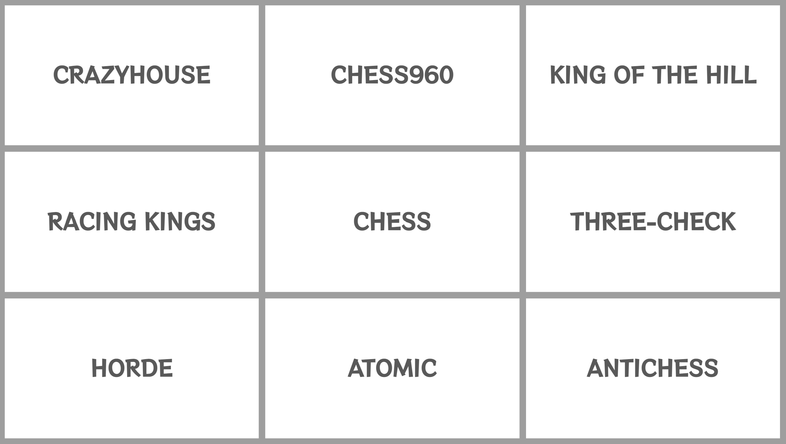

# 2022-12-19 変則チェス九番勝負

## 変則チェスが結構好き

私はスタンダード・チェスも好きですが、変則チェスも結構好きで Chess.com や lichess で頻繁にプレイしています。
中でも lichess で提供されている 8 つの変則チェスはどれも良く考えられており奥が深く、しかもスタンダード・チェスと同様に
Stockfish を使用した解析や lichess オープニング・データベースを使って検討することもできます。
この変則チェスを使って何か面白いことができないかな、と常日頃から考えていました。

## 桑名七盤勝負からインスピレーションを得る

**桑名七盤勝負** という競技をご存知でしょうか。
平たく言うと 7 種類の有名なボードゲームを 2 人で同時に対局する、という競技です。
種目としては連珠、どうぶつしょうぎ、オセロ、チェス、囲碁 (9 路盤)、将棋、バックギャモンを使用するとのことです。
私はプレイしたことはありませんが、これを聞いた時結構面白そうだな、と思いました。
A という種目では負けたが B, C という種目で勝ったから総合的に勝ち、という発想は何だか運動会のようで楽しそうに思えるからです。

ちなみに **番勝負** という用語を [ウィキペディア](https://ja.wikipedia.org/wiki/%E7%95%AA%E5%8B%9D%E8%B2%A0) から引用します:

> **番勝負（ばんしょうぶ）** は、主として、囲碁の棋戦や将棋の棋戦などにおいて、同じ 2 名の対局者が複数回の対局を行い、勝数が多い方を優勝者等とする仕組みを指す言葉である。

桑名七盤勝負が **番勝負** でなく **盤勝負** なのは、実際に 7 つの盤を並べて対局することを意識したネーミングなのだと想像します。

## スタンダード・チェスを加えた「九番勝負」

{class="img-left"}
ということで lichess が提供している 8 つの変則チェス + 普通のチェスで九番勝負を行う、というのを考えました。
変則チェスだけだと 8 つで偶数になってしまい、ドローが無かった場合でも 4 勝 4 敗で決着がつかず面白くないのでスタンダード・チェスを加えた九番勝負としました。
欲を言えば特定の対戦相手同士で 2 人で九番勝負としてやりたいのですが、そんな奇特な人[^1]が現れるのを待つのは現実的ではありません。

というわけで、今後この 9 種目を lichess ロビーでのマッチングで連続して行い、勝ち越せば勝ち、負け越すと負けとするような配信を行ってみようと思います。
こういうのが面白いと思ってもらえるかどうか、探り探りやっていこうと思います。

[^1]: 私のような物好きな人