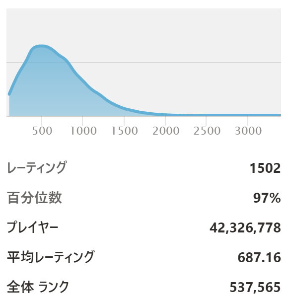
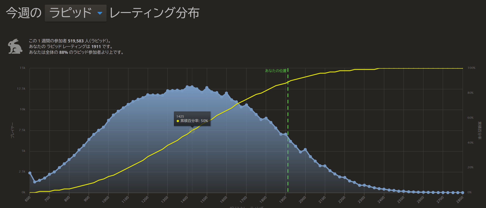

# 2023-03-08 ネットでみるチェスプレイヤーの平均像

## Twitter 上は lichess ラピッド 2000 オーバーの人ばかり

皆さんはチェスを始めた時にどこで情報収集したでしょうか。
インターネットが使えなかった昔なら話は別ですが、今は知りたい情報を簡単に検索して引っ張ってくることができます。
昔であれば書店でチェスの入門書を買ってきて読んでいたところでしょうが、今は **チェス入門** といった用語で検索するだけで事足ります。
対局がしたければどんなレベルでも [Chess.com](https://chess.com/) で簡単に行うことができます。
便利な時代になったものだと思います。

少し慣れてくると、やはり日本の他のチェスプレイヤーの動向が気になってくると思います。
他のプレイヤーはどのようにやっているのかが知りたいですし、同じくらいのレベルのチェス友だって欲しいでしょう。
そういった場合 SNS が便利です。
Twitter で検索するとすぐにいっぱいでてきます。
日本でも有数の上位プレイヤーは大体が Twitter アカウントでも発信していますし、その下の中堅層も Twitter アカウントで発信している人が多い印象です。
とすると始めたばかりの人や初級クラスの人もいっぱいいて Twitter で発信していると思ってしまうものですが、何となく見ているとそういう人が稀なように見えてしまいます。
実際のところそういった方はちょくちょく見かけますが、どうしても目立たない感じになりがちです。
そしてツイートするのは強いプレイヤー、lichess 2000 オーバーのプレイヤーばかりに見えてしまいます。
それをずっと見ているといつしか **チェスプレイヤーなら lichess 2000 オーバーが当たり前なんじゃないか** という錯覚に囚われてきます。
恐らくそう思った方のほとんどは lichess 2000 に届かない水準のプレイヤーでしょう。
そして **自分のレベルが周囲に対して著しく劣っているように錯覚** して、何だか後ろめたくなってしまう。
これが怖いところだと思います。

**Twitter や YouTube 配信コメント上のチェスプレイヤーは日本全体の平均像では全くありません**[^1] ので、今一度よく見ていただきたいのです。

## SNS で発信しがちな人

SNS で発信しがちな人というのはどういう傾向があるのでしょうか。
承認欲求というキーワードがすぐに出てくると思いますが、要は自分はこういう活動をしていてこう思っているから人に認めてもらいたい、共感してほしいという欲求が少なからず存在しているということです。
誰にでもあるもので、勿論私にもあります。
承認欲求が強ければ強いほどツイート内容・回数が多めになるでしょう[^2]。
ただ、チェスのような趣味に限って言うとそれに加えて **棋力・熱量が高い人が多く発信する** 傾向がどうしても出てきてしまいます。
チェスの考察に関するツイートでは棋力の高さがそのまま信頼性に直結するため、レートが高くないとツイートしにくい内容のものが出てきます。
その結果、棋力が高くて四六時中チェスのことを考えているような人のツイートばかりが目立つ結果となり、高レベルのプレイヤーばかりに見えてしまうわけです。

もし日本、もしくは世界の平均像が見たいのであれば Twitter は適切ではありません。
他のプラットフォームをあたってみるのがいいでしょう。

## Chess.com

{.img-left}

[Chess.com](https://chess.com/) は本当に始めたての人からマスタークラスまで、幅広い層が集まっている世界一のプラットフォームという印象でここで調べるのが一番適切でしょう。
[統計情報](https://www.chess.com/leaderboard/live/rapid)からグローバル平均を見ることができます。
この画像はラピッドのものですが、2023 年 3 月 8 日現在の平均は **687.16** です。
思ったよりかなり低いように思うのではないでしょうか。
実際はアクティブでないプレイヤーも含まれているため現在熱心にやっているプレイヤーのみに絞った場合はもう少し高くなるとは思いますが、それでも 800 に届かない程度だと思います。
日本に絞った平均値をすぐに見れないのが残念なのですが、中央値であればランキングを日本に絞った中でのちょうど半分のページのプレイヤーのレーティングを見ることで確認できます。
大体 **730 くらい** です。
日本全体の 25% から 75% くらいのいわゆる中間のプレイヤーのレーティングを見てみると **500 ～ 1000 くらい** です。

**これは正しくない、トリックだ！**
と異議を唱えたくなる方もいらっしゃるでしょう。
Chess.com ではレーティングを絞らずに自動マッチングさせることができるので、何度か試行してみると実際どのレート帯が多いのかを擬似的に調べることができます[^3]。
私はラピッド・レーティング 1500 くらいですが、非レート戦でレーティングを絞らずに自動マッチングさせると自分より高いレーティングの人とマッチングすることはほとんどありません。
大体 300 から 900 くらいの方とマッチングすることが多く、100, 200 くらいの方ともそれなりにマッチングします。
これでこのグラフの内容が実情に近いことが体感できます。

念のため書いておきますが Chess.com ラピッド・レーティング 1000 は、チェスを遊びでプレイする相手に負けることはまずないくらいには強いです。

## lichess

{.img-left}

[lichess](https://lichess.org) は Chess.com と違って、始めたての方がいきなり使うケースはほとんど見受けられないようです。
私もそうでしたが、ある程度チェスを趣味としてちゃんとやっていこうかな、と考えるようになった方が手を出すようなプラットフォームです[^4]。
lichess のラピッド・レーティング中央値はやはり[レーティングの統計](https://lichess.org/stat/rating/distribution/rapid)から確認することができます。
2023 年 3 月 8 日現在、中央値は **1425** で、25% から 75% くらいの中間プレイヤーのレーティングは **1150 ～ 1700** です。
やはり Chess.com より少し水準は高めですが、それでも本来はこのくらいのレーティングのプレイヤーが多いはずなのです。
Twitter 上だけ見ているとこの事実には全く及びもつきません。

この中央値ぐらいあれば全く負い目に感じる必要はないと思いますし、もしそれに届かなかったとしても他人と比べて著しく劣っている、などと考える必要はないと思います。
楽しみ方は人それぞれ、過度に他人と比べることを控えて自分なりに一歩一歩進んでいくことを楽しんでいければ良いのではないかと思います。

[^1]: 強いて言えばチェス沼に浸かりきった人の集合
[^2]: 念のため注釈しますがそれに関しての良し悪しについては言及しません
[^3]: こちらがレートを絞ってなくても相手がレートを絞っている場合があるので完全ではありませんが
[^4]: 実際のところ lichess はすべて無料で機能満載で非常に便利なので始めたてであっても積極的に使っていっていいと思います