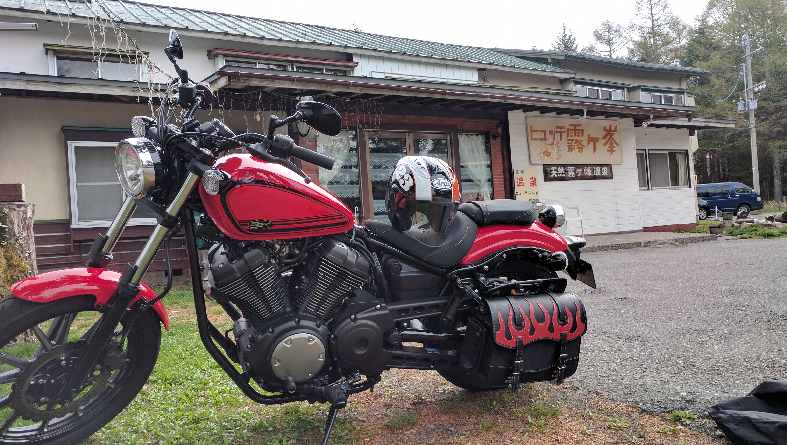

# 自己紹介

## 概要

<figure markdown>
  {width="50%" class="img-center"}
  <figcaption>YAMAHA BOLT at 霧ヶ峰</figcaption>
</figure>

**コジオン** というハンドルネーム[^1]をかれこれ 20 年以上名乗っています。
学生時代は理工系の大学に進学し、現在はプログラマとして企業に勤めております。
チェス以外の趣味は **バイク** です。
よく愛車 YAMAHA BOLT R-Spec でツーリングをしています。
あとラジオも好きで、テレワーク中や就寝時などによく聴いています。
NACK5[^2] のヘビー・リスナーです。
普段の生活においての日記は [2016 年 1 月 1 日からブログに毎日書いて](https://kojion.com/) います。
好きな食べ物は **ハンバーガー** で昔はよく食べ歩いていましたが、今は大体決まった店しか行かなくなってしまいました。
たまにツーリングした先でグルメバーガーを食べたりします。
お酒はビールが大好きです。
というよりほとんどビールしか飲みません。

## チェス

チェス歴は **2022 年 7 月時点で 4 年 4 ヶ月** になります。
元々は将棋ウォーズなどを気分転換にプレイしていましたが 2018 年 3 月 1 日あたりから **CHESS HEROZ** を見つけてチェスのプレイを始めました。
CHESS HEROZ は残念なことにその後サービス終了してしまいましたが、今は代わりに [チェス・ユニバース](https://chess-universe.net/)
というアプリで気楽にプレイしています。
気合を入れてプレイする時は [Chess.com](https://chess.com/) や [lichess](https://lichess.org/) のレート戦を行います。

### Chess.com

詳しくは [アカウント情報を参照](https://chess.com/member/zbxah/) ください。
チェスを始めた時から **ラピッド 1500 を目標** として目指していました。
3 年 2 ヶ月で達成することができ、嬉しく思います。
次はラピッド 1600 やブリッツ 1500 あたりを緩く目指しています。

|日付|概要|コメント|
|:--|:--|:--|
|2021-05-08|**ラピッド 1500**|チェス始めた時からの目標を遂に達成した|
|2021-03-01|ブリッツ 1400|チェス実況で到達。今思えばまぐれかもしれない……|
|2020-02-24|ラピッド 1400|OTB 初参加した後伸びた|
|2018-12-08|ブリッツ 1200|チェス歴 9 ヶ月で達成。ちなみにラピッドは 1300 だった|
|2018-08-29|ブリッツ 1100||
|2018-07-26|ブリッツ 1000||
|2018-07-09|ブリッツ 900||
|2018-03-01|チェス開始|Chess.com を始めた正確な日付はハッキリ覚えていない|

### lichess

詳しくは [アカウント情報を参照](https://lichess.org/@/zbxah) ください。
lichess の良いところはやはり序盤探索データベースが便利なところと、クラシカル 30+20 というタイム・コントロールでじっくり指せることにあると思います。

|日付|概要|コメント|
|:--|:--|:--|
|2021-09-04|ラピッド 1900||
|2021-01-27|クラシカル 1900||
|2021-01-25|ブリッツ 1600|チェス実況で到達|
|2020-08-27|ブリッツ 1500|チェス実況で到達|
|2020-07-21|ラピッド 1800||
|2018-03-01|チェス開始|lichess はチェスを始めてしばらくした後にプレイ開始したと思います|

!!! Question "何故開始時期がハッキリ分からないのですか？"

    1 回 **チェス止めよう** と思ってアカウントを消したことがあったからです。
    今使っているアカウントは 2 代目です。

### NCS

OTB で公式戦をプレイすることもありますので NCS[^3] 会員になっています。
NCS 初期レーティングは **1373** と高めについたのですが、それから何戦かして大体 1300 近辺で落ち着きました。

[^1]: 大学生になった時からです。罪と罰の主人公 **ロジオン・ロマーノヴィチ・ラスコーリニコフ** から取りました
[^2]: 埼玉県の FM ラジオ局
[^3]: NCS は National Chess Society of Japan (日本チェス連盟) を指します。NCS レーティングが国内 OTB におけるレーティングとなります