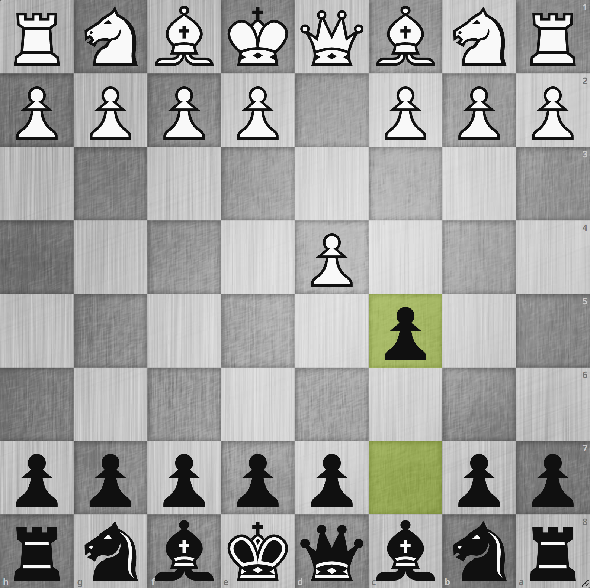
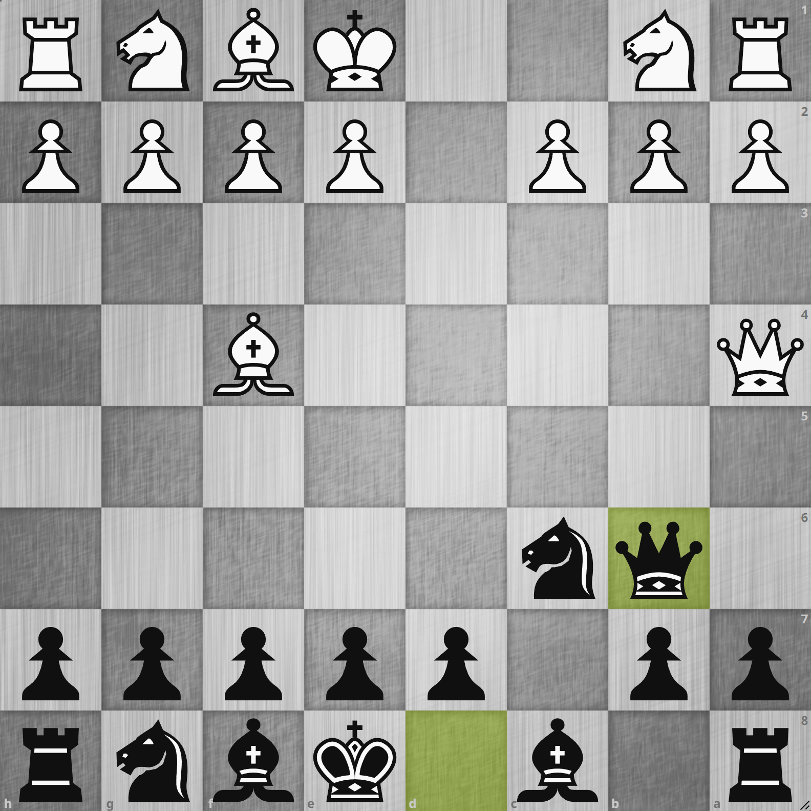
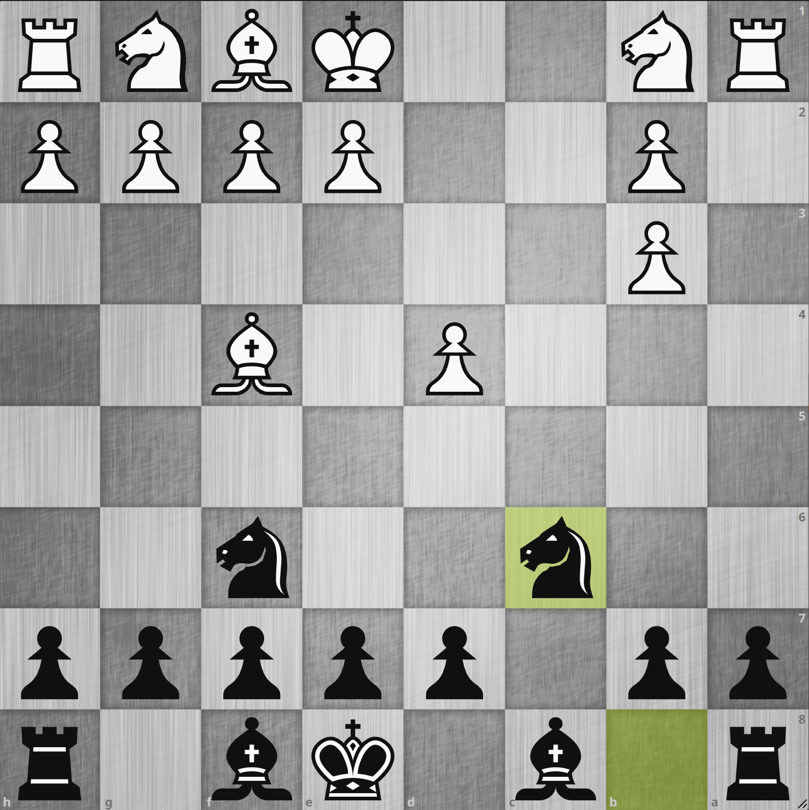
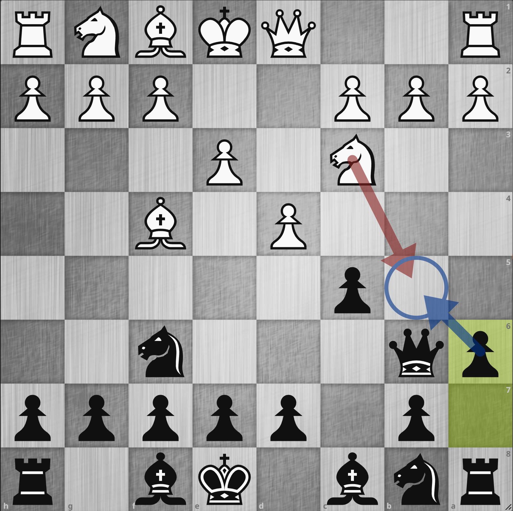
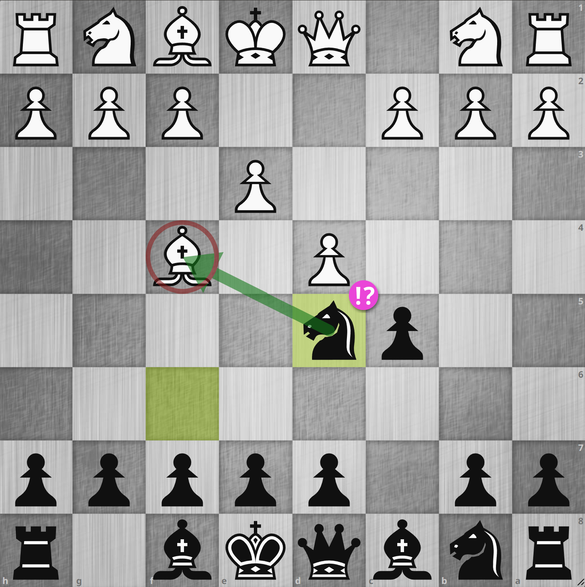

# アンチ・ロンドン・システムの紹介

## ロンドン・システムについて

**ロンドン・システム** という有名なオープニングがあります。
このオープニングの利点は、相手のムーブにあまり影響されずに決まった手順でシステマチックに陣形を組み上げられること、また無難で手堅いことです。
攻め筋も相手の陣形に関わらず大体同じような作戦を使えるので、学習コストが低いのが良いところです。
オープニングの勉強にあまり時間をかけたくない人、または初心者・初級者が一定の効果を上げるのにとても有用だと思います。

ただ、このオープニングは自分が使っているぶんには良いのですが、対戦相手が使ってきた時は全くの対策なしだと前述した特徴から非常に手強く、悩まされます。
相手はほぼノータイムでシステマチックに組み、攻め筋も毎回ほぼ同じなのでそこもほとんど時間を使わずに指してきます。
それに対してこちらはしっかり時間を使って考えどんどん時間が減っていき、一生懸命にやっているはずなのにまるで流れ作業を行っているかのような対応で負けていく。
これに狼狽し、ロンドン・システムの相手をするのが嫌になってしまった方もいらっしゃるかと思います。
私もその一人です。

これを改善するために、今までいろいろ試してきました。
それらも一定の効果を上げることはできましたが、完全に納得がいっていたわけではありませんでした。
そして最近になってこれが決定版ではないか、と思えるようなアンチ・ロンドン・システムに出会えたので、ここではその作戦を紹介していきます。

## オールド・ベノニ・ディフェンス: 1. d4 c5?!

{.img-left}

**1. d4 c5?!**

**オールド・ベノニ・ディフェンス** というオープニングがあります。
これがロンドン・システム対策としてある程度使えますが、相手がロンドン・システムに組んでくるつもりがなくてもベノニ・ディフェンスとして戦っていかなければならないことに注意する必要があります。
なので、ベノニを使うつもりがない場合は使いにくいと思います。

d4 のポーンに初手から直接アプローチすることで、ロンドン・システムに組むのをある程度牽制することができます。
例えば構わずにロンドン・システムに組もうとしてきた時は、以下のようになります。

---

{.img-left}

**2. Bf4 cxd4 3. Qxd4 Nc6 4. Qa4 Qb6**

構わず `2. Bf4` と組んできた場合、そこで `2... cxd4` を入れることでクイーンを d4 に自然に呼び込むことができ、そこで
`3... Nc6` がクイーンを攻撃しつつナイトを展開するというテンポになっている味の良い一手となります。
クイーンをもう 1 回動かさせたところで `4... Qb6` が白の黒マスビショップを f4 に出してしまったことで b2 の守りがなくなってしまったことを咎める手で
**アンチ・ロンドン・システムでよく出てくるアイデアの 1 つ** となります。
ロンドン・システムに限らず b2, g2 のポーンは実は **初期配置ではビショップでしか守られていない**
という点が戦略的に重要になってくることがあるので、初期配置のビショップが動いた場合注意して見てみると相手の隙を突けることがあります。

`2. Bf4` とするとこのようになるので、ロンドン使いとしては d ポーンを盤石にするために `2. c3` と d ポーンを補佐してくることもよくあります[^1]。
この場合は以下のような変化で戦いやすくなります。

---

{.img-left}

**1. d4 c5 2. c3 Nf6 3. Bf4 Qb6 4. Qb3 Qxb3 5. axb3 cxd4 6. cxd4 Nc6**

やはり `3... Qb6` が重要な一手で `3. Bf4` で弱くなった b2 のマスを狙います。
ロンドン使いとしては `4. Qb3` としてクイーンを交換するのがアリとされているのでそれに飛び込みますが、その後 d ポーンを交換していけば
b ファイルに孤立ダブル・ポーンが残り黒結構やりやすいのではないかと思います。

## Agadmator's Anti-London System

{.img-left}

前述のオールド・ベノニ・ディフェンスでも悪くはないのですが、作戦がベノニに固定されてしまうのが難点です。
他のアンチ・ロンドン・システムはないのでしょうか。
勿論あります。
**Agadmator** は海外の有名なチェス・ユーチューバーですが、この方が提唱しているアンチ・ロンドン・システムが一番有名なのではないかと思います。
[Chessable の無料コースもある](https://www.chessable.com/agadmators-anti-london-system/course/62565/)ので学習もしやすいでしょう。
このような手順で始まるものとなります:

**1. d4 Nf6 2. Bf4 c5 3. e3 Qb6 4. Nc3 a6**

前述のオールド・ベノニ・ディフェンスの場合の考え方と結構共通しているのが分かるかと思います。
やはり `3... Qb6` で弱い b2 地点を狙っていくところですが `4. Nc3` が鋭い反撃でナイトを
b5 - c7 までムーブすることでキング・ルークのフォークのスレットを見せるのが目的です。
なので `4... Qxb2!?` などとするとその筋の反撃を食らうのでナイトを b5 に来させないために事前に `4... a6` で予防しておく、といった感じになります。

研究された良いアンチ・ロンドン・システムだと思いますが、この後私はもっと面白そうなのを見つけてしまったのでそちらにシフトしてしまいました。

## Anti-London | Crazy Knight Attack

{.img-left}

[Nate Solon という FM が提唱するアンチ・ロンドン・システムの lichess 研究](https://lichess.org/study/rxrdqKAi) があります。
これを見た時衝撃を受けました。

**1. d4 Nf6 2. Bf4 c5 3. e3 Nd5!?**

`3... Nd5!?` という奇妙なムーブ、これこそがこのアンチ・ロンドン・システムのキー・ムーブとなります。
f4 のビショップを攻撃しているのでテンポになっている[^2]上、先程書いた通り白の重要な反撃である `Nc3` を牽制している手です。
勿論白は `Nc3` を指すことはできますが、その場合は構わずエクスチェンジし有利に事を運ぶ変化が前述の研究に記されています。

ここでは、私の実戦譜や試行錯誤などを交えてこの画期的なアンチ・ロンドン・システムの検討を行っていく予定です。
前述の Agadmator's Anti-London System もそうなのですが、それなりに変化が多いので習得にはある程度の修練が必要でしょう。
ここで検討を記録しておくことで私自身だけでなく皆様にも参考情報として見ていただけるのではないかと考えます。

[^1]: `2. e3` は黒マスビショップが f4 に出せなくなってしまうのでロンドン使いは選択しません
[^2]: f4 のビショップを無条件にエクスチェンジされたらポーン・ストラクチャも乱れるし白不満なのは明らか