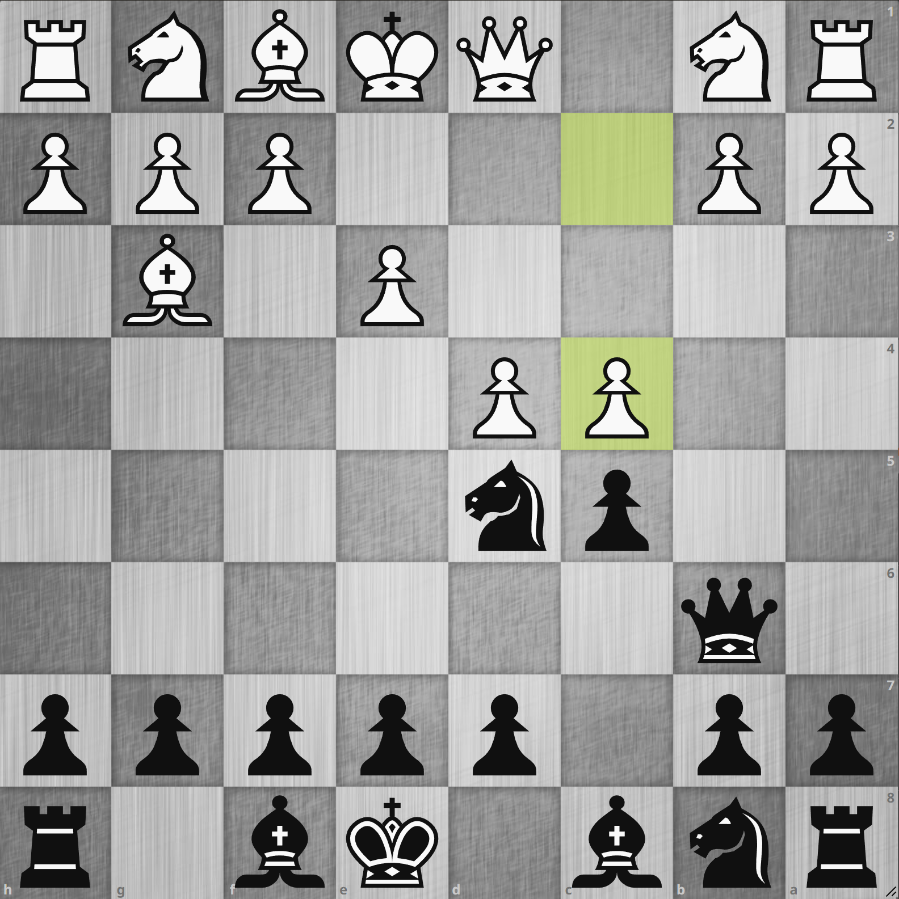
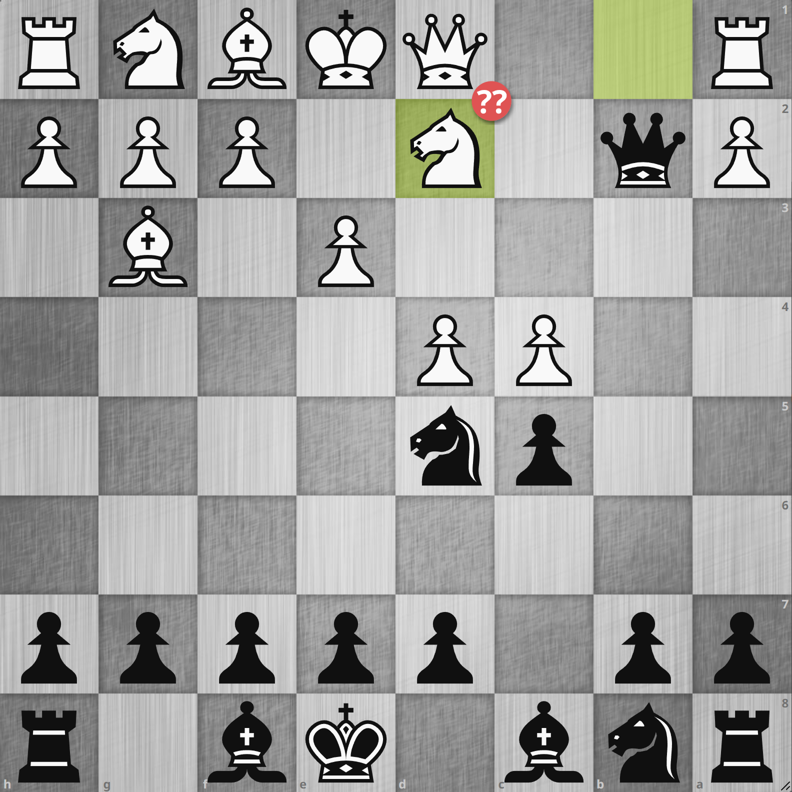

# 4. Bg3 Qb6 5. c4

<iframe width="560" height="315" src="https://www.youtube.com/embed/s9OUjeXzSCQ" title="YouTube video player" frameborder="0" allow="accelerometer; autoplay; clipboard-write; encrypted-media; gyroscope; picture-in-picture; web-share" allowfullscreen></iframe>

{.img-left}

**1. d4 Nf6 2. Bf4 c5 3. e3 Nd5 4. Bg3 Qb6 5. c4**

**4... Qb6** からいくつかのラインに分岐するところですが、今回は **5. c4** を選択してきました。
d5 のナイトを攻撃する積極的な手のようですが `Qxb2` した後にナイトが取られてもルークが取れるというスレットになるので危うそうな手に見えます。
Stockfish に聞いてみると最善は `5... Nf6` とナイトを戻す手のようですがちょっと指しにくいです。
`5... Nf6 6. b3 cxd4 7. exd4` と進みそうなところで、白のクイーンサイドの白マスが弱くなりそうでまずまずに見えますがハッキリとは分かりません。

lichess データベースを見てみても本譜と同様の **5... Qxb2** が一番よく指されていました。
ここは `6. cxd4` とナイトを取って白から見てエクスチェンジ・ダウンするラインを選ぶのが最善らしいですが、これは事前知識がない限り人間としては選びにくいです。
なので **5... Qxb2** で普通に指しやすいのではないかと思います。

---

{.img-left}

** 5... Qxb2 6. Nd2??**

やはりエクスチェンジ・ダウンを避けるにはこの手を指さざるを得ません。
しかしこれには **6... Nc3!** とするとクイーンは c1 しか有効な行き先がないため **7. Qc1**
とするところですが、そこでクイーンをエクスチェンジした後にナイトで端のポーンを取ることでツー・ポーン・アップという結果となり、黒優勢となりました。