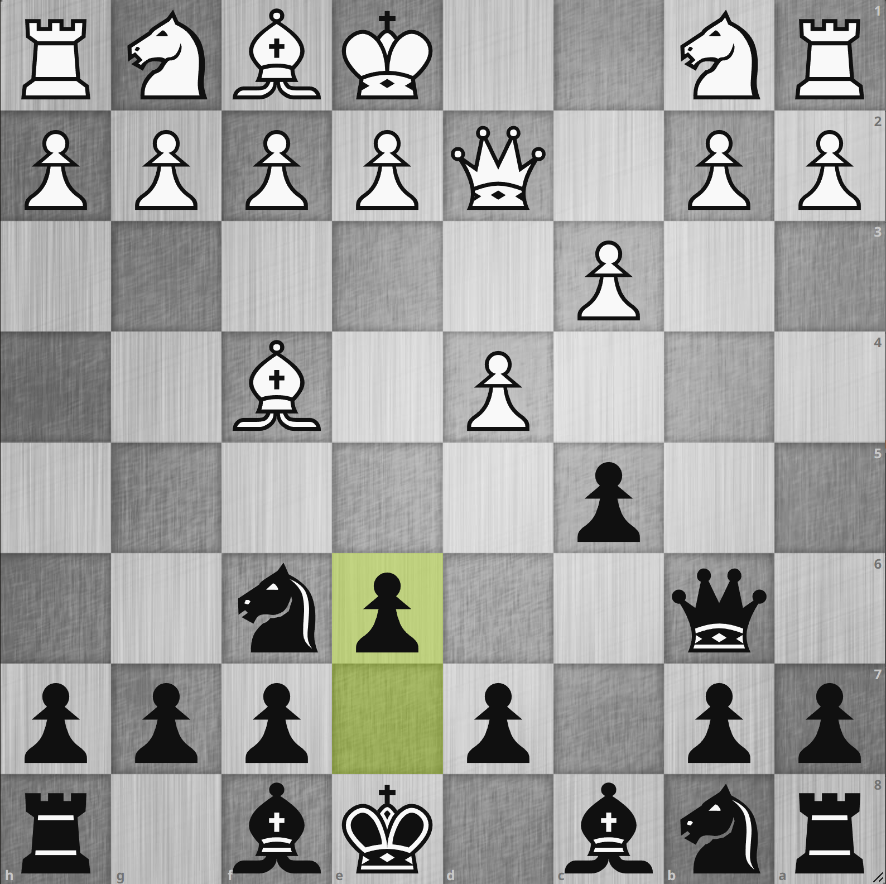
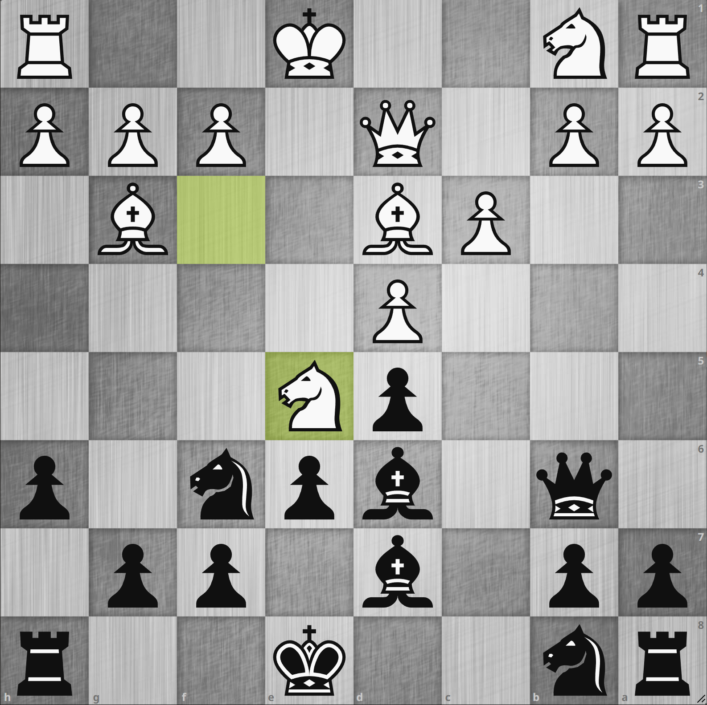
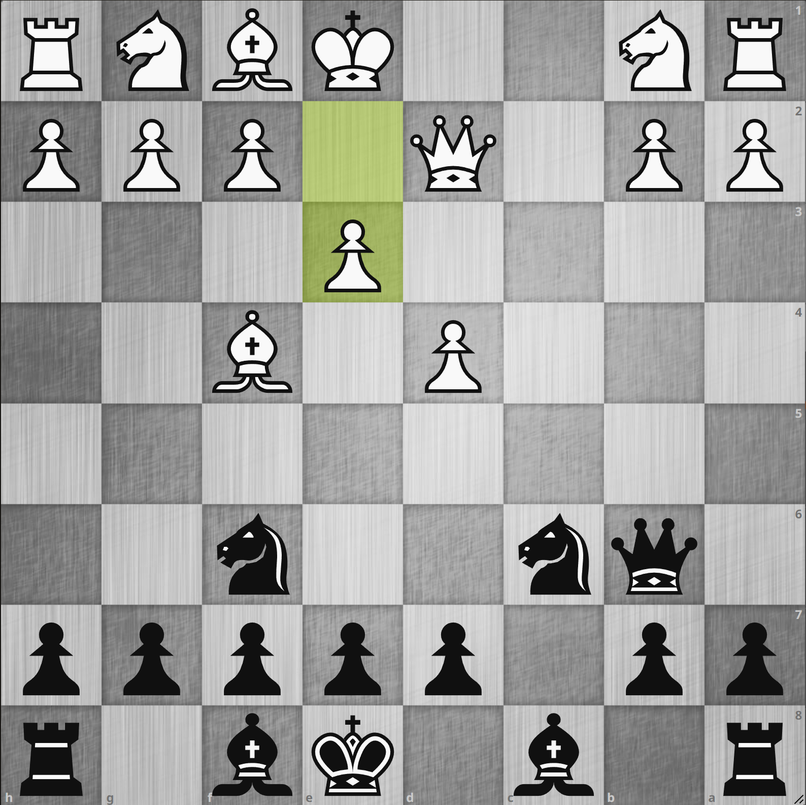

# 4. Qd2 e6

<iframe width="560" height="315" src="https://www.youtube.com/embed/L3_c3YfJtJc?si=Caf0d8KD5qxO-hoo" title="YouTube video player" frameborder="0" allow="accelerometer; autoplay; clipboard-write; encrypted-media; gyroscope; picture-in-picture; web-share" allowfullscreen></iframe>

{.img-left}

**1. d4 Nf6 2. Bf4 c5 3. c3 Qb6 4. Qd2 e6**

**3... Qb6** は b2 を攻撃している手なので例えば `4. Qb3` や `4. Qc2` などで守るところですが、今回は **4. Qd2** を選択してきました。
ここで **4... e6** を指して c5 ポーンのサポート及び、あわよくば `5... cxd4 cxd4 Bb4`
のような感じで攻めていくことを考えましたが、lichess データベースや解析をあたってみたところここではヌルい手のようでした。
実際この後 **5. e3** とされてしまい **5... cxd4 exd4** と e ポーンで取られてしまいます。

---

{.img-left}

**5. e3 cxd4 6. exd4 d5 7. Bd3 Bd6 8. Bg3 Bd7 9. Nf3 h6 10. Ne5**

今回このように進みました。
この局面自体は互角であり、形勢はそこまで悪い局面ではありません。
しかしやはり **7. Bd3** や **8. Bg3** に **10. Ne5** といった **ロンドン・システムお決まりのムーブ**
を許してしまったところが黒としては不満ということになります。
何故なら相手はロンドン・プレイヤーであり、この後ロンドン・システムでよくある戦術でほぼ時間を使わずに遮二無二攻めかかってくるのが予想できるからです。
では、どのようにすればよかったのでしょうか。

---

{.img-left}

**1. d4 Nf6 2. Bf4 c5 3. c3 Qb6 4. Qd2 cxd4 5. cxd4 Nc6 6. e3**

白に e3 を突かれる前に `4... cxd4` を入れてしまうのがポイントで、そうすることで `5. cxd4` をほぼ強制できます[^1]。
その後 `5... Nc6` と d ポーンを狙っていけば黒かなりやりやすそうな局面に見えます。
当然白は `6. e3` と守ってきますが、この後 `6... Ne4` から攻めが続きます。
ロンドン・システムのペースに持ち込まれないように Bd3 や Nf3 を入れさせる前にどんどん攻めていくのが良さそうです。

[^1]: `5. Qxd4` は `5... Qxb2` でルークが助からず黒勝勢
