# 2022-06-25 北千住チェスクラブ

## 1R: 白, ポーリッシュ・オープニング

いつも当たる K さんとの対局です。

**1. b4!**

<figure markdown>
  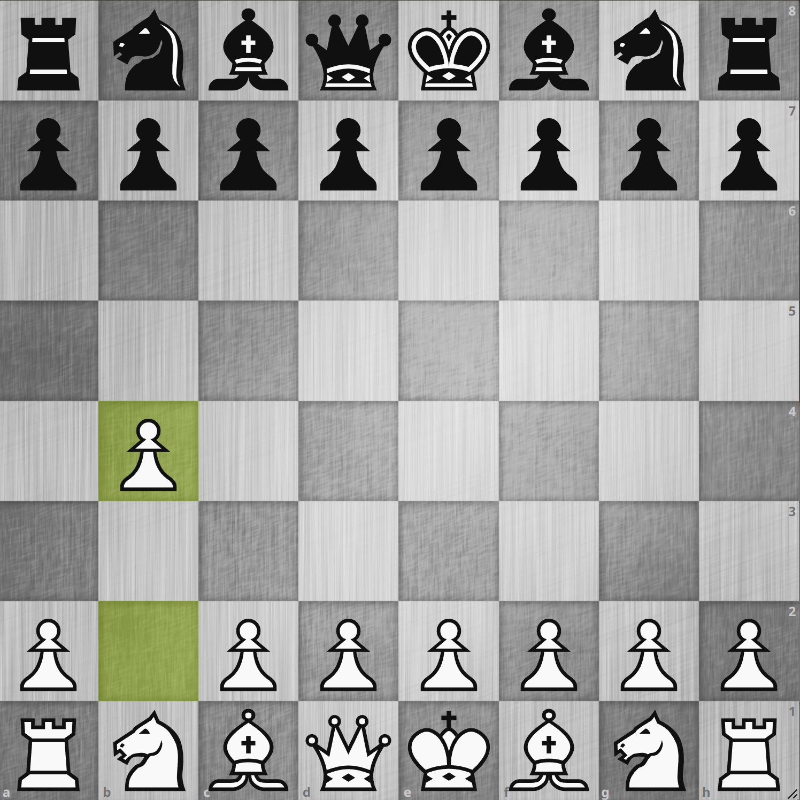{class="img-center"}
</figure>

OTB で初めて**ポーリッシュ・オープニング**を指してみました。
ここでどう応手してくるかですが、割とノータイムで応対されました。

**1.. Nf6**

<figure markdown>
  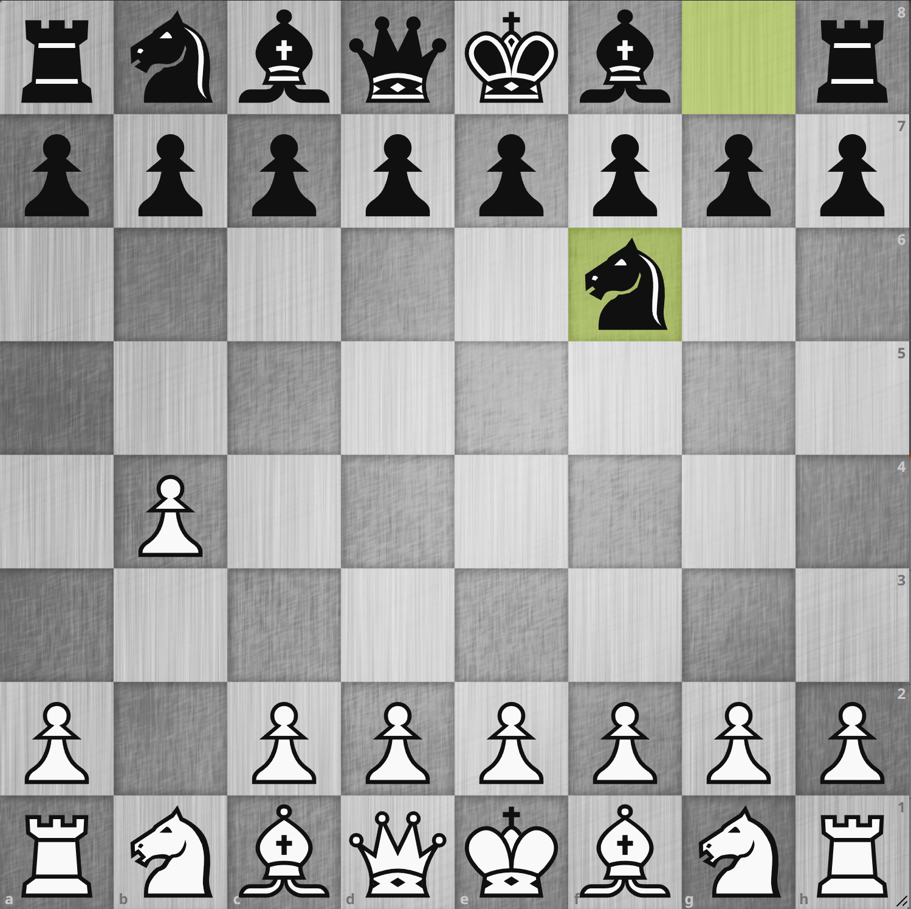{class="img-center"}
</figure>

インディアン・ゲーム風味の応手で手堅い手です。
以前 `1. d4` を指した時もこう応手されたので `1. e4` 以外はこの手で行こうと決めているのかもしれません。
実際これで悪くありません。

**2. Bb2 e6 3. b5**

<figure markdown>
  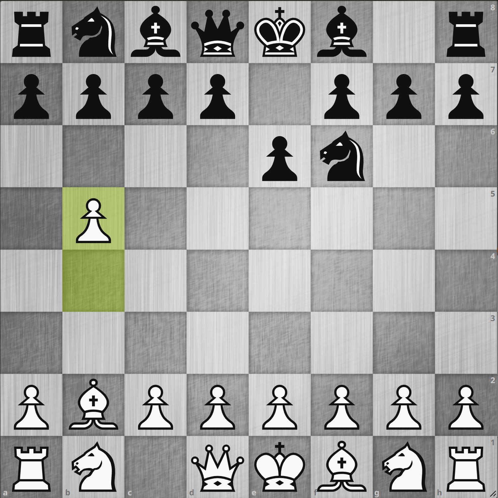{class="img-center"}
</figure>

`2.. e6` で b4 の浮いているポーンを狙われました。
ワザと狙わせるのがポーリッシュ・オープニングの狙いの一つではありますが Nf6 と出られている形だと取られた後の反撃手段がありません。
そこでこのように `3. b5` と突いて c6 地点へナイトが出てくるのを牽制します。
よくあるアイデアですが少し考えてしまいました。

**3.. b6 4. e3 d5 5. Nf3 Bb7**

<figure markdown>
  {class="img-center"}
</figure>

クイーンズ・インディアン・ディフェンスの形です。
以前 `1.d4` を指した時も同じ形にされたので、やはりこのように組むと前もって決めているのだと思いました。

**6. d4?! Bd6 7. Bd3 O-O 8. O-O a6**

<figure markdown>
  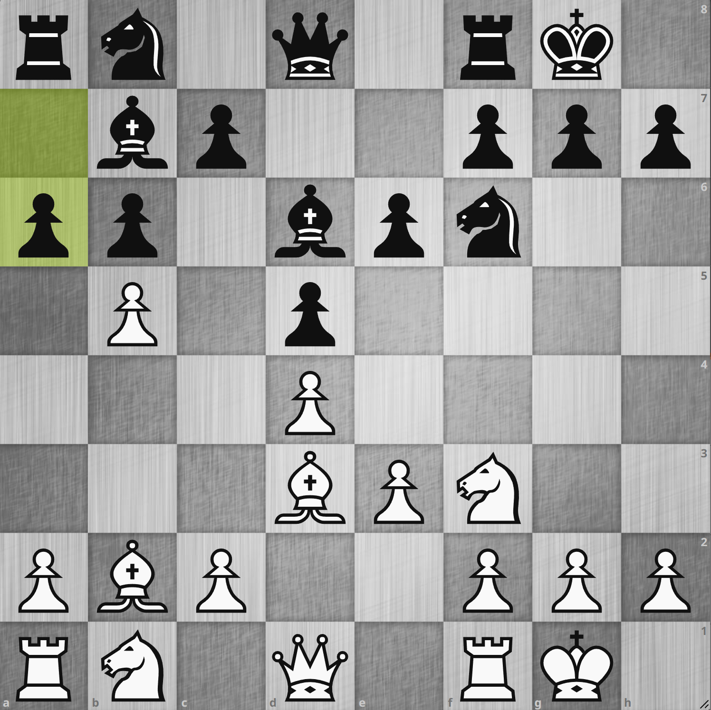{class="img-center"}
</figure>

`6. d4?!` は確かに疑わしい手で b2 のビショップの利きを遮ってしまいます。
ただ黒の d5 のポーンをとめることで相手の b7 ビショップの利きを遮断する効果があるのですが、相手からは然るべき用意をした上で `.. e5` を突いて斜線を開くことができます。
お互い無難な駒組み及びキャスリングした後 `8.. a6` と b5 ポーンを攻撃してきました。

**9. a4 Nbd7 10. Nbd2 Ne4**

<figure markdown>
  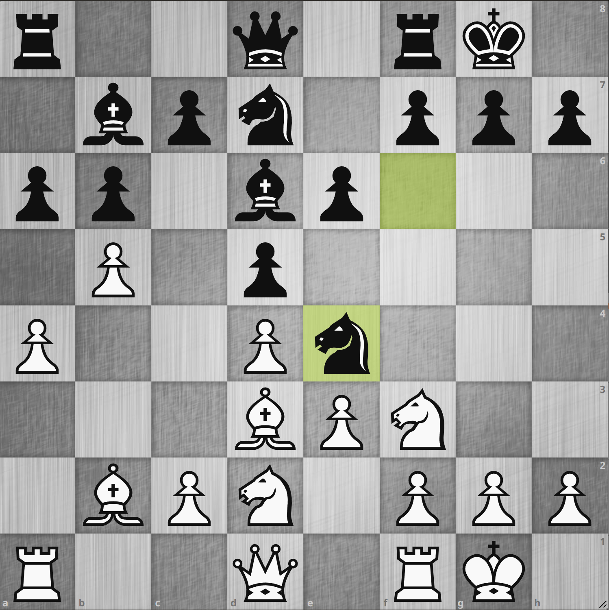{class="img-center"}
</figure>

この `10.. Ne4` はなるほどと思いました。
`11. Nxe4??` は `11.. dxe4` でポーン・フォークされピース・ダウンしますし
`11. Bxe4? dxe4` も好位置のビショップを失った上にナイトが攻撃されて不格好な位置に行かなければならず苦しい形になります。
よってこのナイトはこちらから取りに行くことができません。
なので出遅れている c ポーンの形を改善する方向で手を進めることにしました。

**11.c4 Nxd2 12. Nxd2 Re8 13. Re1?!**

<figure markdown>
  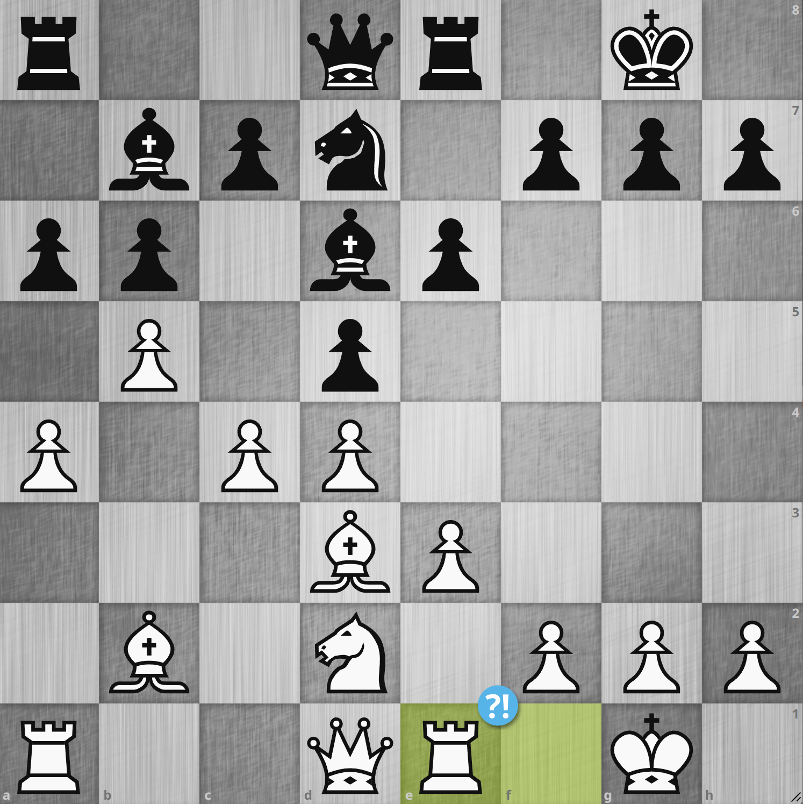{class="img-center"}
</figure>

`13. Re1?!` は明らかに `12.. Re8` に備えた手ですが受け身の手です。
`13. Qc2` のような手はミエミエの狙いではありますが、明らかに相手に `13.. Nf6` や `13.. h6` などの応手を強制させる手であり、こちらのほうが積極的です。

**13.. Nf6?! 14. h3?! c6? 15. e4?**

<figure markdown>
  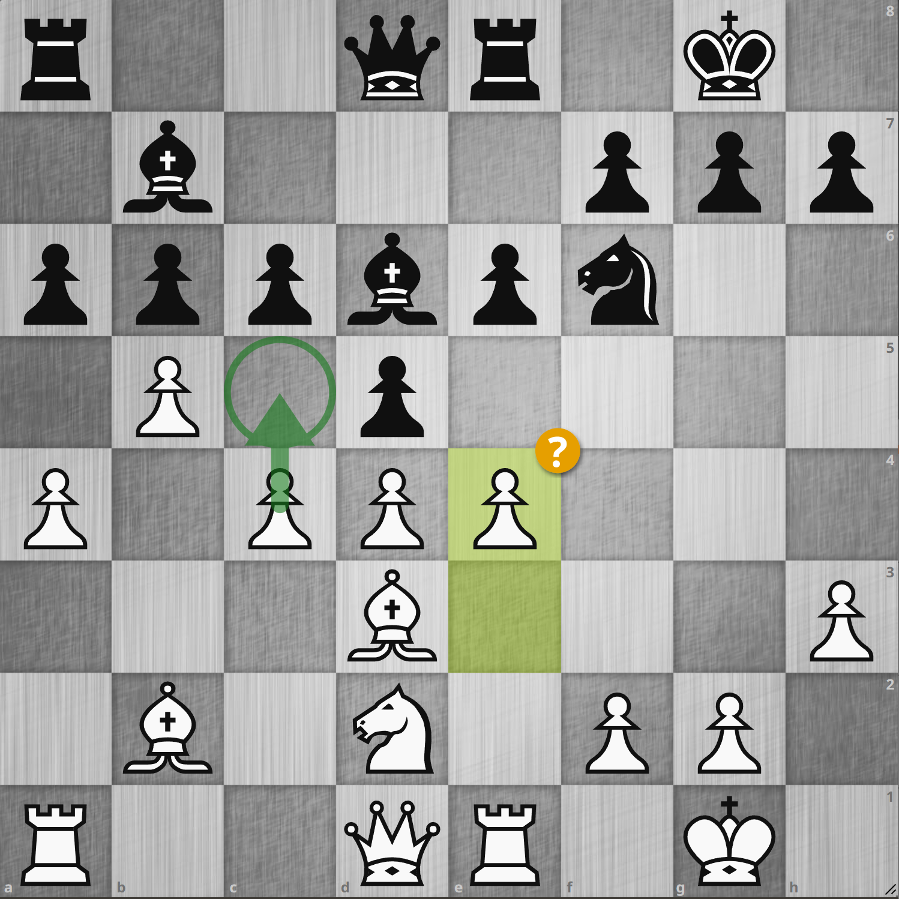{class="img-center"}
</figure>

このあたりの攻防はかなり疑わしいところです。
まず `14. h3?!` は `.. Bxh2+` サクリファイスから危なくなる順があるのではないか？
と考えて **指させられた手** となります。
実際のところ `14. Qc2 Bxh2+` とされても `Kxh2 Ng4+ Kg1 Qh4 Nf3` くらいで受かっているのですが、読み切ることができませんでした。
`14.. c6?` に対しては `15. c5!` が強手で、例えば `15.. bxc5 16. dxc5 Bxc5 17. Rc1 Qd6 18. Nb3` などとなり一旦ポーンダウンしますが取り返せます。
ただ一旦ポーンダウンする順というのはどうしても読み切っていないと選びにくいです。
`15. e4?` はナイトのポジションを改善しつつツー・ビショップの斜線を開いて攻めようという手です。

**15.. dxe4 16. Nxe4?! Nxe4?? 17. Bxe4**

<figure markdown>
  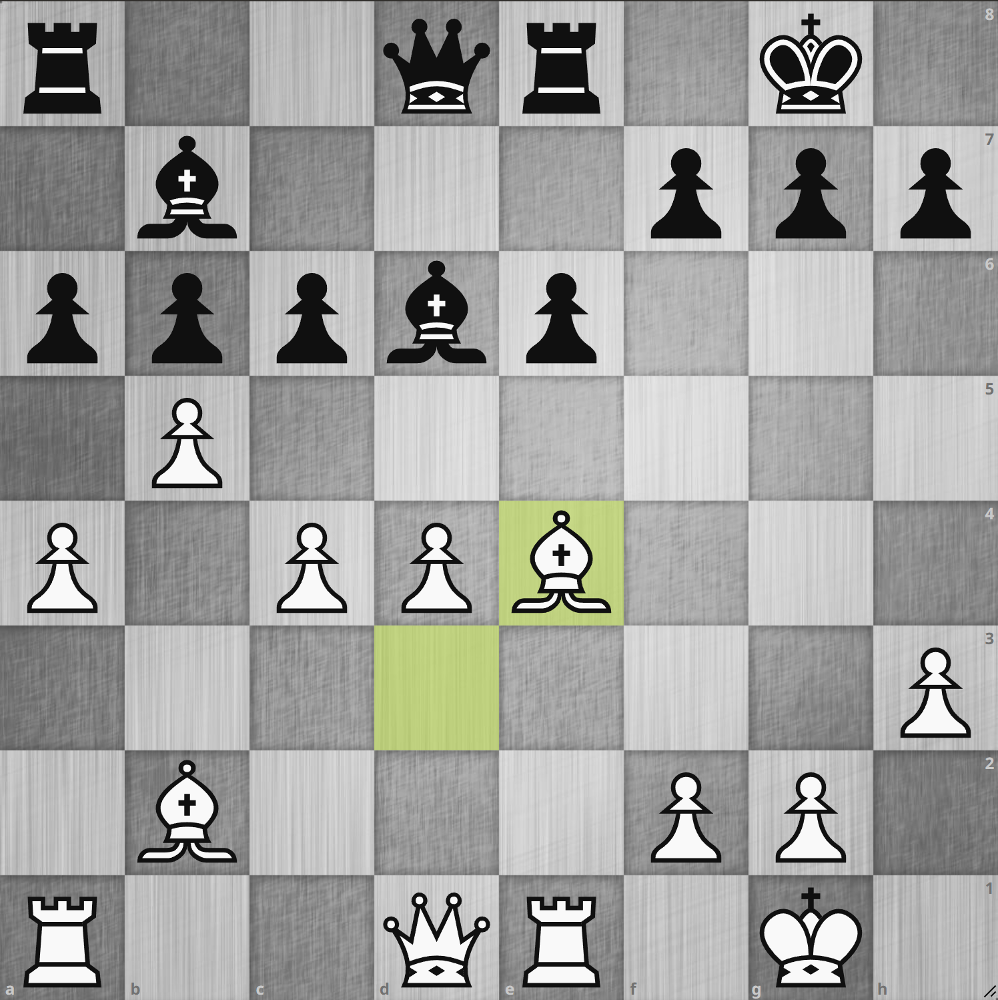{class="img-center"}
</figure>

`16.. Nxe4??` がブランダー扱いとなっているのは次の `17. Bxe4` でビショップが好位置に来てしまい、この後
`18. Qf3` などと弱い c6 ポーンが攻撃されてしまうからだと思います。

**17.. Qc7?! 18. Qh5 g6? 19. Qg5??**

<figure markdown>
  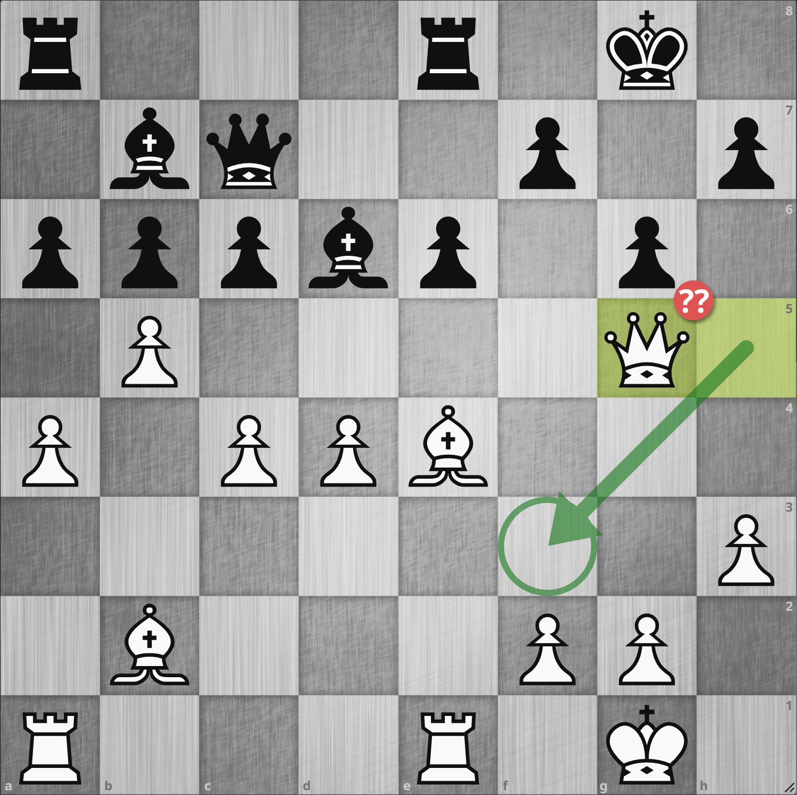{class="img-center"}
</figure>

`18. Qh5` が直接的な狙いですがやはりこういう手が功を奏することがよくあります。
`18.. g6?` で明らかに相手のキャスリング陣形が弱くなり、一本取った形です。
ただ `19. Qg5??` は次の手を見落としており、あまり迫っていない形です。
`19. Qf3` として弱くなった黒マスと c6 地点を同時に狙っていくほうがはるかに効果的でした。

**19. Be7? 20. Qh6? Bf8 21. Qg5 Bg7**

<figure markdown>
  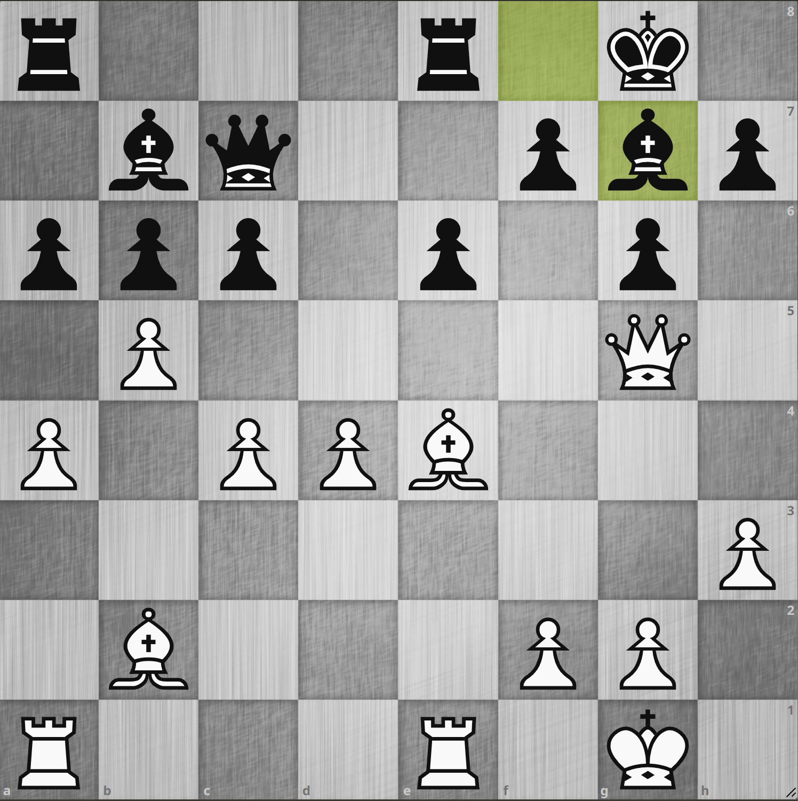{class="img-center"}
</figure>

クイーンを行ったり来たりさせているうちに、弱い黒マスにフィアンケットされる形で埋められてしまい攻撃の手がかりを失ってしまいました。

**22. Rab1?! axb5 23. axb5 Red8?! 24. Red1?! Ra2??**

<figure markdown>
  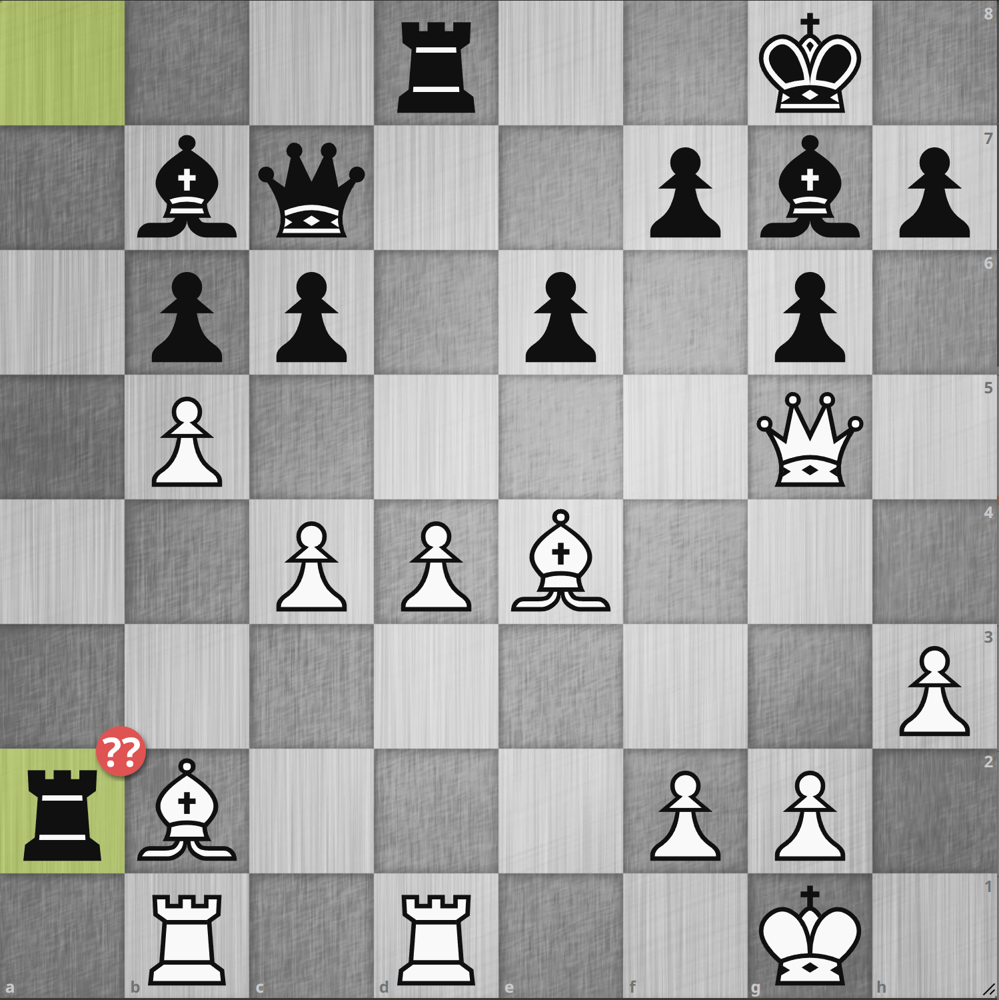{class="img-center"}
</figure>

結果的にですがこの `24.. Ra2??` が相手の方の敗着となりました。
ルークを敵陣に送り込む手は確かに有効でこちらの d ポーンが無くなってフィアンケット・ビショップやもう一つのルークが参戦できればかなりの脅威となります。
しかしそれができなければ孤立したルークは攻撃の目標にされやすく、諸刃の剣です。
そして恐らく相手の方は次の手を見落としていました。

**25. bxc6!**

<figure markdown>
  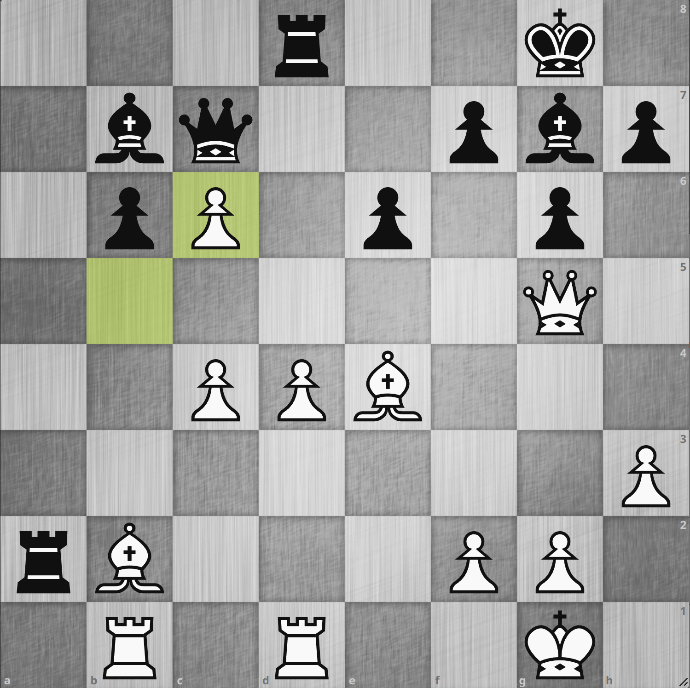{class="img-center"}
</figure>

`25.. Bxc6 26. Bxc6 Qxc6 27. Qxe8+` となりルーク・ダウンしてしまうため、黒はこのポーンを取り返すことができません。
これが前の手でルークを敵陣に送り込んでお互いのルークを孤立させてしまった結果となります。
ルークが連結されていればこうなりませんでした。

**25.. f6?? 26. Qe3? Bxc6 27. d5!**

<figure markdown>
  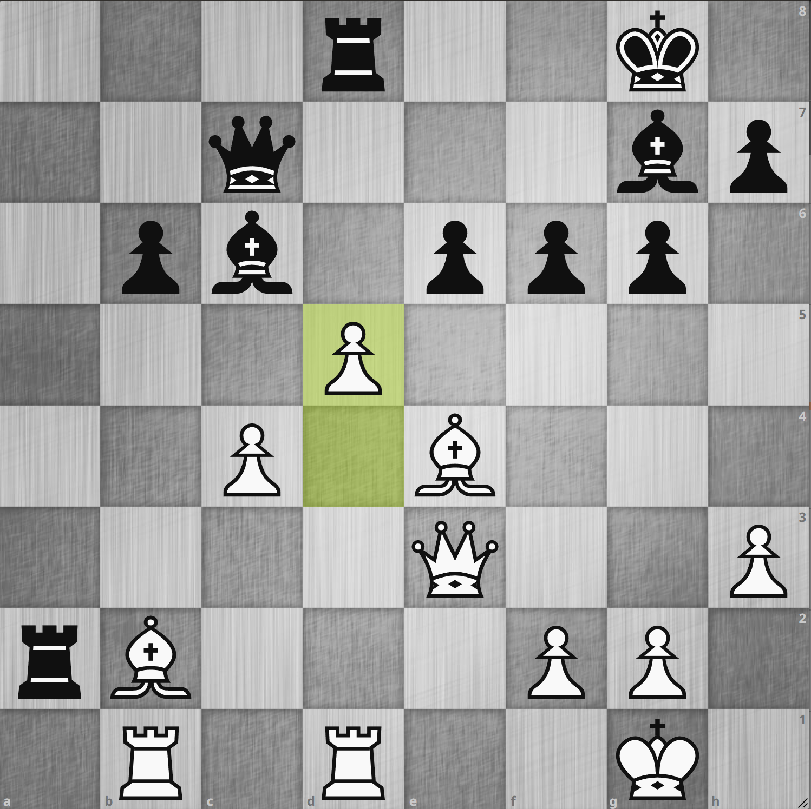{class="img-center"}
</figure>

やはり a2 のルークが孤立しているのをみて、更に攻撃を加えようと斜線を開きにいきました。

**27.. exd5? 28. cxd5 Bb7?! 29. d6!**

<figure markdown>
  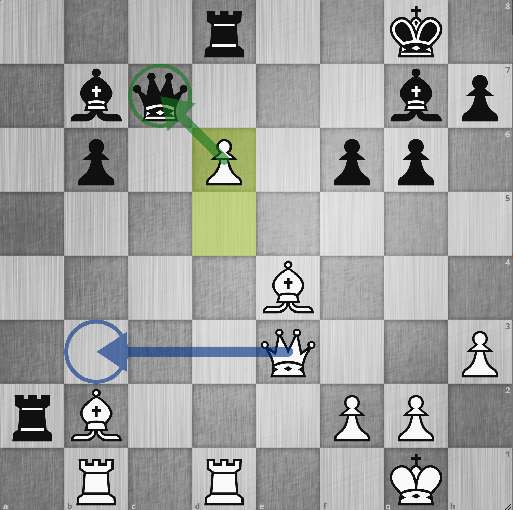{class="img-center"}
</figure>

決め手になりました。
この `29. d6!` はクイーンを攻撃している手ですが、それと同時に次の `Qb3+` のキング・ルークのダブル・アタックを狙っています。
且つクイーンが b7 ビショップの守りから外れたら Bxb7 とテイクする狙いもあります。
一例としては `29.. Rxd6 30. Rxd6 Qxd6 31. Bxb7 Rxb2 32. Rxb2` となり、ルーク・アップで勝勢です。

**29.. Qf7 30. Bxb7 Rxb2 31. Bd5 Qxd5 32. Rxd5 Rxb2+ 33. Kh2**

<figure markdown>
  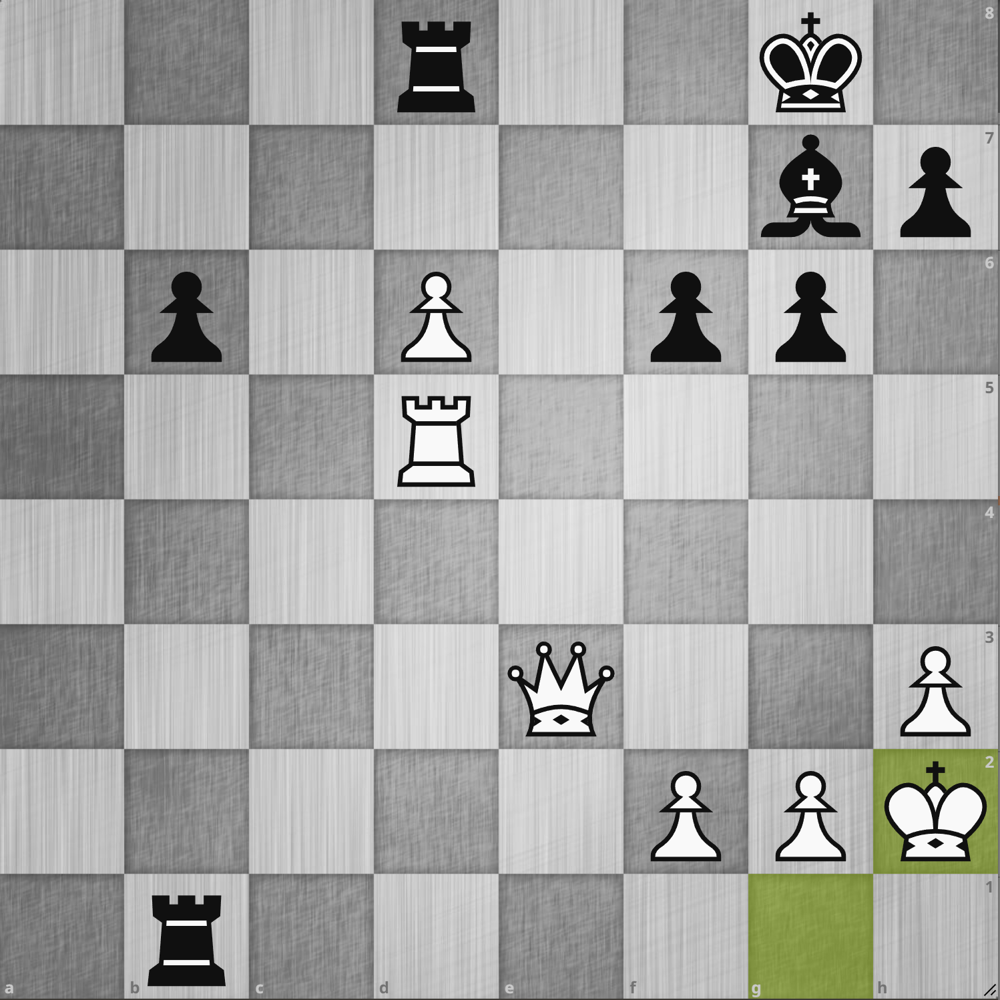{class="img-center"}
</figure>

`31. Bd5` はクイーンを消しに行った手ですが、普通に `31. Rxb2` くらいでも勝ちでした。
結果的に QR vs RRB になりこれでも勝勢ですが、クイーンを残してしまうともしかしたら逆転されてしまうかもしれない、という思いに駆られてしまいました。

**33.. Bf8 34. d7?! b5?? 35. Qe8 Rxe8?! 36. dxe8=Q b4 37. Rd8 1-0**

<figure markdown>
  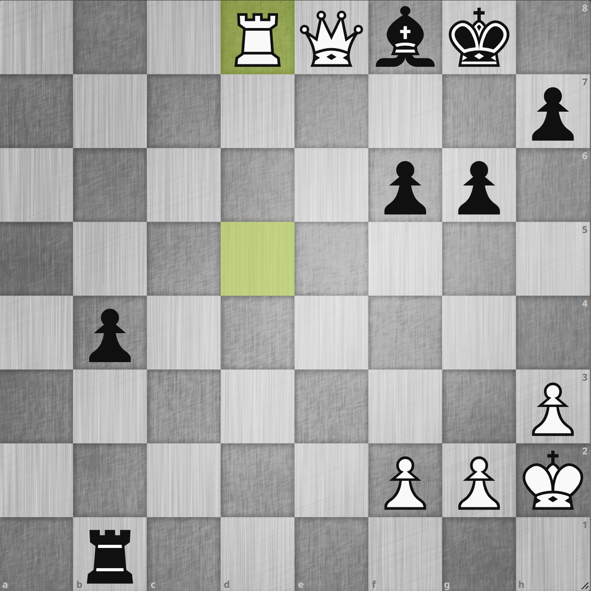{class="img-center"}
</figure>

ビショップはもう助からず、メイトも避けられない形となりました。

<iframe width=900 height=400 src="https://lichess.org/study/embed/0Gsow1PX/nwWdQvjq?theme=metal" frameborder=0></iframe>

## 2R: 黒, イングリッシュ・オープニング

2 戦目は A さんで確か 3 回目くらいの対戦です。
しかし私が黒なのは初だと思います。

**1. c4 Nf6 2. Nf3 g6 3. g3 Bg7 4. Bg2 O-O 5. O-O**

<figure markdown>
  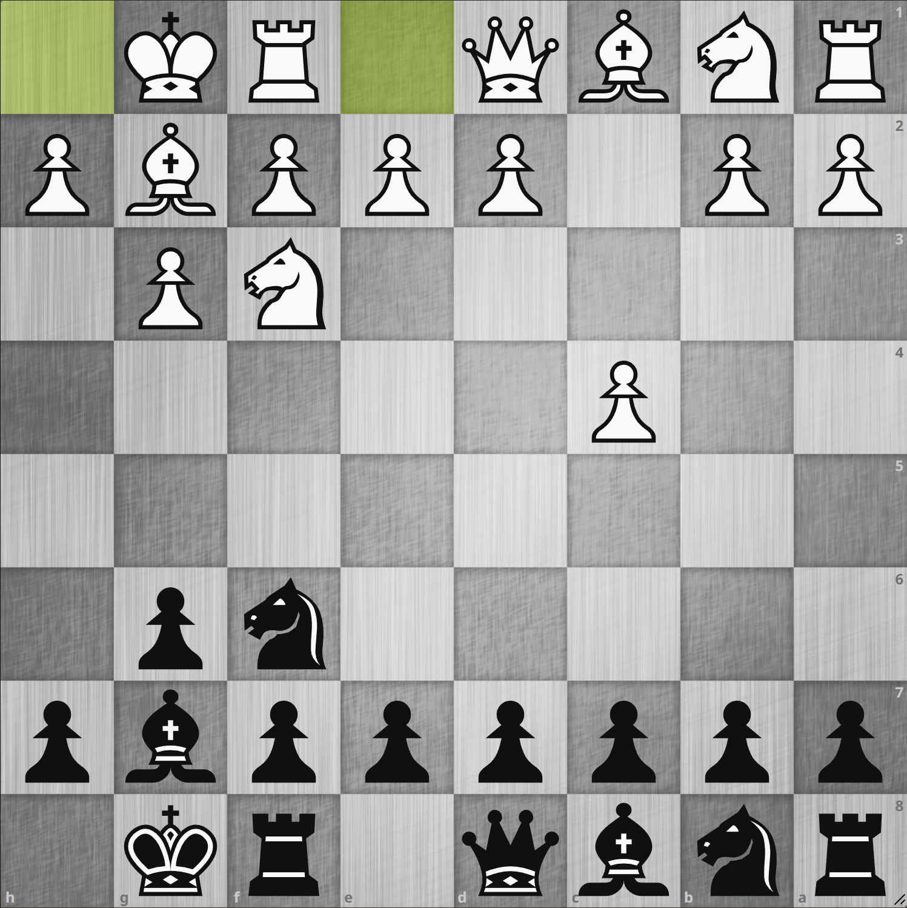{class="img-center"}
</figure>

イングリッシュ・オープニングから始まってお互いフィアンケットしてキャスリングする、特筆すべきことはない始まり方です。

**5.. c6 6. Nc3 d5 7. d3?! dxc4 8. dxc4 Be6?!**

<figure markdown>
  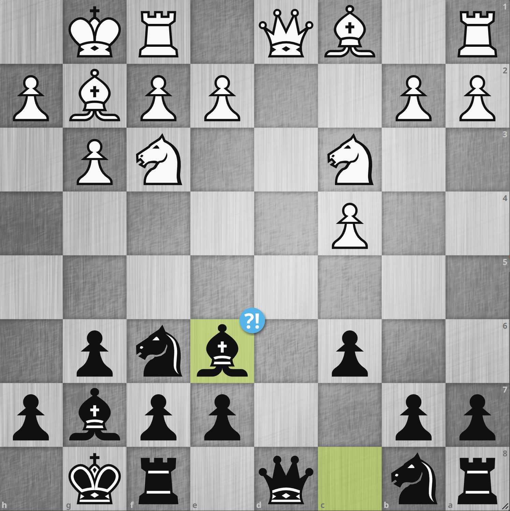{class="img-center"}
</figure>

`7. d3?!` がちょっとアレッと思った手で `7.. dxc4 8.dxc4` でクイーン交換の主導権がこちらにある形になります。
ただ、なんだか誘われている気がしてクイーン交換はせずに `8.. Be6?!` としてしまいました。
今思えばクイーン交換して普通に戦うべきでした。

**9. Qa4 Nbd7 10. Rd1 Qb6 11. Be3?!**

<figure markdown>
  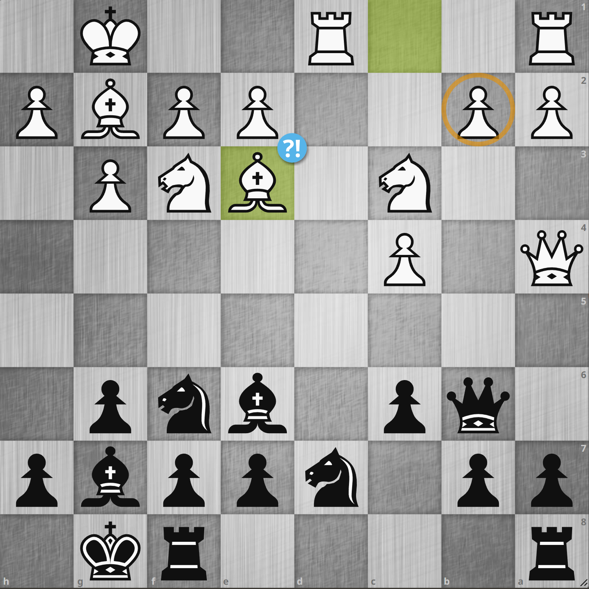{class="img-center"}
</figure>

長考された上で `11. Be3?!` を指してきました。
これは明らかに b ポーンが**毒入りだから取ってこいよ**と言っているように見えます。
そこで私もしっかり考えることにしましたが、これは b ポーンを取った後に c3 のナイトにも当たるしそこまで狭くなさそうで逃げ切れるように見えました。
怖いところですが**ここで日和っていては後で後悔する**と思ったので、果敢にも取っていきました。

**11.. Qxb2 12. Rab1?? Qxc3 13. Rdc1**

<figure markdown>
  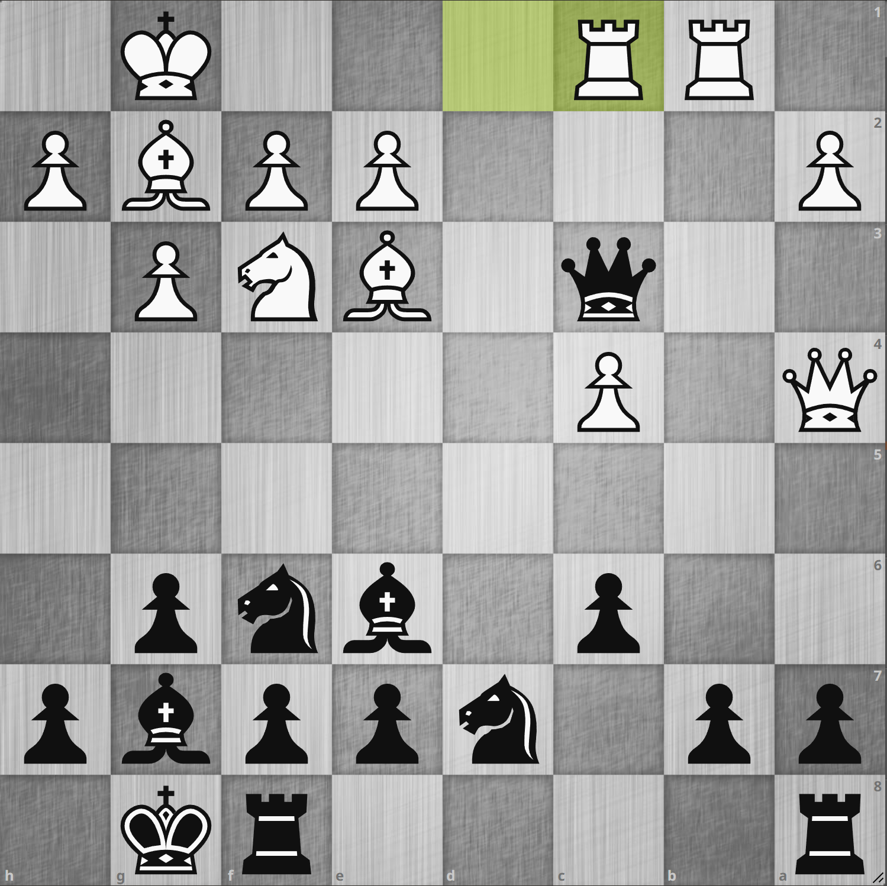{class="img-center"}
</figure>

見事、クイーンが捕まったように見えます。
ルークと刺し違えたとしてもかなり厳しいところではあります。
ただ、解析した今だから言えることですがここは `13.. Nb6!` とクイーンを攻撃して手を稼ぎ
`Qd1` などと逃げたところで悠々とクイーンを逃がせば普通にピース・アップでこちらが勝勢でした。
しかし私は恐れをなして思考停止してしまい、ルークと刺し違える順を選んでしまいました。

**13.. Qxc1+?? 14. Rxc1 a6? 15. Qb4??**

<figure markdown>
  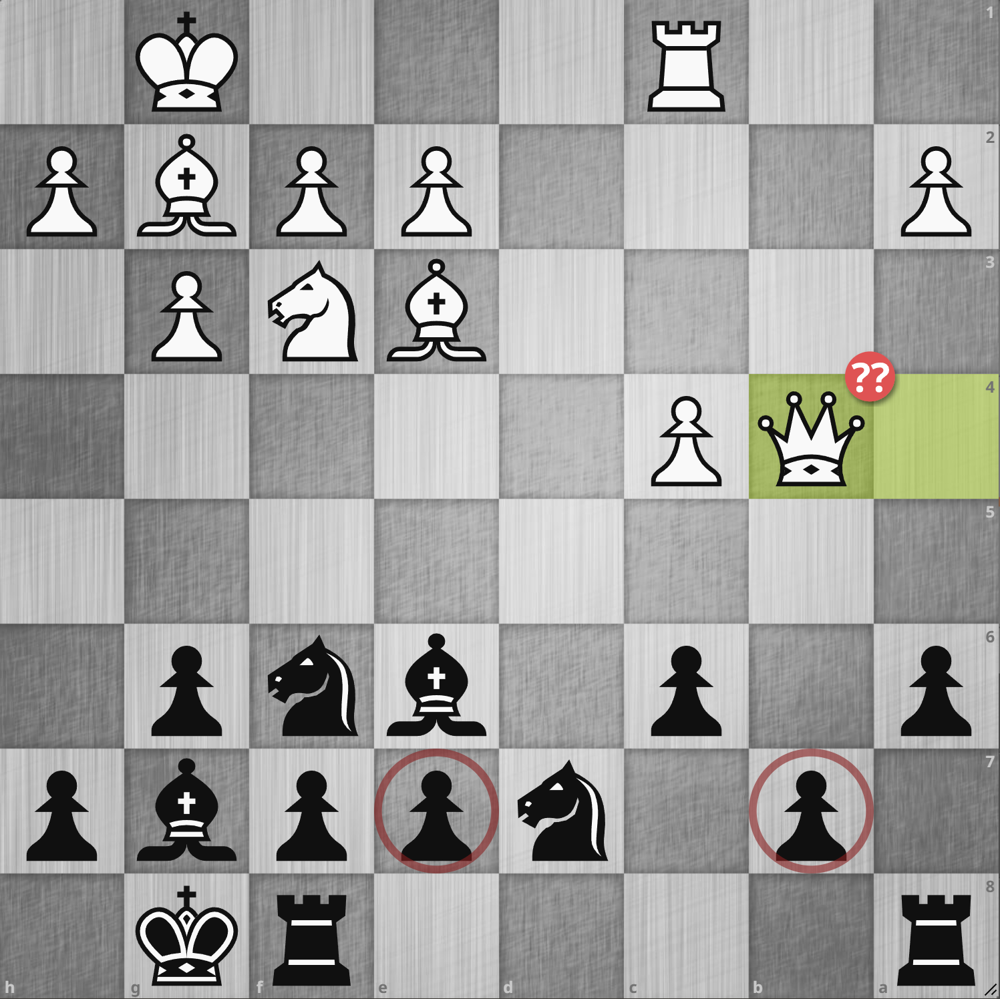{class="img-center"}
</figure>

解析的にはブランダー扱いとなっていますが b7 と e7 と同時に受ける手がなく、普通に脅威でした。
このあと戦意喪失気味で消化試合のような内容のムーブを連発してしまい、敗北しました。
結果的に言えることは、今回の相手の方は私はまだ勝ったことがなく、相手の実力に勝手に怯んでしまった結果が出てしまったのだと思いました。

<iframe width=900 height=400 src="https://lichess.org/study/embed/0Gsow1PX/fPd6FHOM?theme=metal" frameborder=0></iframe>