# 2022-07-23 北千住チェスクラブ

## 1R: 白, ピルツ・ディフェンス 

今回の例会は暑さのせいか参加人数が少なかったです。
なので前回に引き続き A さんと当たりました。
とても強い方で、毎回ボコボコにされています。
今回も負けはしましたが**今までで一番まともな試合**になりました。

**1. e4 d6 2. d4 Nf6 3. Nc3 g6 4. Nf3?! Bg7 5. Bc4 O-O 6. O-O Bg4**

<figure markdown>
  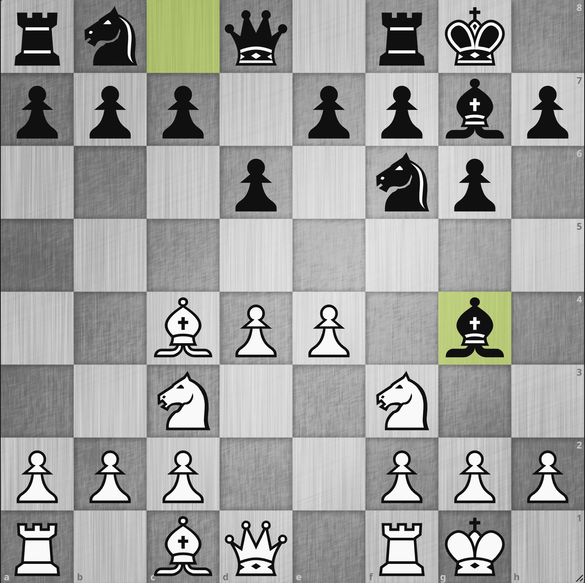{class="img-center"}
</figure>

いつものピルツ・ディフェンスです。
分かってはいるのですが、これがとても強いです。

**7. Be2 Nc6 8. d5 Bxf3 9. Bxf3 Ne5 10. Be2 c6 11. f4 Qb6+**

<figure markdown>
  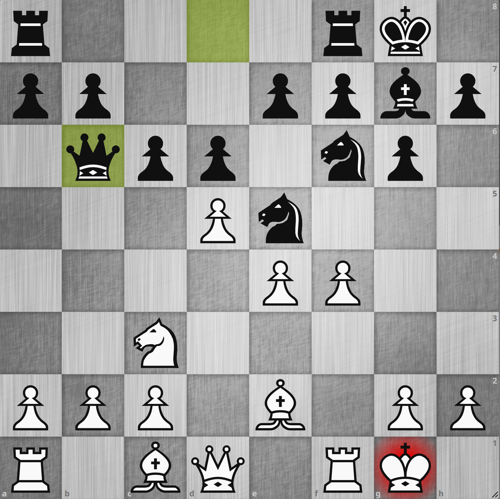{class="img-center"}
</figure>

`7. Be2` はピルツでよくある `... Nxe4 Nxe4 d5!` とポーン・フォークされてしまう筋を警戒したもの[^1]ですが消極的な手です。
ここは `7. h3` 程度で良かったところでした。
`7... Bxf3 Qxf3` となれば `... Nxe4` の筋は成立しません。

`11. f4` は積極的に行った手ですが当然守備力は弱まります。
`11... Qb6+` から弱い b2 地点及び連結されていないクイーン・サイドのルークの防御の懸念が出てきます。

**12. Kh1 Ned7 13. Rb1 cxd5 14. Nxd5 Nxd5 15. exd5 Nf6 16. Qd3?!**

<figure markdown>
  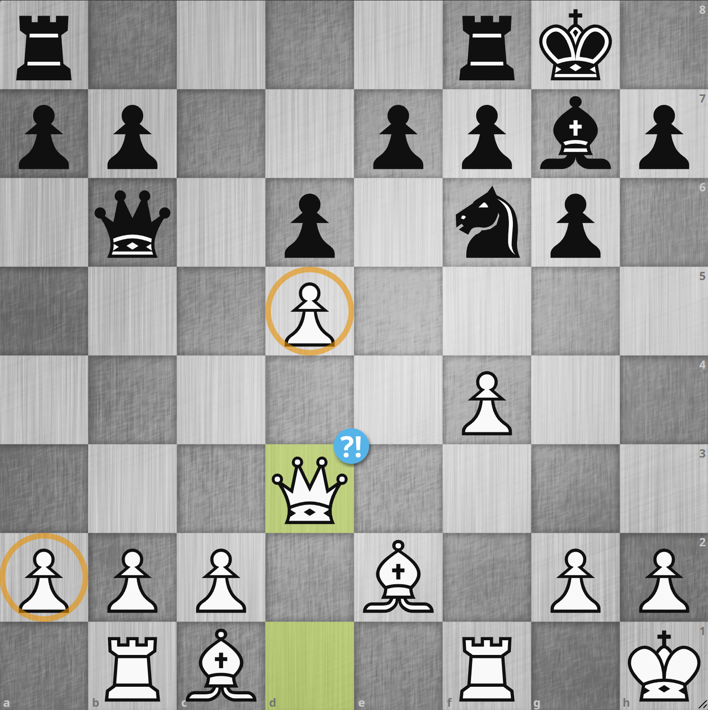{class="img-center"}
</figure>

`15... Nf6` の意図がすぐに読めず、あっそうか Qa5 を狙っているんじゃないか、とは気づきました。
ただそこで混乱した私は `16. Qd3?!` という訳のわからない手を繰り出してしまいました。
`16... Qa5` には `17. Qb3` を用意したつもりでしたが、結局 d5 のポーンが落ちてしまいます。

**16... Qa5 17. Qb3?! Qxd5 18. c4?! Qe4**

<figure markdown>
  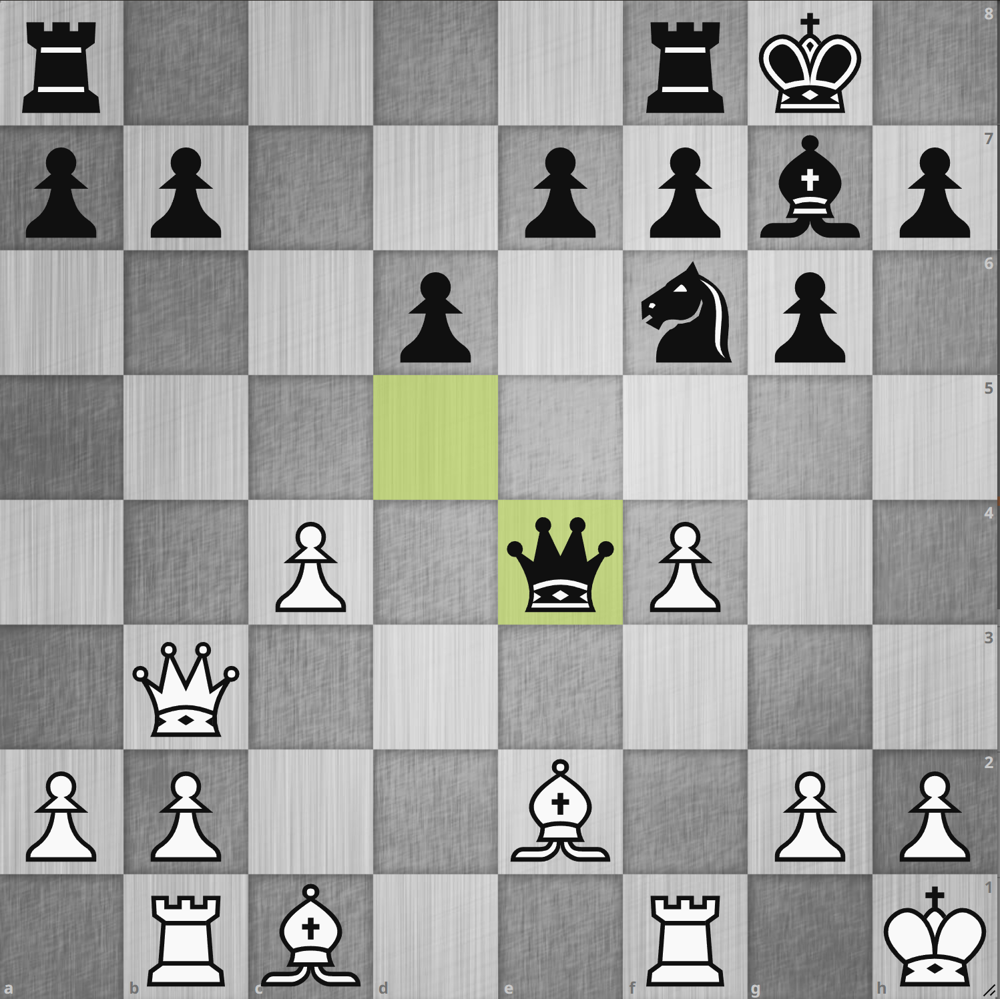{class="img-center"}
</figure>

`18. c4?!` はクイーンを追い払いつつなんとか反撃の手を作ろうという手ですが `18... Qe4` は見事な手です。
こちらのルークの連結が外れているのを突かれました。
強い方はクイーンの使い方が上手いです。

**19. Bd3 Qd4 20. Bd2 Ng4?!**

<figure markdown>
  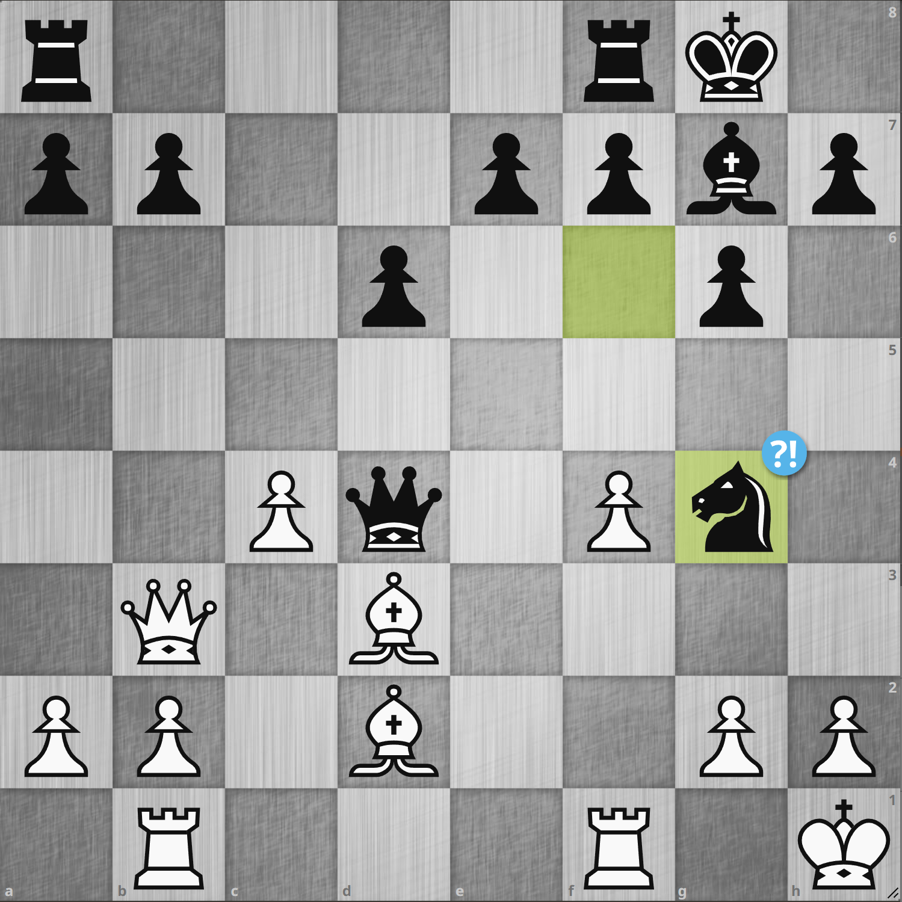{class="img-center"}
</figure>

これは **チェスプレイヤーならひと目でピンとくる局面**[^2] だと思います。
明らかに `... Nf2+ Kg1 Nh3+ Kh1 Qg1+ Rxg1 Nf2#` のスマザード・メイト若しくは `... Nf2+ Rxf2 Qxf2` のエクスチェンジ・アップを狙っています。
とても苦しい局面ですが必死の頑張りをしました。

**21. Be1!**

<figure markdown>
  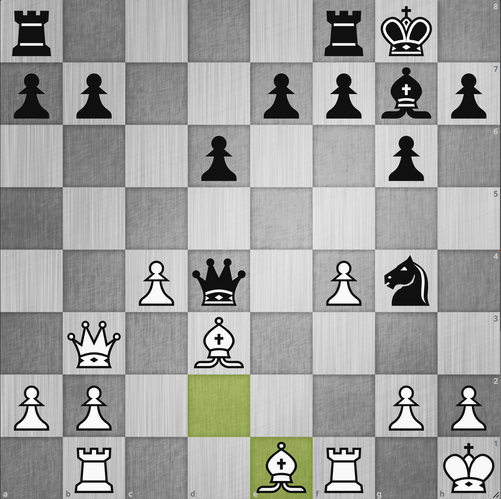{class="img-center"}
</figure>

あくまで `... Nf2+` させないという手ですが、またルークの連結を自ら外してしまう手で苦しいところです。
ただ感想戦で A さんが **Be1 をみて `Ng4` からの狙いがイマイチだった** と仰っていました。
ルークの連結を外されたので普通に嫌なところでしたが、明確な後続手はなかったようです。

**21. Qf6?? 22. h3 Ne3 23. Rf3 Nf5 24. Bxf5??**

<figure markdown>
  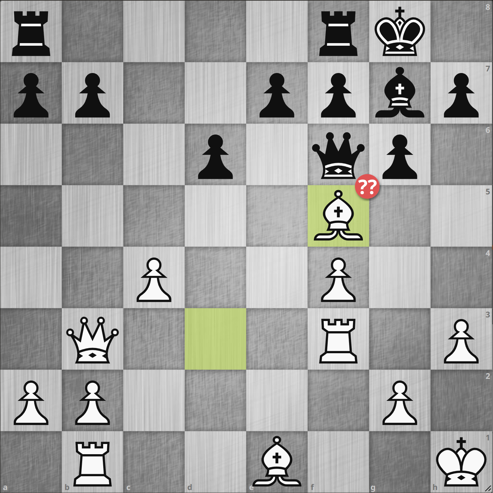{class="img-center"}
</figure>

せっかくイーブンに戻したのにフイにしてしまうブランダーでした。
次の `... Nd4` フォークがみえますが、それは `Bc3` などとしておけばいいところです。
もしくは `24. Qxb7` とポーン損を取り返しておけばまだ戦えました。
感想戦で A さんが即座にこのエクスチェンジが良くないことを指摘されていたので、やはりこの方には敵わないと再認識させられました。

**24... Qxf5 25. Qd3 Qxd3 26. Rxd3 Rfc8 27. b3 Rc6 28. Bc3 Bxc3 29. Rxc3 b5 30. Rbc1 Rac8
31. g4 bxc4 32. Rxc4 Rxc4 33. bxc4 f6 34. Kg2 Kf7 35. Kf3 Rc5 36. Ke4 h5 37. Kd4 hxg4 38. hxg4 e5+ 39. fxe5 fxe5+ 40. Kd3 Ke6
41. Rh1 Ra5 42. Rh2 Ra3+ 43. Ke4 Rc3 44. c5 d5# 0-1**

<figure markdown>
  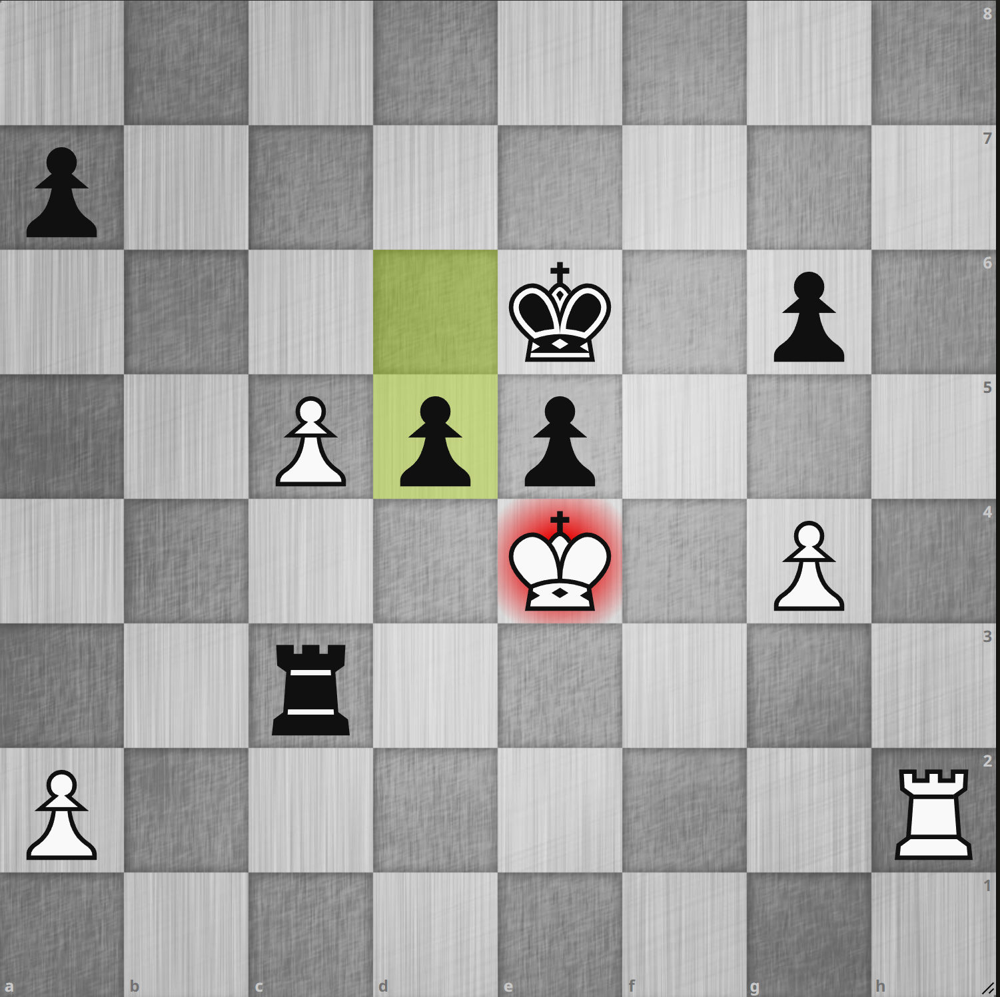{class="img-center"}
</figure>

その後はポーン損が響いたまま差が開いていき、最後は時間に追われて指した `44. c5?` で 1 手メイトとなりました。

<iframe width=900 height=400 src="https://lichess.org/study/embed/0Gsow1PX/wKvGOSRx?theme=metal" frameborder=0></iframe>

## 2R: 白, ルイ・ロペス・オープン・バリエーション

今回はなんと席主の田畑さんでした。
レーティング差にして 550 もあり、**奇跡が起きないと勝てないくらいの実力差**です。
ともかく指導対局のつもりで積極的にやっていくことにしました。

**1. e4 e5 2. Nf3 Nc6 3. Bb5 a6 4. Ba4 Nf6 5. O-O Nxe4!**

<figure markdown>
  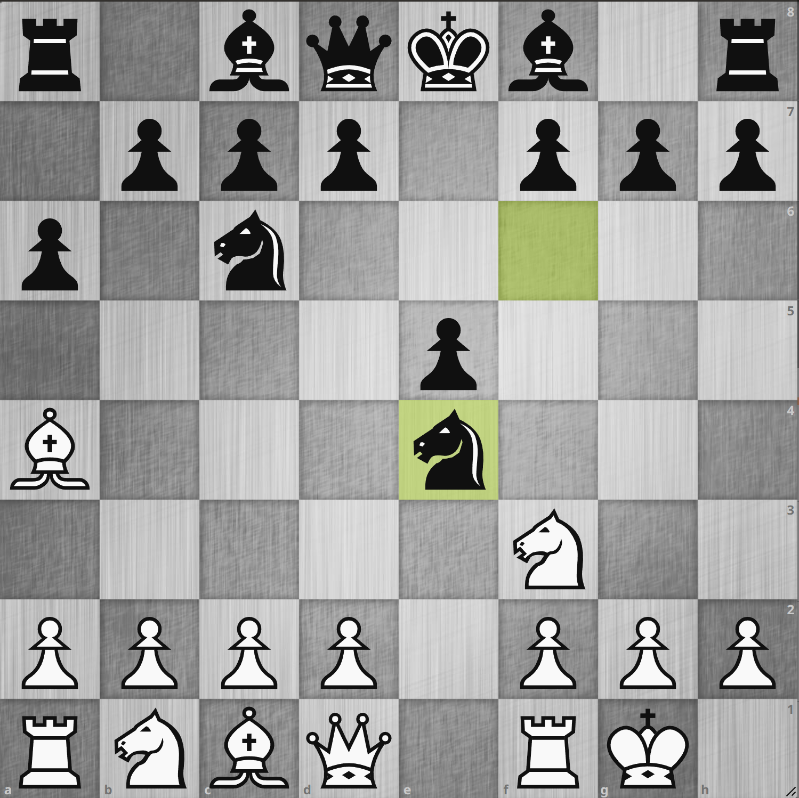{class="img-center"}
</figure>

戦慄しました。
オープン・バリエーションです。
私は OTB で見たのは初めてですし、オンラインチェスでもほとんど遭遇したことがありません。
激しく難しい展開になるにも関わらずやってくる方は少ない印象です。
なので実のところ私は次の `6. d4 or Re1` くらいしか知りません。
ただ、田畑さんは当然この定跡はよくご存知だったようです。

**6. d4 b5 7. Bb3 d5 8. dxe5 Be6 9. Bf4?!**

<figure markdown>
  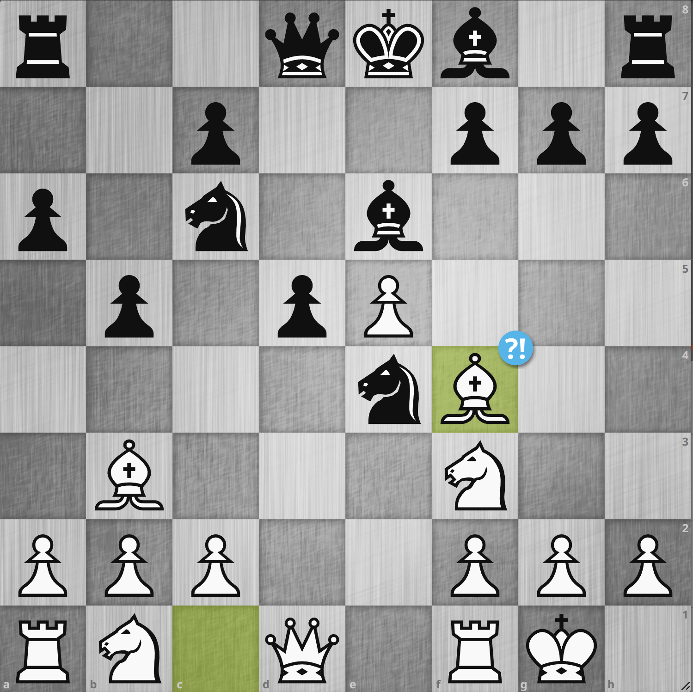{class="img-center"}
</figure>

`9. Bf4?!` はこの後の展開がよく分からないので `Nbd2` と出せるようにするために
e5 ポーンを支えつつ自然な駒展開をした手でしたが、感想戦で田畑さんが
**こういうビショップ出はあんまり見ない**[^3] と仰っていました。
結果的にこの後の乱戦に持ち込めたので今回は悪くはなかったのですが、ここは c6 ナイトの牽制をするために
`9. c3` とするかすぐに `9. Nbd2` としてしまって良いところでした。

**9... Be7?! 10. Nbd2?! Nc5 11. Re1 O-O?! 12. a3??**

<figure markdown>
  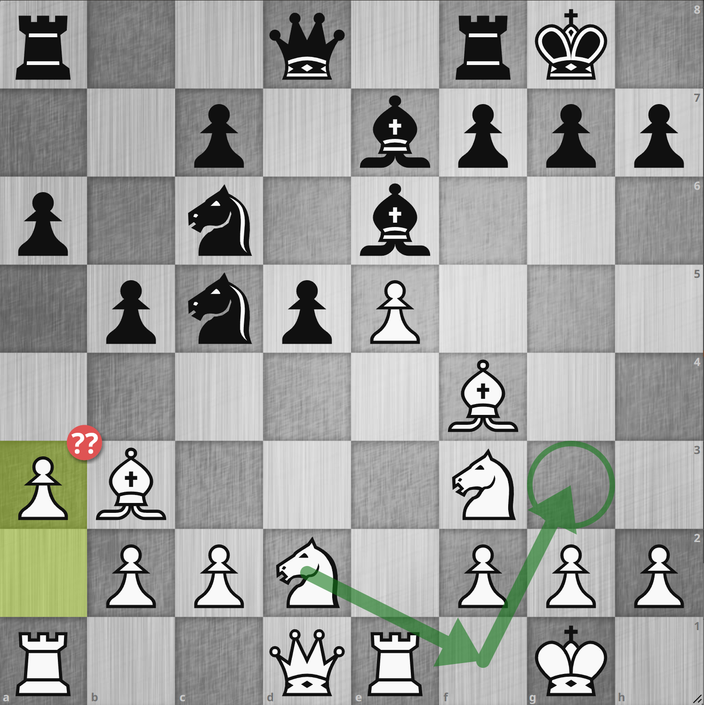{class="img-center"}
</figure>

`12. a3??` は b4 地点へのナイト出を牽制しつつビショップの逃げ道を作っておく手ですがブランダーのようでした[^4]。
f1 - g3 とナイトをマヌーバリングさせる手はルイ・ロペスではよくあるムーブですが、ここではできませんでした。

**12... Qd7?? 13. Ba2 b4 14. Nb3 Nxb3 15. Bxb3 Na5 16. Nd4?! c5? 17. Nxe6?! fxe6 18. Bd2 Nxb3 19. cxb3 a5 20. Qg4?! Kh8? 21. Re3 Rf5 22. Rg3**

<figure markdown>
  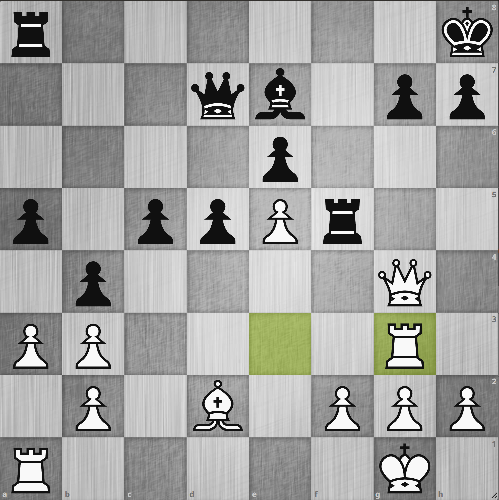{class="img-center"}
</figure>

ルーク・リフトさせてキングめがけてバッテリーを組みました。
見た目はかなりの迫力で、この瞬間だけ **もしかするといけるのでは？** と思わせてくれました。
ただ解析にかけてみると実はまだ互角の状態で明確な決め手はなく、ここから頑張って手を作っていかないとまだまだ難しい状態でした。

**22... g6?! 23. Rh3? Rg8?! 24. Re1?!**

<figure markdown>
  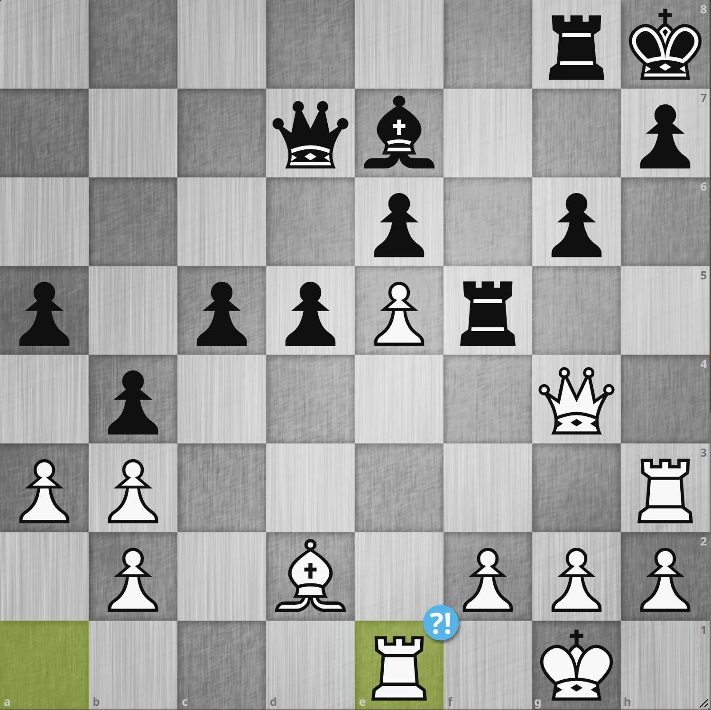{class="img-center"}
</figure>

これは感想戦で田畑さんも仰っていましたが **ルークは a ファイルに置いておいたほうが利いており e に回したのがヌルい手** でした。
`24. axb4 axb4 25. Ra6` などとして敵陣に侵入させたほうが迫っているところでした。
このあたりで雲行きを大分怪しくしてしまいます。

**24... Bf8?! 25. Bh6?? Qf7? 26. Bxf8??**

<figure markdown>
  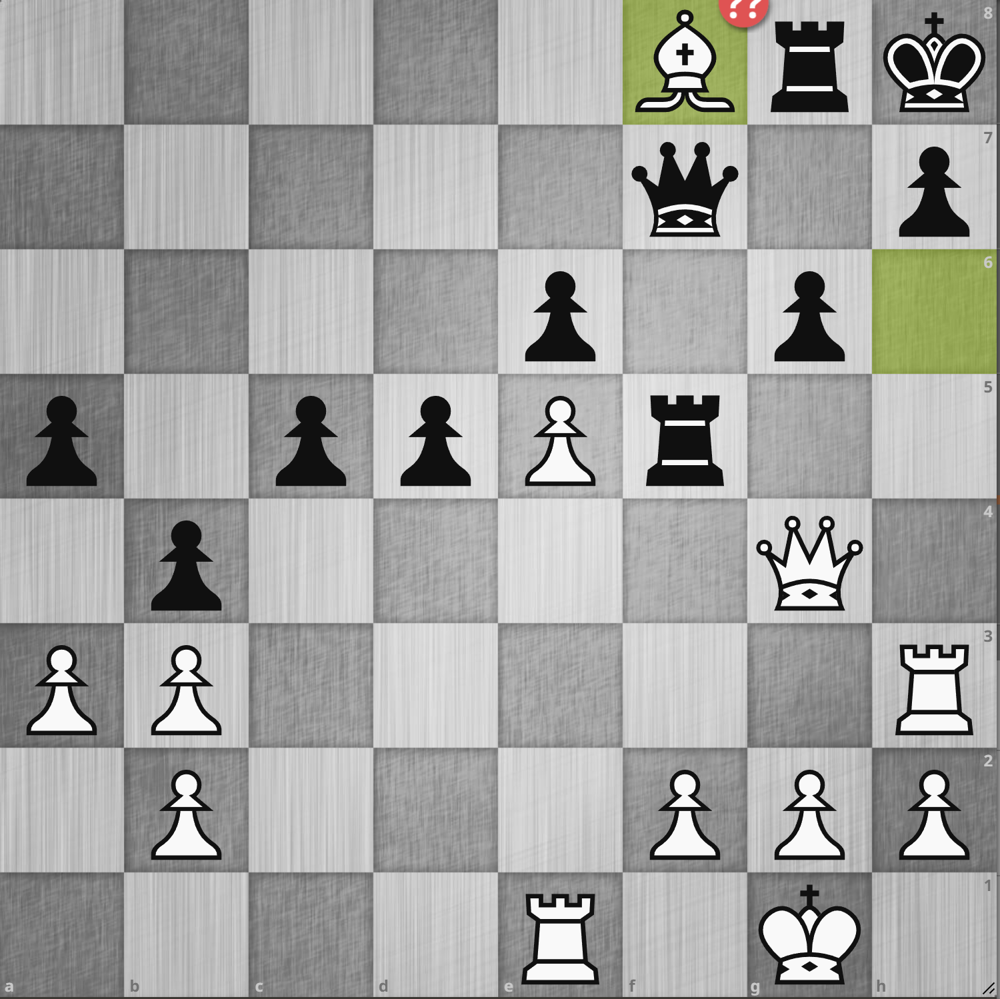{class="img-center"}
</figure>

正直手に困ってしまってビショップ交換しに行ったのですが **致命的なエクスチェンジ** で、これで黒がハッキリやりやすくなりました。
ここは `25. Bg5` くらいで良かったところで `25... Bg7??` とする手は `26. Rxh7!!` からの 3 手メイトです。
これが見えなくて指せませんでした。
つまり `25... Bg7` があると思ったので仕方なく `25. Bh6??` としたのです。

**27. Ree3 Rxe5?? 28. Rhf3 Rf5 29. Qh4?? Qf6?? 30. Qxf6+ R8xf6 31. Rxf5 gxf5 32. f4 Kg7 33. Kf2?? Kf7 34. g3? Ke7 35. Kf3?! h5?! 36. Re2?! Kd6?! 37. Rd2?! d4 38. Rd3 Rg6 39. Rd1 Rg8 40. Rd2?! Rb8 41. Rd3 Kd5 42. Kf2 c4 43. bxc4+ Kxc4 44. Rd2 bxa3 45. bxa3 Rb3 46. Ra2 Kc3 47. Ke2 a4 48. h3 Rb2+ 49. Rxb2 Kxb2 50. Kd3 Kxa3 51. Kxd4 Kb3 0-1**

<figure markdown>
  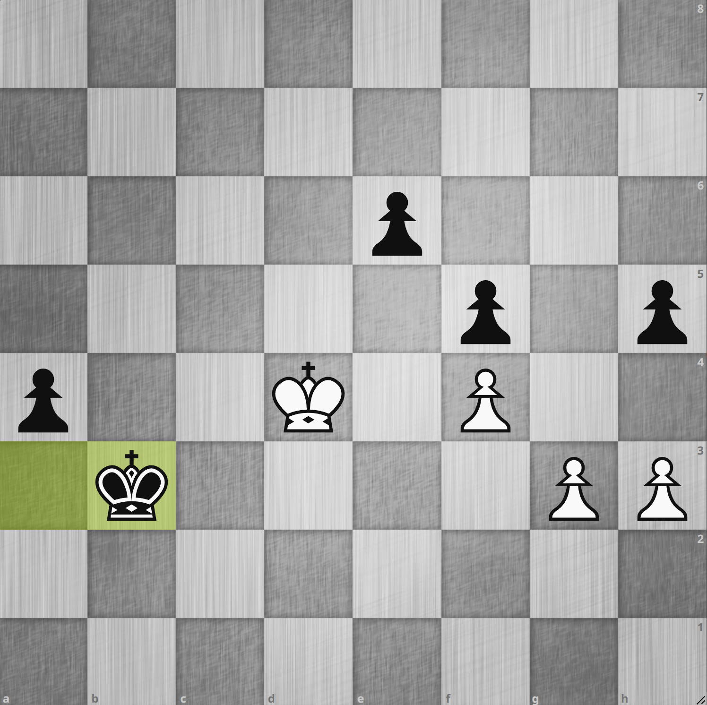{class="img-center"}
</figure>

やはり 1 ポーン・ダウンした結果その差を埋められず、敗北しました。

<iframe width=900 height=400 src="https://lichess.org/study/embed/0Gsow1PX/5o8z60R3?theme=metal" frameborder=0></iframe>

[^1]: ポーン・フォーク対象のビショップを移動させつつピンを外す手
[^2]: タクティクスで何度も解いたことがあって大体の人がひと目でパターン認識できる
[^3]: つまりは疑わしい手で、ルイ・ロペスでは黒マスビショップは動かさなくても良くてそのままエクスチェンジしても御の字ではないかとのことでした
[^4]: 驚愕の `... g5!!` でビショップかナイトが落ちますが見つけるのはかなり困難だと思います