# 2022-10-09 東京チェスフェスティバル

## 0R: 池上本門寺

<figure markdown>
  {class="img-center" style="width: 50%"}
</figure>

2022 年 10 月 9 日に **東京チェスフェスティバル** という一日制の大会が開催されました。
いつもの会場ではなく **池上会館** という聞き慣れない場所でした。
あいにくと夕方から雨のようだったのでバイクではなく電車で向かいました。
蒲田まで行って乗り換える必要があり、埼玉からだとちょっと遠いところでした。
ただ、ロケーションは食事や買い物に不便なところ [^1] を除いてはとても良かったです。
1 時間前に会場に着いてしまったので、近くに見えた **池上本門寺** にお参りしました。
日蓮宗がどうとかよく分かりませんが、大田区にこんなに広い敷地に大きなお寺や緑豊かな場所があるのかと驚きましたし、普通に散策して楽しめました。
日曜のみ開放している宝物殿が有料で見れるようでしたが、今回はチェスの大会に来ているので見ている暇がありません。
名残惜しいですが、池上会館に向かいました。

## 1R: 白, ルイ・ロペス・オールド・シュタイニッツ・ディフェンス

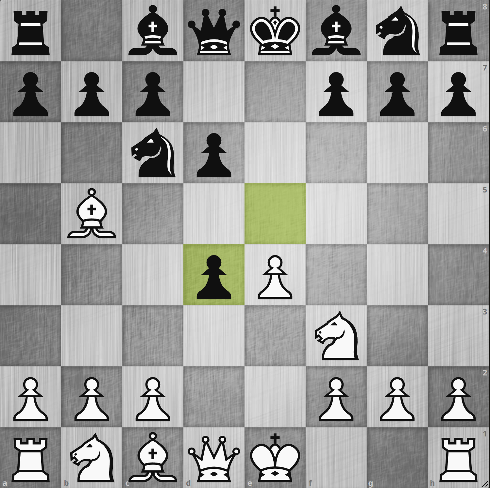{.img-left}

**1. e4 e5 2. Nf3 Nc6 3. Bb5 d6 4. d4 exd4**

割と見慣れた定跡のルイ・ロペス・オールド・シュタイニッツ・ディフェンスです。
以前書いた通り、フィリドール・ディフェンスと似た形で同じような戦略でいけるところです。
なので `d4` と力強く突いていきました。

---

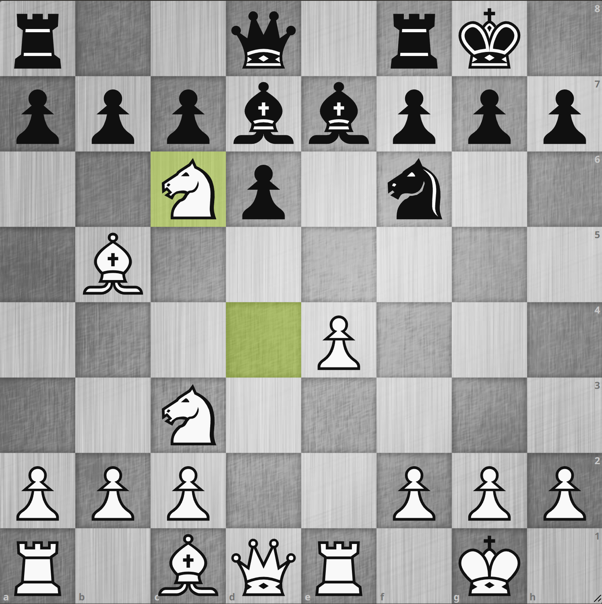{.img-left}

**5. Nxd4 Bd7 6. O-O Nf6 7. Nc3 Be7 8. Re1 O-O 9. Nxc6**

自然な駒組みをした後にこのタイミングでナイトをエクスチェンジしました。
黒としてはツー・ビショップを放棄した状態でダブル・ポーンを作る `9... Bxc6 10. Bxc6 bxc6` とし辛いところです。

---

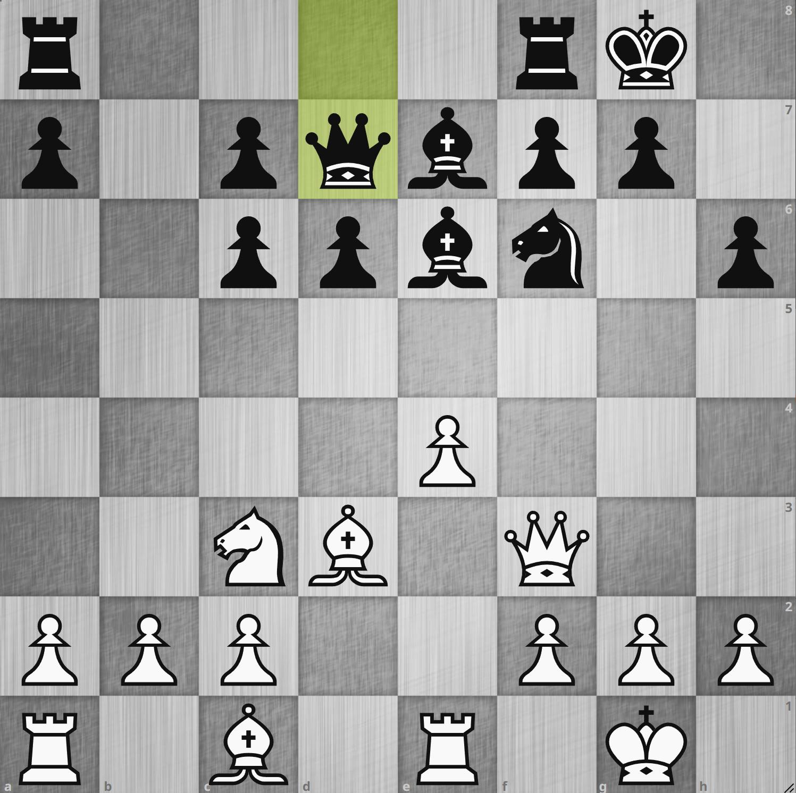{.img-left}

**9... bxc6 10. Bc4 h6 11. Qf3 Be6 12. Bd3 Qd7**

オンラインチェスだとこういう局面で `13. Qg3` と据えて `14. Bxh6` を狙っていくようなところだと思いますが
`13... Nh5!` とされると継続手がなく相手のビショップのラインも強いため止めておきました。
しかし今回私が選んだ手も疑わしいところでした。

---

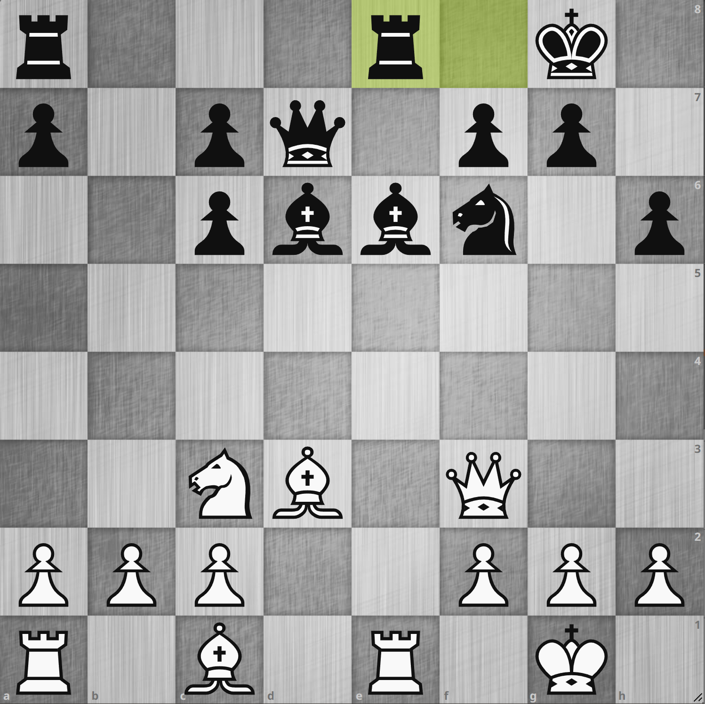{.img-left}

**13. e5 dxe5 14. Rxe5 Bd6 15. Re1 Rfe8**

`13. e5?` で開戦したところでしたが結局ビショップでルークを追い返されてあまり意味がありませんでした。
実際ルークの戻り先が悪いと f3 のクイーンとのスキュアやビショップで攻撃されるのを狙われてしまいます。
安全を考えると元の e1 に戻らざるをえず、あまり得な手には見えません。
それどころか `15... Bg4 16. Qe3 Rae8` などとされたら白がかなりまずかったように思います。

---

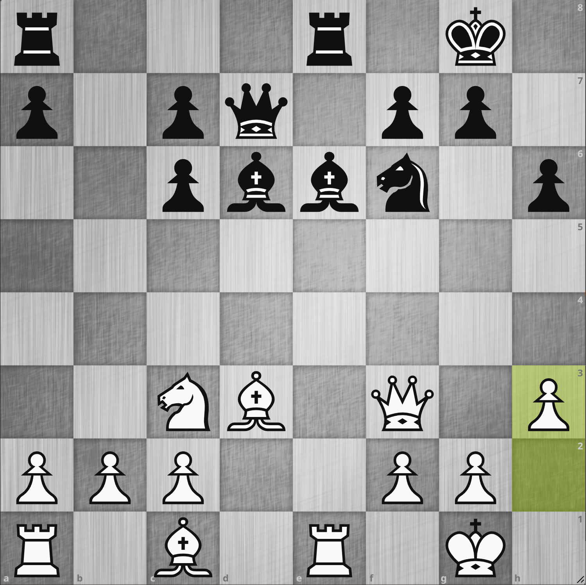{.img-left}

** 16. h3??**

`16 ... Bg4` とされる筋のケアのつもりでしたが **致命的なブランダー** でした。
ルークが連結されていないのがミソで、ここで `16... Bg4!` が成立します。
`17. Rxe8+ Rxe8 18. hxg4 Re1+ 19. Bf1 Nxg4` のような感じで負けです。
相手の方もこの筋を考えられたのかもしれませんが、かなり先まで読まないといけないので踏み込めなかったのでしょう。
ひとまずは助かったところでした。

---

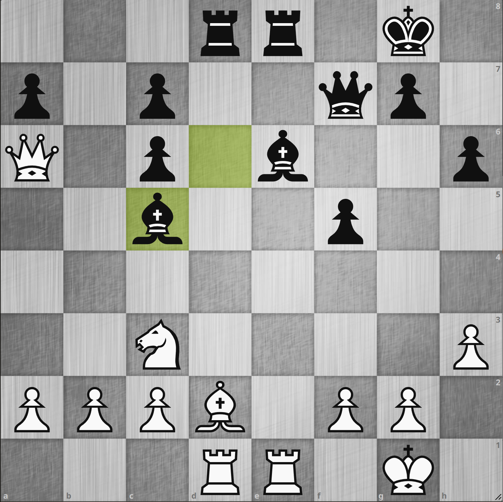{.img-left}

**16... Nd5 17. Bd2 Nb4 18. Be4 f5 19. Bd3 Nxd3 20. Qxd3 Rad8 21. Rad1 Qf7 22. Qa6 Bc5**

`22. Qa6` と相手のクイーンサイドのポーン形の不備を突きました。
結構守りにくい形です。
これだけでは優勢とはとても言えませんが、まずまずかなと思っていました。
すぐ c6 のポーンを取ると a2 のポーンが落ちてしまうので守りを考えてしまいましたが
c6 のポーンを取った時に c5 のビショップや c7 のポーンにも当たるので a2 のポーンをすぐには取れず、取っても良かったところでした。

---

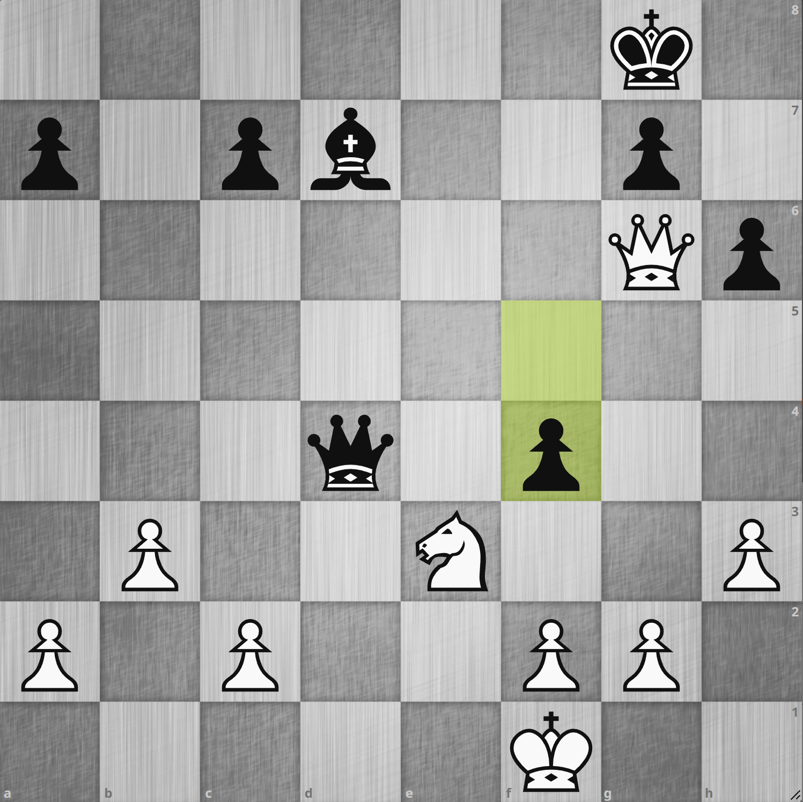{.img-left}

**23. b3 Bc8 24. Qxc6 Rxe1+ 25. Bxe1 Rxd1 26. Nxd1 Qe7 27. Kf1 Bd7 28. Qg6 Qe4 29. Bc3 Bd4 30. Bxd4 Qxd4 31. Ne3 f4**

ポーンアップのままうまくエクスチェンジを進めて少し有利のままエンドゲームまで持ち込んだと思いました。
しかし `31. Ne3??` が致命的で `31... f4!` とされてしまい頭が真っ白になりました。
このナイトは d1 の地点を守っており、逃げると `32... Qd1#` のため動けません。
何故 `Ne3` を指す前にもう少しちゃんと考えなかったのか悔やまれますが、もう遅いです。
ナイトが助かる見込みはかなり薄いと思われたため、どうやってドローに持ち込むかに意識を切り替えて可能な限り考えました。

---

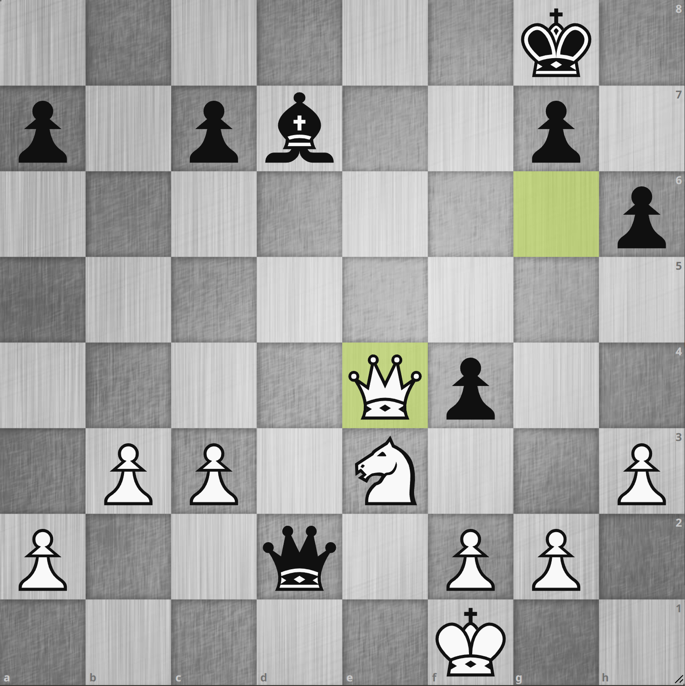{.img-left}

**32. c3 Qd2 33. Qe4??**

ナイトを取られても `Qxe3` から頑張るつもりで指しましたが、実は `33. Nc2!` で助かっていました。
`c3` という手がクイーンをそらすために指した手ですが、その手が c2 にスペースを作る手というのに自分でも気がついていませんでした。
ここでナイトを失いましたが、必死に粘りました。
以下長いので省略します。

---

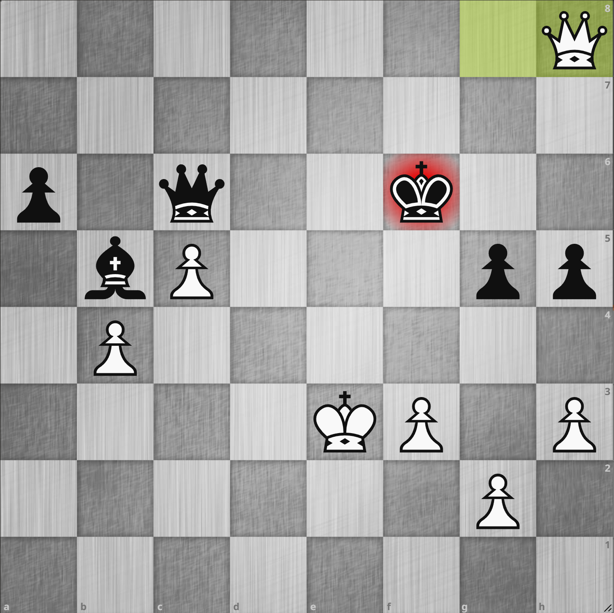{.img-left}

**33... fxe3 34. Qxe3 Qd1+ 35. Qe1 Qd3+ 36. Kg1 Kh8 37. Qe3 Qb1+ 38. Kh2 Qxa2 39. Qe7 Qd2 40. Qd8+ Kh7 41. Qxc7 a6 42. Qc4 Qd6+ 43. Kg1 Bb5 44. Qe4+ Kg8 45. Qa8+ Kf7 46. Qf3+ Ke7 47. Qe4+ Kf7 48. Qb7+ Kg8 49. Qa8+ Kh7 50. Qe4+ g6 51. Qb7+ Bd7 52. c4 Kg7 53. c5 Qc6 54. Qa7 Kf6 55. Kh2 Be6 56. b4 Bd5 57. f3 h5 58. Kg3 Bc4 59. Qb6 Bb5 60. Kf4 g5+ 61. Ke3 Ke5 62. Qb8+ Ke6 63. Qg8+ Kf6 64. Qh8+ Kg6 65. Qg8+ Kf6 66. Qh8+ Kg6 67. Qg8+ Kf6 68. Qh8+ 1/2-1/2**

ひたすら粘りに粘ってスリーフォールド・リピティションに持ち込みました。
黒がドローを拒否した場合どちらかのポーンが落ち、黒にビショップがあるとはいっても自信がない局面となります。
この試合 **1R で一番最後まで続いたもの** となりました。
東京チェスフェスティバルはスケジュールにかなり余裕があるように見えたのですが、このせいで昼食休憩の時間がかなり削られてしまいました。
それが今後の試合に響いてしまいます。

<iframe width=900 height=371 src="https://lichess.org/study/embed/OMqfgYs7/AZcM5Qcr?theme=metal" frameborder=0></iframe>

## 2R: 黒, オールド・ベノニ・ディフェンス

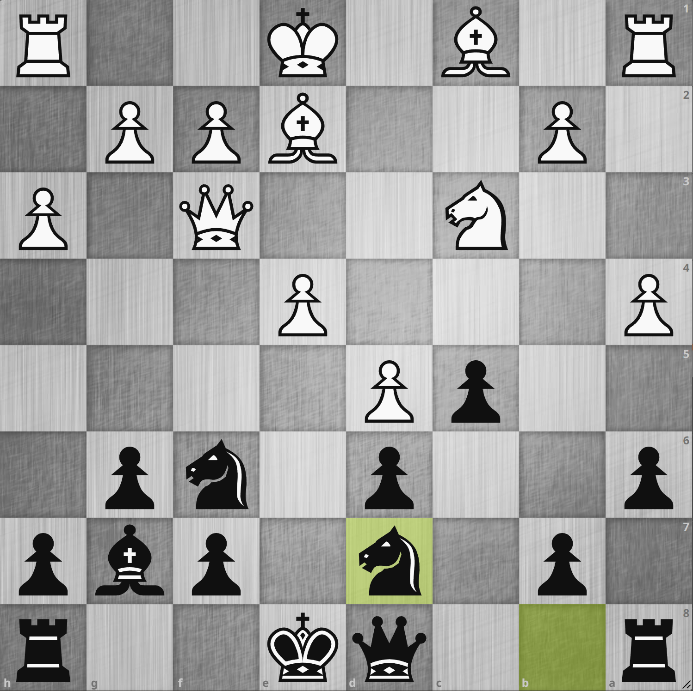{.img-left}

**1. d4 c5 2. d5 Nf6 3. c4 e6 4. Nc3 exd5 5. cxd5 d6 6. e4 a6 7. a4 g6 8. Nf3 Bg4 9. h3 Bxf3 10. Qxf3 Bg7 11. Be2 Nbd7**

典型的なベノニの局面です。
これはもう何十回も指した局面なのでほぼノータイムで指し、私にしては珍しく **30 分だった持ち時間が 35 分くらいまで回復** しました。
途中 `6... a6` と `7... b5` を狙ったり、ナイトが出てきた瞬間に `8... Bg4` とピンしたり、ビショップを攻撃されたら
`9... Bxf3` と大して使いやすいとはいえない白マスビショップをためらいなく切っていくのがベノニの指し方です。
d4 や e5 マスへの支配があるため a1 - h8 ダイアゴナル上のビショップが強く、フィアンケット・ビショップで十分戦える形だと思います。

---

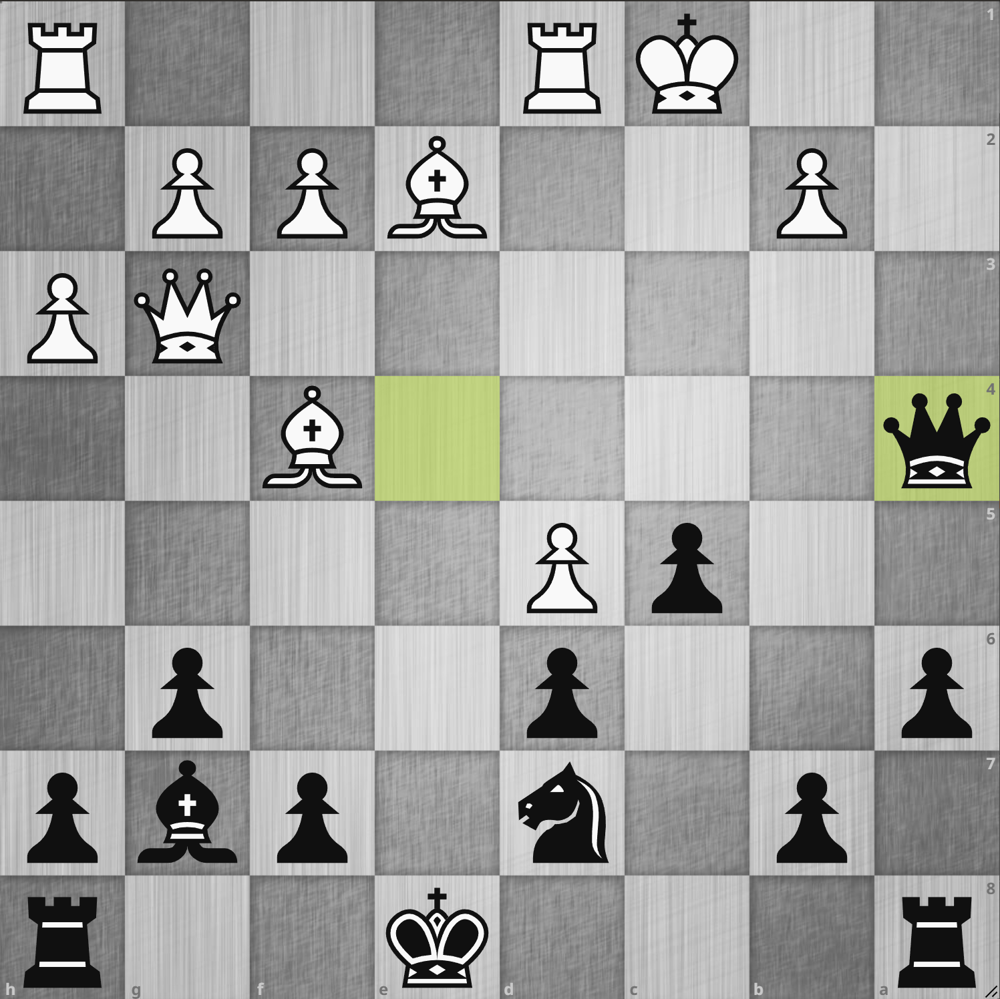{.img-left}

**12. Bf4 Qe7 13. Qg3 Nxe4 14. Nxe4 Qxe4 15. O-O-O Qxa4**

`13. Qg3?` が d5 への利きを追加して `Bxd5` を狙っていたのだと思いますがらしからぬブランダーで、単純に e4 への利きが減ってしまうので
`13... Nxe4` としてそのナイトがクイーンへも当たるので普通にピースアップできる局面でした。
たまらず相手の方はクイーンサイド・キャスリングしましたが `15... Qxa4` としてかなりの優勢です。
まさかここから失敗するとは思ってもいませんでした。

---

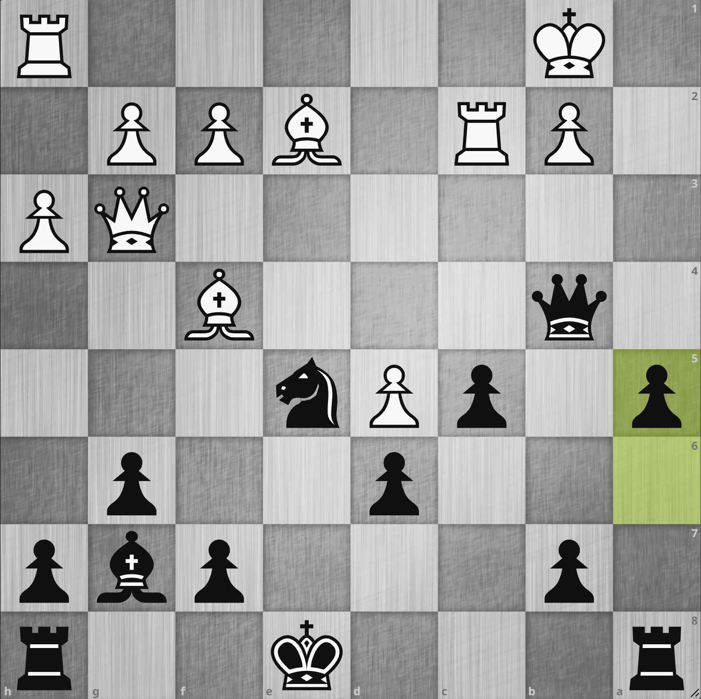{.img-left}

**16. Kb1 Qb4 17. Rd2 Ne5 18. Rc2 a5**

`18... a5??` は **致命的な戦略ミス** で、敗着だと思います。
相手キングが危険なので `a5 - a4 - a3` と **3 手かけてゆっくり指しても勝てる** と思っていました。
いくらなんでもここで 3 手かけるのは遅く、相手の反撃を許してしまいます。
十分優勢になったのだから、ここはしっかりとキャスリングしてキングの安全性をはかるべきところでした。

---

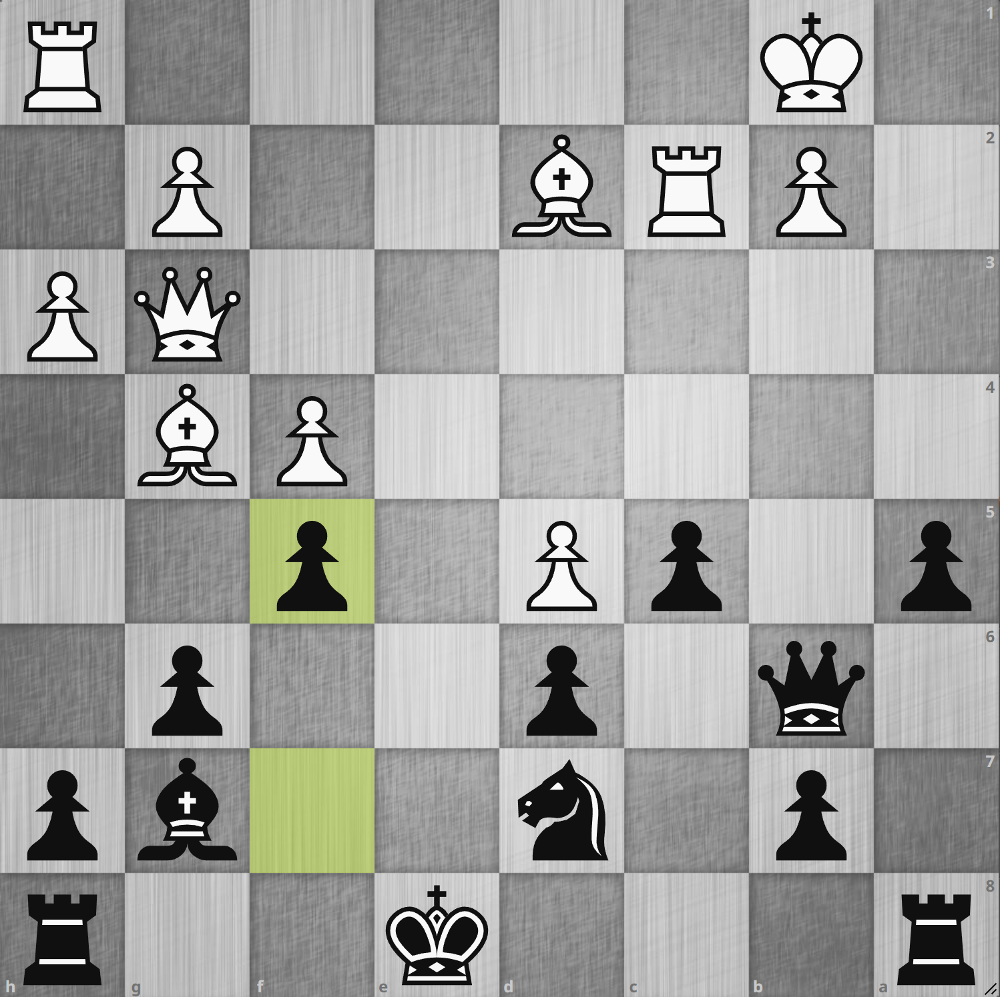{.img-left}

**19. Bd2 Qb6 20. f4 Nd7 21. Bg4 f5**

キャスリングしていないことの弊害がここで大きく出ました。
`21... f5??` も致命的なミスで、全く守りになっていません。
キャスリングしていないと g7 のフィアンケット・ビショップが浮いている状態で f5 のポーンはタダで取られてしまいます。
それに Re1+ からの反撃も許してしまいます。

---

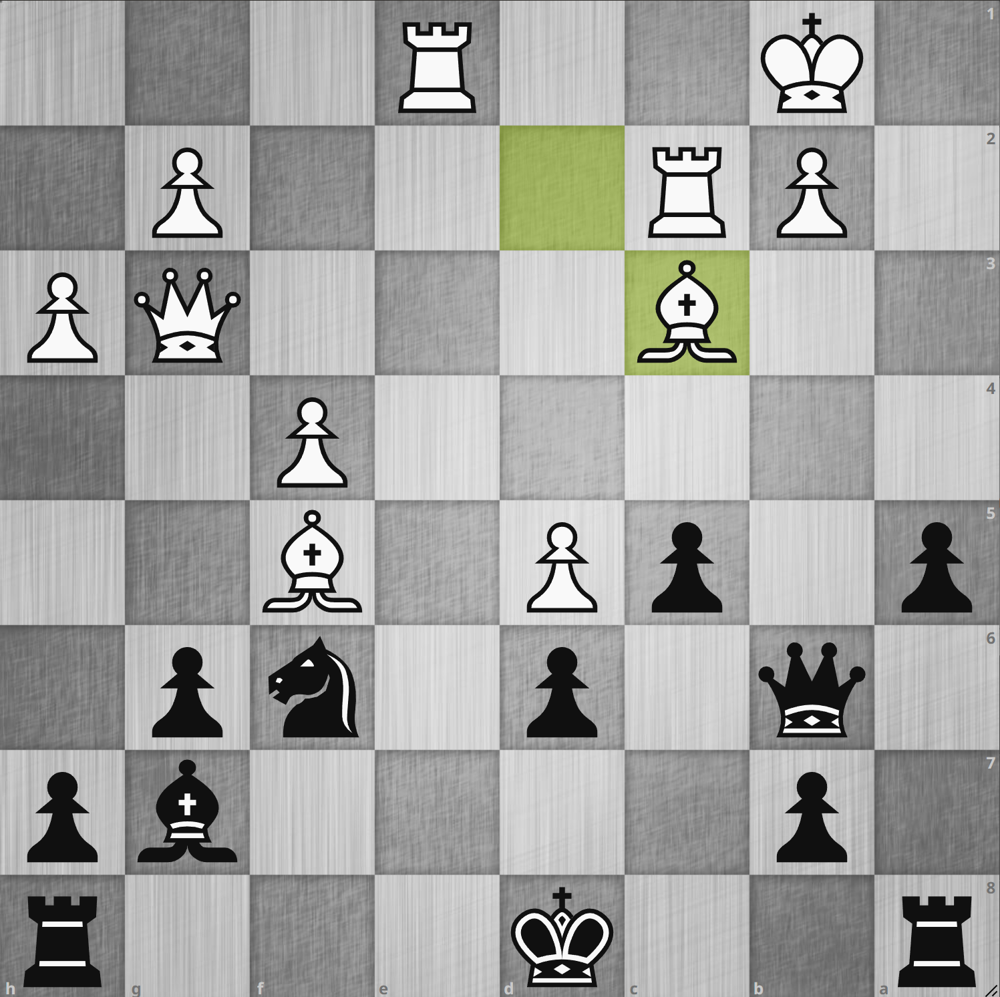{.img-left}

**22. Bxf5 Nf6 23. Re1+ Kd8 24. Bc3**

**あっ、終わった。**
そう思いました。
キングは危険で c7 に逃げられず、ナイトはピンされて動かせず。
ここから 1R と同じように最後まで粘りましたが、今回はうまく紛れさせることができませんでした。

---

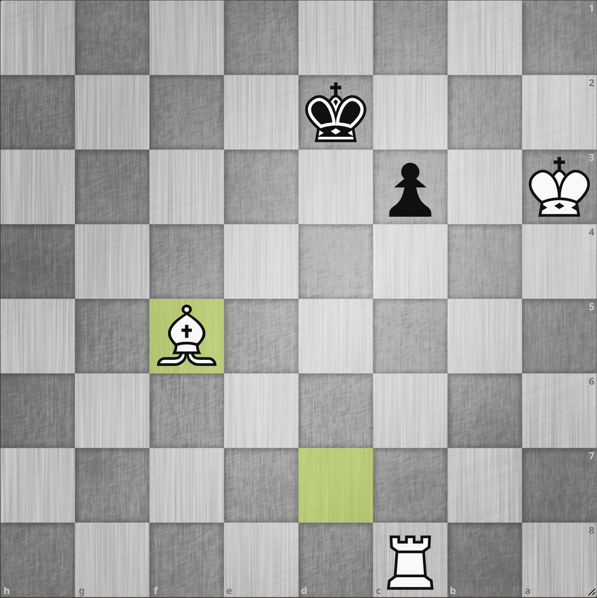{.img-left}

**24... Nh5 25. Qh4+ Kc7 26. Bxg7 Nxg7 27. Qe7+ Kb8 28. Qxg7 Ka7 29. Be6 Qb4 30. Rf1 a4 31. g4 a3 32. Qc3 a2+ 33. Kxa2 Kb6+ 34. Kb1 Qa4 35. b3 Qa6 36. Rff2 h5 37. Ra2 Qb5 38. Qc4 hxg4 39. Rxa8 Rxa8 40. Qxb5+ Kxb5 41. hxg4 Rh8 42. f5 gxf5 43. Bxf5 Kb4 44. g5 Kxb3 45. Rf3+ Kc4 46. Be6 Rh2 47. Rf7 Rh1+ 48. Ka2 Rg1 49. Rxb7 Rxg5 50. Rd7 Kd3 51. Rxd6 c4 52. Rc6 Rg2+ 53. Ka3 c3 54. d6 Kc2 55. d7 Rd2 56. Rc8 Rxd7 57. Bxd7 Kd2 58. Bf5 1-0**

今回も大熱戦となり、2R の最後の試合とまではいきませんがほぼ最後の方の試合になってしまいました。
この時点で **自分のスタミナが完全に切れました。**

<iframe width=900 height=371 src="https://lichess.org/study/embed/OMqfgYs7/nICHAt82?theme=metal" frameborder=0></iframe>

## 3R: 白, スカンジナビアン・ディフェンス・マーシャル・バリエーション

{.img-left}

**1. e4 d5 2. exd5 Nf6 3. d4 Nxd5 4. c4 Nb6 5. Nc3 g6 6. Nf3 Bg7 7. b3**

公式戦で相手の方にスカンジナビアン・ディフェンス・モダン・バリエーション (`2... Nf6` 型) を指されたのは初めてです。
よくブリッツでは `3. c4` というポーン得を強欲に守っていくパターンを指しているのですが、ここでは
`3. d4` が最善であることは知っていたのでそれを指していきました。
ただそれが最善であったと知っていたとしても、その後の方針を正しく知っていないと指しこなすことができません。
今回 `4... Nb6` としたことで何だかアレヒン・ディフェンス・エクスチェンジ・バリエーションのような局面になりました。
これを白でもって戦ったことがなく、実際自信のない形でした。
`7. b3?` という頓珍漢な手を指してしまいました。
勿論フィアンケットするつもりでも何でもなく、ただ単に c4 ポーンが不安だったからだと思います。

---

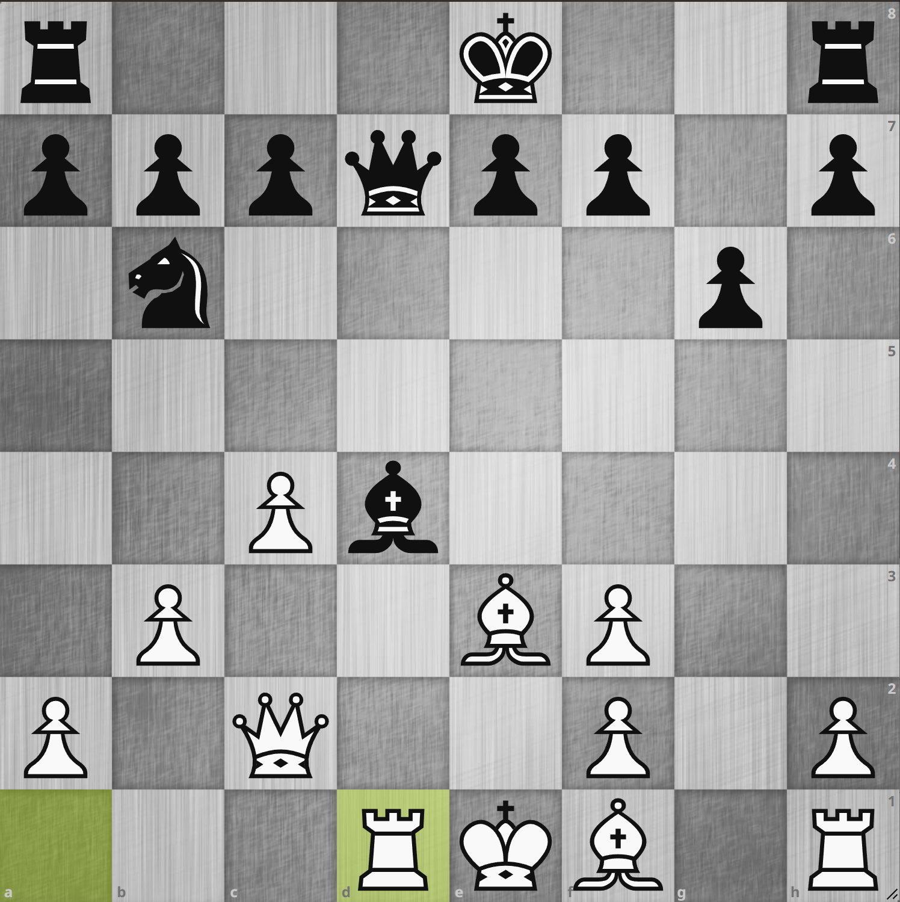{.img-left}

**7... Bg4 8. Be3 Bxf3 9. gxf3 Nc6 10. Ne2 Qd7 11. Qc2 Nxd4 12. Nxd4 Bxd4 13. Rd1**

`9. gxf3` はクイーンで取るとポーンが落ちるので仕方なくそうしたのですが、ここは `9. Qxf3` でも `9... Bxd4 10. O-O-O!`
とすればビショップをピンできるので白十分戦えるところでした。

`11. Qc2` はワザと隙を作ってビショップをピンするつもりでした。
実際その通りになって予定通り `13. Rd1` とピンしたのですが、実はあまり迫ってはおらず普通にポーン損です。
すぐに追撃できないとピンできても効果がありません。

---

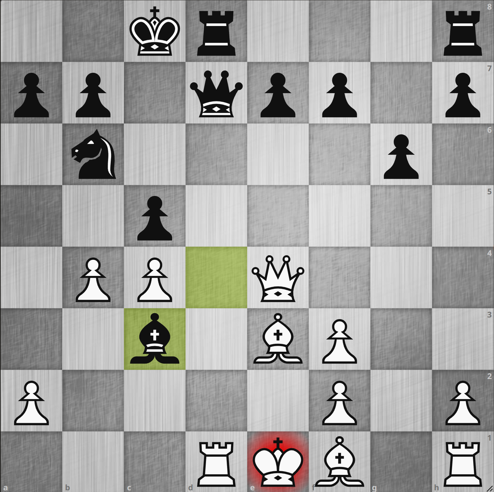{.img-left}

**13... c5 14. Qe4 O-O-O 15. b4 Bc3+**

さきほどのピンから追撃をうまくすることができず、相手にキャスリングを許してしまいます。
それどころか `15... Bc3+` が全く見えておらず、指された時に **あれ……なんでここにビショップこれるんだ……**
などと呆然自失しました。
ただ、どこかで致命的なミスをしたというのはすぐに分かりました。
しかも 1R や 2R と違い本当に致命的で、取り返しがききません。

---

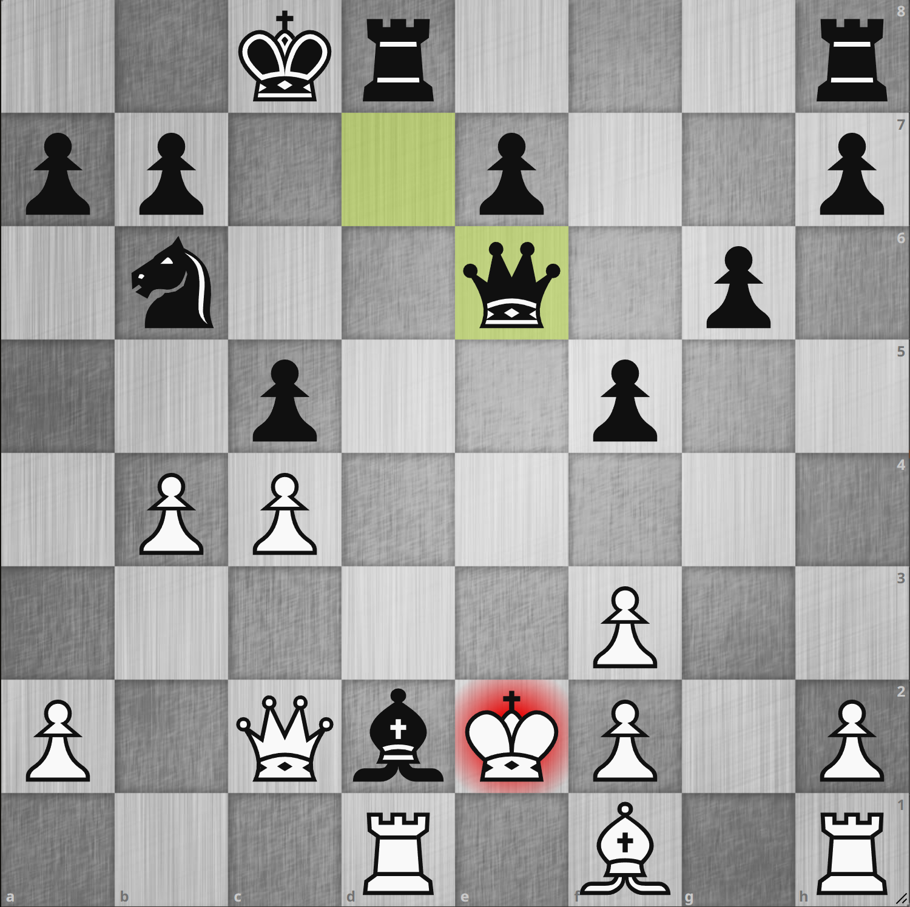{.img-left}

**16. Bd2 Bxd2+ 17. Ke2 f5 18. Qc2 Qe6+ 0-1**

クイーンを捨てるしかなく、リザインしました。
ここまで恐らく 20 分もかかっておらず、お互い 20 分以上残したまま終了しました。
あまりにひどい試合内容に愕然としました。

言い訳になってしまいますが、1R と 2R が両方とも長手数の試合になってしまったためその時点で疲労困憊、3R をまともにこなす体力が残っていませんでした。
とはいってもそのおかげで 1R 目はドローに持ち込めて 0.5 ポイントは確保できたので難しいところです。
年齢の問題もあって体力はこれ以上鍛えられそうもないので、後は経験でカバーするしかありません。

今回はレーティングによってグループ分けがされているので近いレーティングの相手とばかり当たったのが苦しかったです。
レーティングが 300 以上違ったりするとほぼ勝ち目がなくなるので半分捨て試合のような感じでやるので休憩時間が確保できたり体力が温存できたりしていたのですが、今回はそれが全くありませんでした。
1 日に 3R しかないからそんなに疲れないだろう、とタカをくくっていたのですが甘かったです。

<iframe width=900 height=371 src="https://lichess.org/study/embed/OMqfgYs7/RwpOYXyg?theme=metal" frameborder=0></iframe>

[^1]: 会館の近くには何もなく最寄りのコンビニでも 5 分くらい歩く