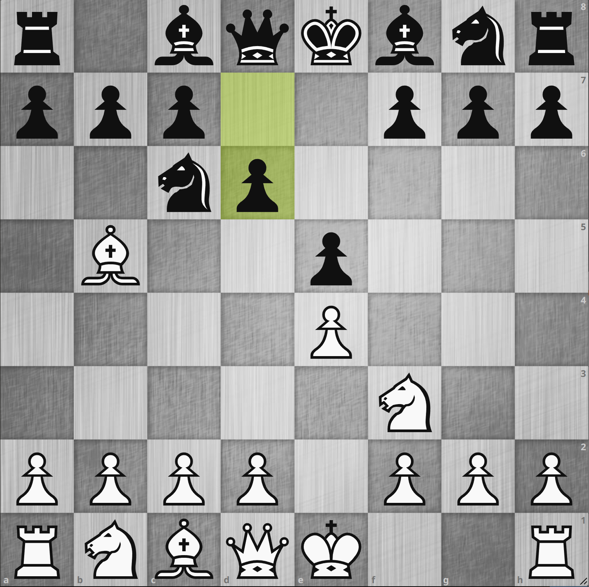
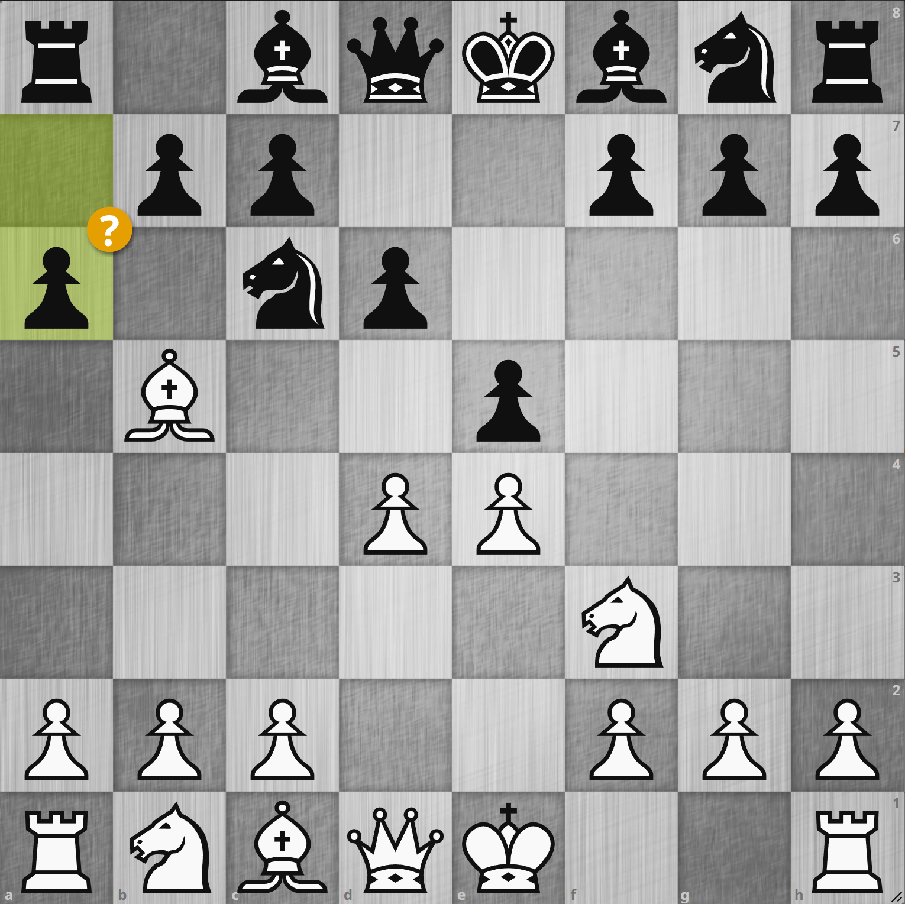
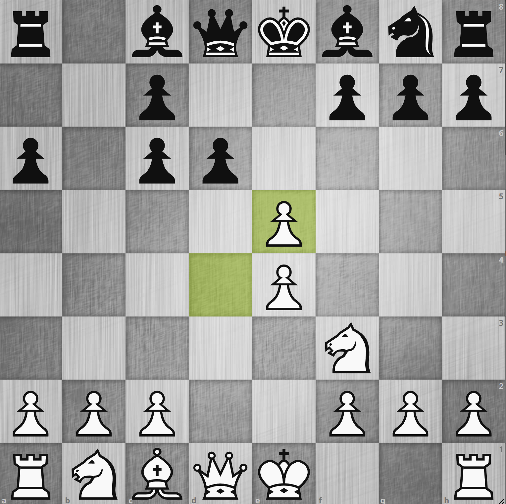

# 802. オールド・シュタイニッツ・ディフェンス 4... a6?

    <iframe width="560" height="315" src="https://www.youtube.com/embed/pBfUFSx-Rpk" title="YouTube video player" frameborder="0" allow="accelerometer; autoplay; clipboard-write; encrypted-media; gyroscope; picture-in-picture" allowfullscreen></iframe>

## オールド・シュタイニッツ・ディフェンスについて

<figure markdown>
  {width="30%" class="img-center"}
</figure>

ルイ・ロペスには応手がいろいろありますが、その中で黒勝率が低い[^1]にも関わらずネットチェスだと割と頻繁に指されるのがこの
**オールド・シュタイニッツ・ディフェンス** です。
要するにルイ・ロペスの形から `3... d6` と突いた形で e5 のポーンをポーンで支えるという何だかフィリドール・ディフェンスに似た形です。
なのでこの後の白側の指し手もフィリドール・ディフェンスと似たところがあって割と戦いやすいという印象なのですが、それにしても個人的にはそこまで勝ちやすいとも思えません。
やはりチェスは特に私のようなアマチュアでは、オープニングの選択でそこまで優劣は変わらないという印象です。

d6 を突いたことによって自分からナイトをピンさせてしまったということになりますので、このあと高い確率で `... Bd7` も指されます。
その前に開戦しようということで、対フィリドール・ディフェンスと同じように `4. d4` と指していきました。

## 4... a6?

<figure markdown>
  {width="30%" class="img-center"}
</figure>

これに対して黒は `4... a6?` と **手順前後でモーフィー・ディフェンス、もしくはモダン・シュタイニッツ・ディフェンスに合流させてきた** ようにみえました。
モダン・シュタイニッツ・ディフェンスというのはモーフィー・ディフェンス `3... a6` を突いてからシュタイニッツ・ディフェンス
`4... d6` とするものでこれも手強いのですが、手順前後したせいで今回は d4 の手が入ってしまっています。
ここで白が `5. Ba4` と引くと本当にモダン・シュタイニッツ・ディフェンスに合流してこれからの勝負となるのですが、ここはポーン・アップできる局面です。

## 5. Bxc6+! bxc6 6. dxe5

<figure markdown>
  {width="30%" class="img-center"}
</figure>

黒は `6... dxe5` としにくい局面です。
そうしてしまうとクイーン交換となって黒がキャスリングの権利を失う上に、ポーン・ダウンしたままとなってしまいます。
実際チェス実況では黒は `6... dxe5` としてはきませんでした。
何だか簡単にポーン・アップできてしまったようですが、ビショップが攻撃されたから一旦引こうと脊髄反射で動かしてしまうとこういうチャンスを逃してしまいます。
割と序盤でもこのような手順の不備で優勢を築くことができるので、相手の手順に違和感を感じたら注意深く見ていく必要があると思いました。
ちなみにこの `4... a6?` ですが lichess 序盤探索を見る限りだとそこそこのレーティング帯でも **それなりの頻度で発生** しているようです。

[^1]: lichess 序盤探索調べ。a6 モーフィー・ディフェンスや Nf6 ベルリン・ディフェンス、Bc5 クラシカル・ディフェンスより劣ります