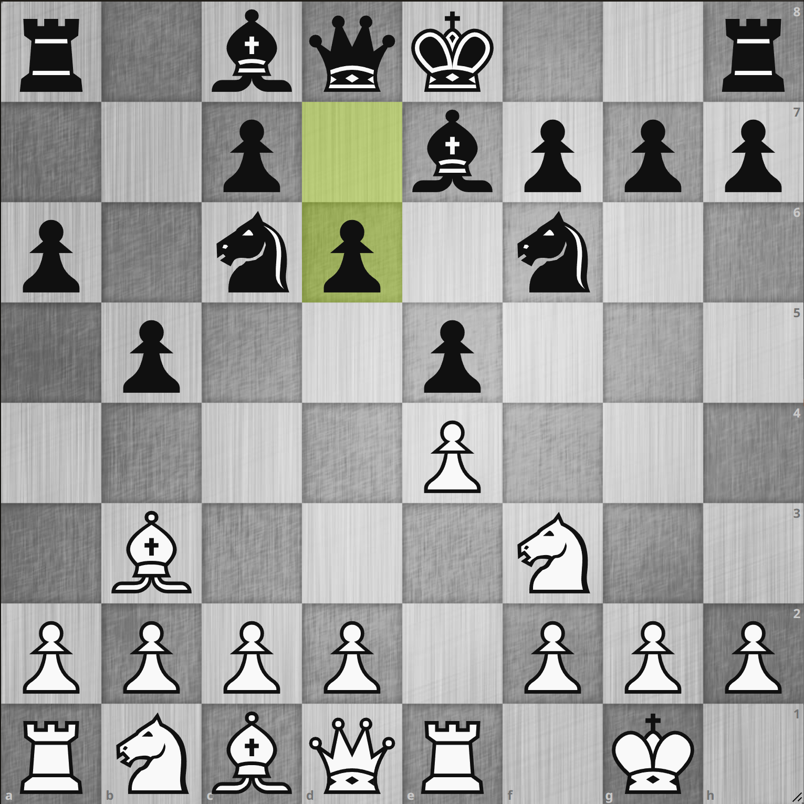
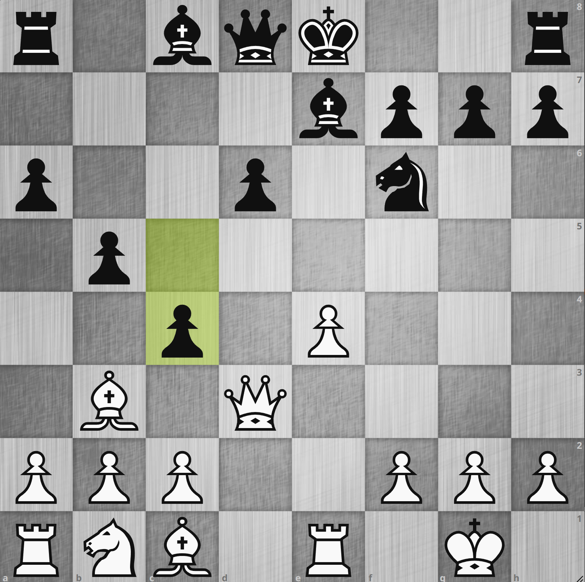
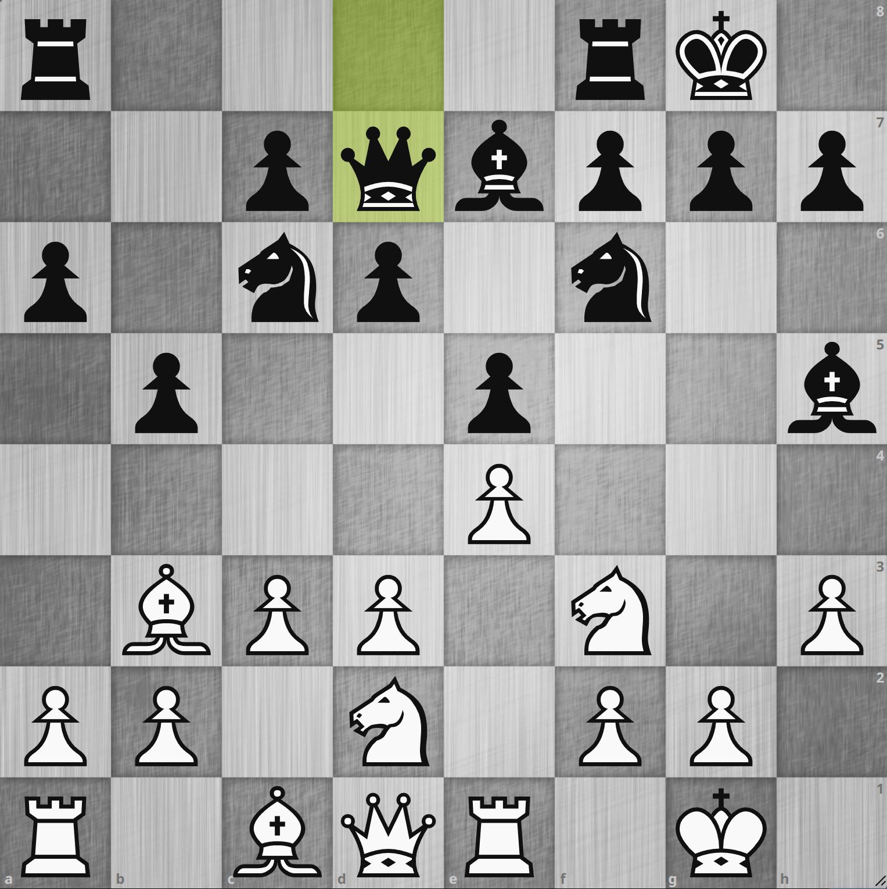
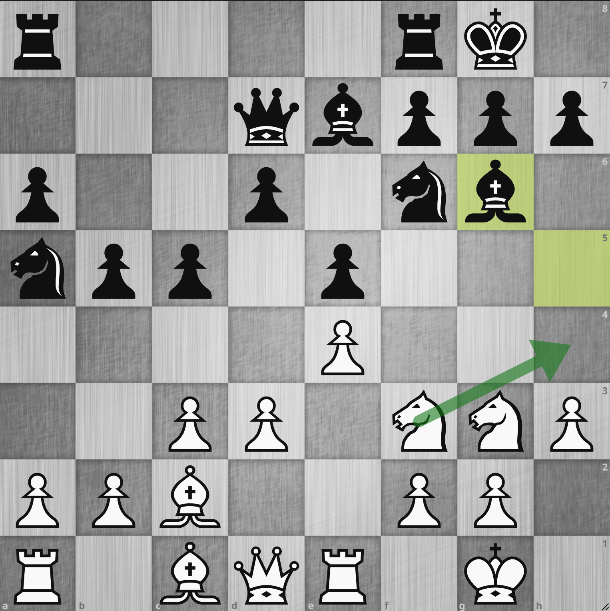

# 808. モーフィー・ディフェンス 7... d6

    <iframe width="560" height="315" src="https://www.youtube.com/embed/g2AhKUgSkb4" title="YouTube video player" frameborder="0" allow="accelerometer; autoplay; clipboard-write; encrypted-media; gyroscope; picture-in-picture" allowfullscreen></iframe>

## 8. d4?: ノアの箱舟トラップについて

{.img-left}

モーフィー・ディフェンスのこの局面について考察します。
ここで `7... d6` は e5 のポーンを守りつつビショップの道を開け、次に Bg4 のピンを狙っています。
こういった局面で `8. d4?` からエクスチェンジしに行くのは **ノアの箱舟トラップ** という有名なトラップにかかるため NG というのはよく知られています。

---

{.img-left}

**8. d4 exd4 9. Nxd4?? Nxd4 10. Qxd4 c5! 11. Qd3 c4**

で見事、ビショップがトラップにかかります。
手順中 `11. Qd3` は一例ですが、ここならば `12. Bxc4 bxc4 13. Qxc4` と 1 点損で済むことになります。
が、やはりビショップを失ったのは大きく劣勢となります。
ノアの箱舟トラップは有名なので YouTube や他のブログ記事などでもいくつか取り扱われておりますので、適宜そちらもご参照ください。

---

## 8. c3 Bg4 以降の変化

さて、前述の局面で `d4` が駄目だとすると有力な候補手としては `8. c3` と `8. h3` ということになりそうです。
`8. h3` は単純に `8... Bg4` のピンがいやらしいのでそれを予防する堅実な手で、これからの勝負といった印象です。
今回は以下のように進みました。

{.img-left}

**8. c3 Bg4 9. h3 Bh5 10.d3 O-O 11. Nbd2 Qd7**

恥ずかしながらこの後の変化を知りませんでした。
事前に `h3 Bh5` としたことで `Nf1 - Ng3` とした時に h5 のビショップを手順に攻撃できます。
一例としては以下のようになります。

---

{.img-left}

**12. Nf1 Na5 13. Bc2 c5 14. Ng3 Bg6**

次に `Nh4` からのエクスチェンジがあるため、白が少しやりやすいのではないかと思います。
`Nf1 - Ng3` とした時に `h5` が手順に攻撃できるということを押さえておきたいところです。

---