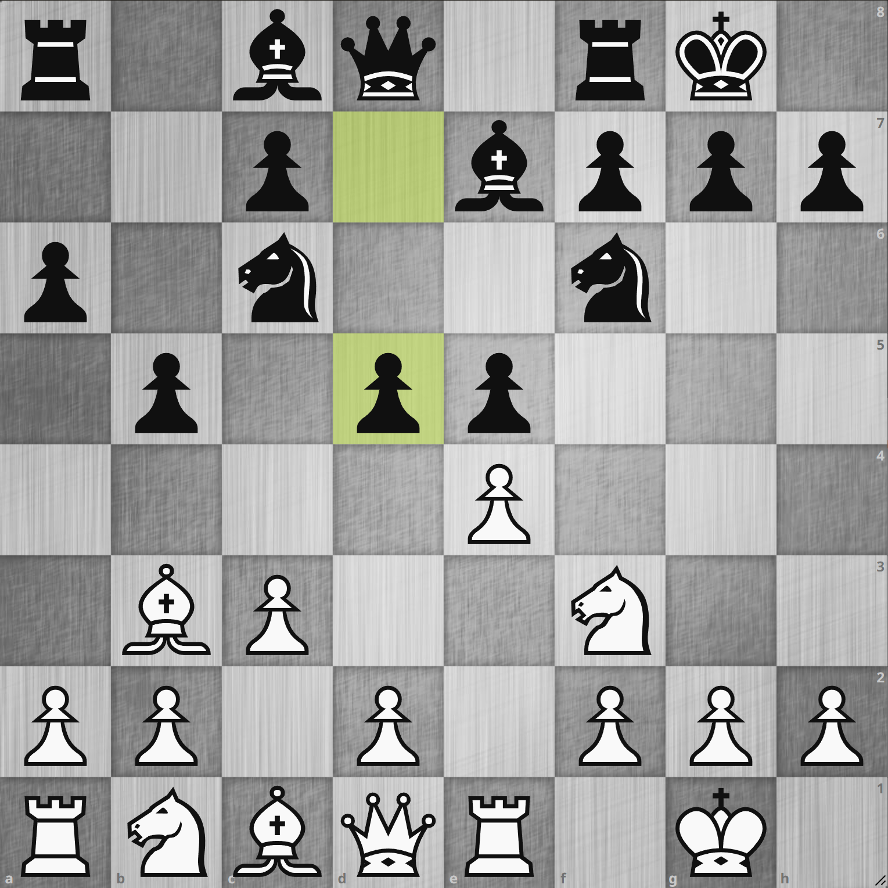
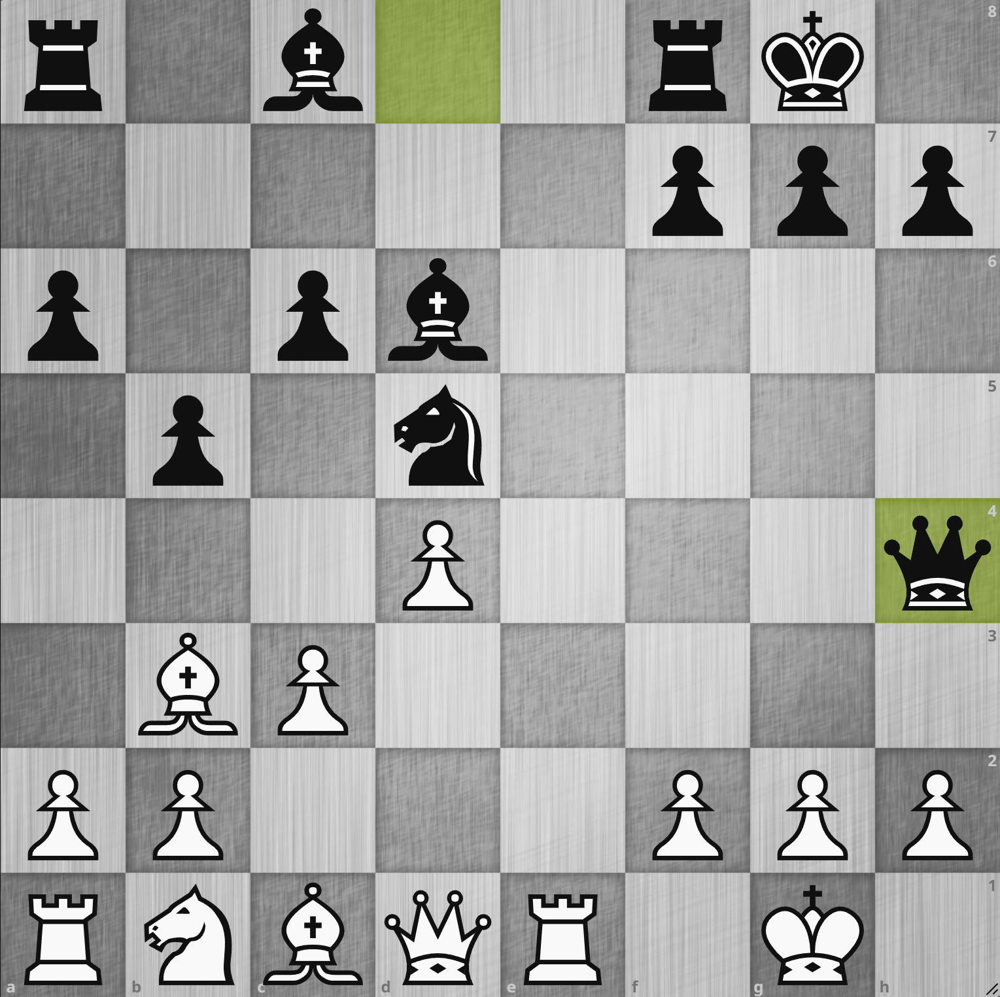
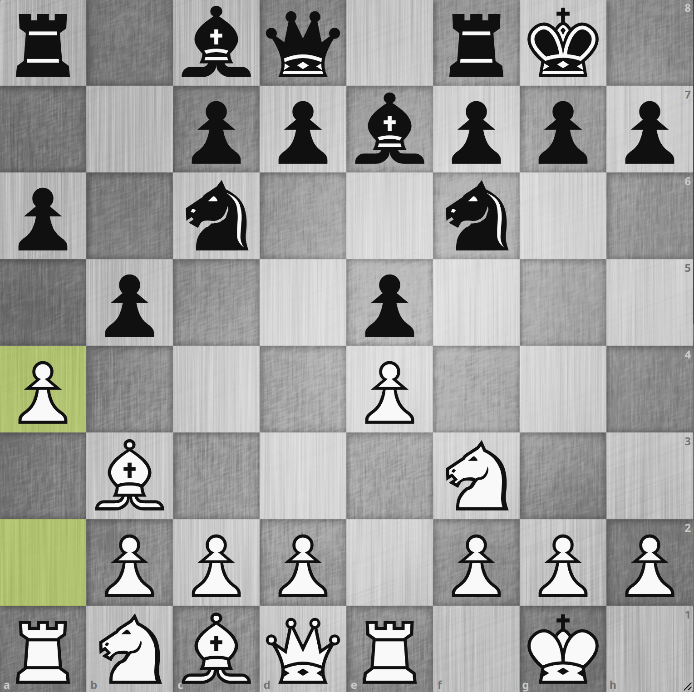
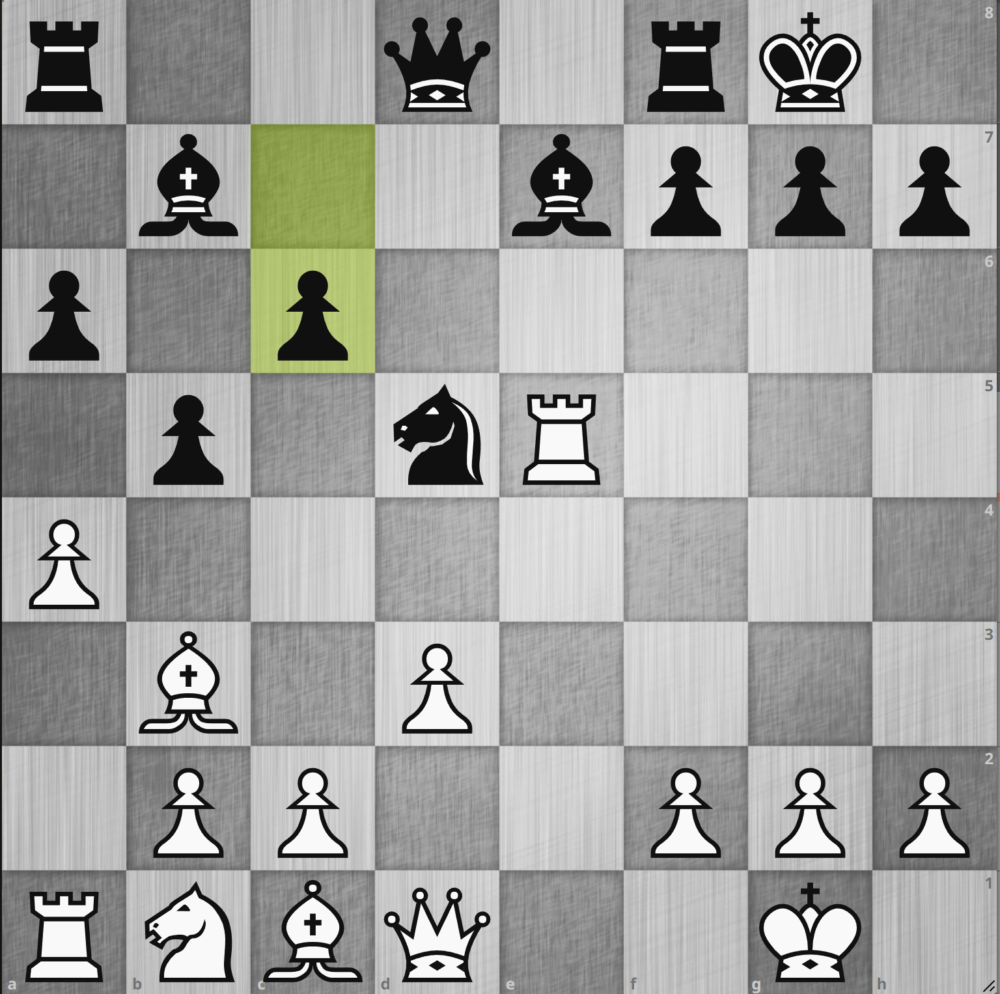

# 834. マーシャル・ギャンビット

    <iframe width="560" height="315" src="https://www.youtube.com/embed/rss7Q9wb8kc" title="YouTube video player" frameborder="0" allow="accelerometer; autoplay; clipboard-write; encrypted-media; gyroscope; picture-in-picture" allowfullscreen></iframe>

## マーシャル・ギャンビット

{.img-left}
{.img-left}

ルイ・ロペスの **マーシャル・ギャンビット** 変化というのは名前だけは知っていましたが、何しろ手順が長いのでどういう手順かは把握していませんでした。
[Wikipedia](https://ja.wikipedia.org/wiki/%E3%83%9E%E3%83%BC%E3%82%B7%E3%83%A3%E3%83%AB%E3%83%BB%E3%82%AE%E3%83%A3%E3%83%B3%E3%83%93%E3%83%83%E3%83%88)
によると以下の手順として定義されています:

**1. e4 e5 2. Nf3 Nc6 3. Bb5 a6 4. Ba4 Nf6 5. 0-0 Be7 6. Re1 b5 7. Bb3 0-0 8. c3 d5**

で図の局面となります。
ここから **9. exd5 Nxd5 10. Nxe5 Nxe5 11. Rxe5 c6 12. d4 Bd6 13. Re1 Qh4** などと続きます。
Stockfish の評価値はこれでもイーブンですが、黒のツー・ビショップがこちらのキャスリング陣形を睨んでおりクイーンも好位置に来ているということで、白かなり指しにくいと思われます。
実際序盤探索のデータを見ても黒の勝率が非常に高いです。
よってこの変化は避けなければなりません。

## 8. a4!

{.img-left}
{.img-left}

幸いここまでの手順が長いので、避けるのは容易に見えます。
例えば e4 のポーンを守るために `6. Re1` の代わりに `6. d3` を選択するなどありそうですが、ちょっと消極的に見えます。
`8. c3` は次の `9. d4` の足がかりにするのとb3 のビショップの逃げ道を確保する手ですが、これに変えて黒の伸びすぎたクイーンサイドのポーンを攻撃する
**8. a4** が良さそうです。
この後一例ですが **8... Bb7 9. d3 d5 10. exd5 Nxd5 11.Nxe5 Nxe5 12.Rxe5 c6** のように続きます。
`8. a4` は序盤探索によると **アンチ・マーシャル** という名前がついているようで、要はマーシャル・ギャンビットを避けるための手順のようです。
とはいっても無理やり合流させられてしまう可能性を秘めていそう[^1]なので、そこは注意する必要はありそうです。

[^1]: 例えば `8... b4 9. c3 d5!` のようにされる