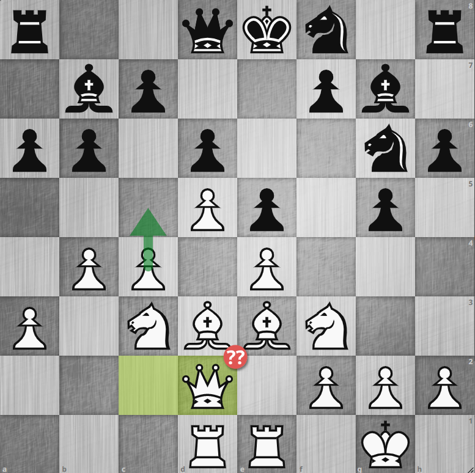
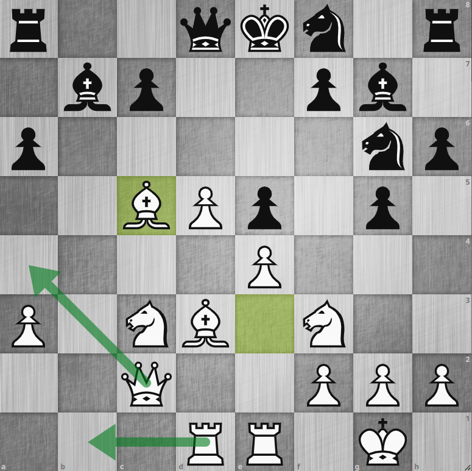
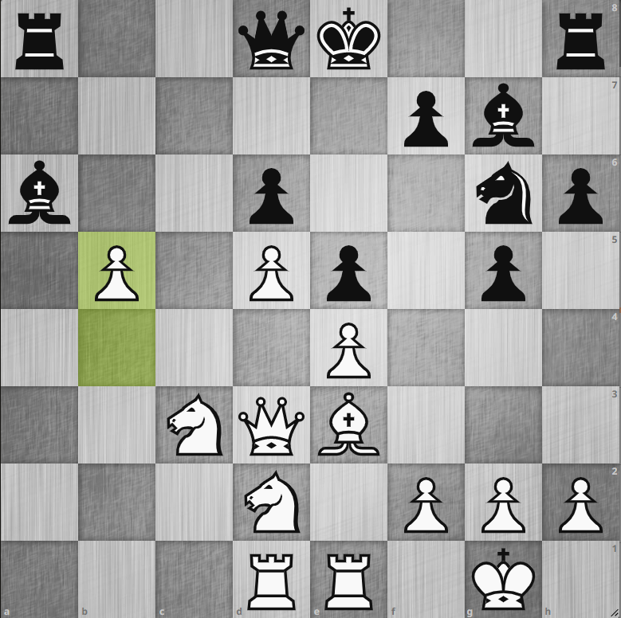

# 893. c5 が勘所の理由を考察

    <iframe width="560" height="315" src="https://www.youtube.com/embed/hC860PlrIp8" title="YouTube video player" frameborder="0" allow="accelerometer; autoplay; clipboard-write; encrypted-media; gyroscope; picture-in-picture" allowfullscreen></iframe>

## 問題の局面

{.img-left}

この対局では全体を通して **私が指した手よりもまず c5 を指すべき** と Stockfish に指摘されてしまいました。
確かに今回の対局のキングサイドが攻められそうだからとそちらの対策をして、あわよくば逆襲しようという姿勢は尤もらしく聞こえますが積極的ではありません。
本来はこちらが既にクイーンサイドでスペースを取っているのだからそこから攻めの手を作っていくべきところで、クイーンサイドで行き詰まってしまった時にはじめて別の手を考えるべきところでした。

例えばこの局面の **15. Qd2??** は致命的なブランダーで、次に `15... g4` とされた場合に必要なナイトの退避先のマスを取ってしまっています。
相手の方にそこは突かれなかったのですが、やはりここでも **c5 を突け** と言われてしまいます。
私が何となくこのあたりのポーンを突きたくなかった理由は
**中央でポーン・ブレイクしたら相手のダブル・フィアンケットを働かせてしまうのではないか？** と恐れてしまったからです。
実際のところ `c5` を突いても `d5 - e4` ポーンが相手のセンター・ポーンをブロックしているためダブル・フィアンケット・ビショップは働かなさそうに見えます。
以下 `c5` を突いた後に相手がポーンをエクスチェンジしてきた時としてこなかった時について考察します。

## エクスチェンジしてきた時

{.img-left}

**15. c5 dxc5 16. bxc5 bxc5 17. Bxc5**

見ての通り相手のビショップよりこちらの黒マスビショップのほうが働きが良くなっています。
更に空いた b, c ファイルにルークを回したり `Qa4+` として攻めを継続できそうです。
現状こちらのルークもセンタリングできておりクイーンを遠目に睨んでいるため、黒は `17... c6` ともしにくいところです。

こうなってしまうと黒はキングが危険な状態なので、狙いのキングサイド・アタックを仕掛けている暇がありません。

## エクスチェンジしてこない時

{.img-left}

**15. c5 Bc8 16. cxd6 cxc6 17. Nd2 b5 18. a4 Nf4 19. axb5 N8g6 20. bxa6 Nxd3 21. Qxd3 Bxa6 22. b5**

変化の一例ですがこのような感じに進むと思われます。
エクスチェンジしてきた時ほどの明快さはないですが、やはりクイーンサイドの小競り合いでポーン・アップできパスポーンが手に入っています。
このあと a, b, c ファイルにルークを回してパスポーンを頼りに攻めの手を作っていけるというところで白有望な局面になります。